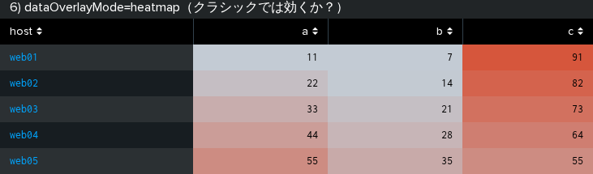
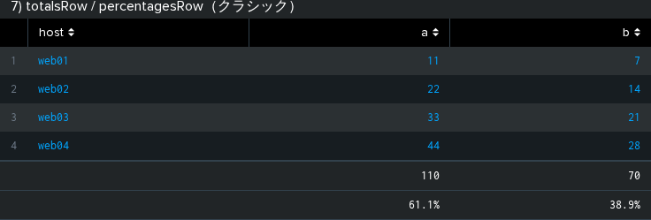
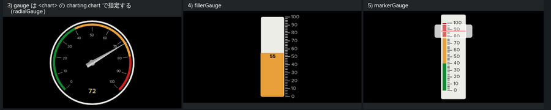
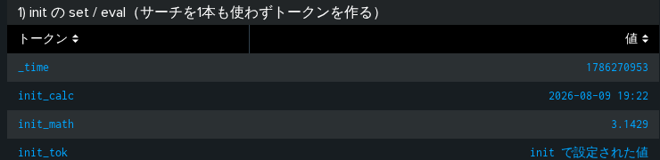
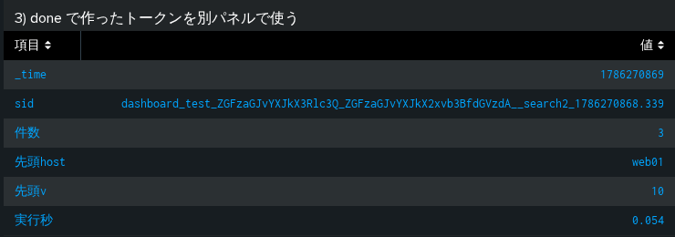
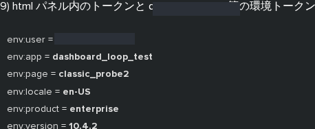
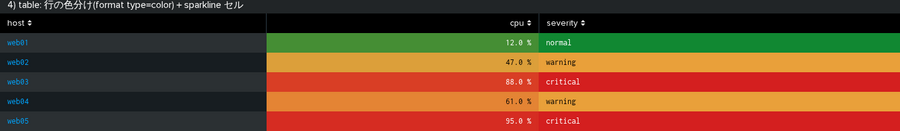
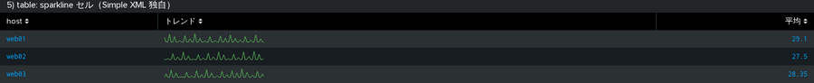
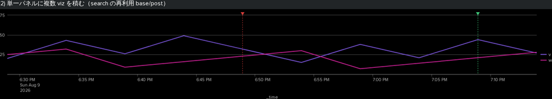
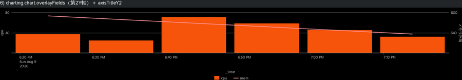

# クラシック（Simple XML）ダッシュボードの隠し機能（実機検証ナレッジ）

`/splunk-viz` スキルの参照ナレッジ。**Simple XML ダッシュボードで何ができるか**をまとめる。

**このファイルの位置づけ**：これまでこのリポジトリのナレッジは Dashboard Studio 側に偏っていて、
クラシック側は「カスタム viz の作り方」（[custom-viz-methods.md](custom-viz-methods.md) §2）しか
無かった。だが**クラシックにしか無い機能がかなりある**ので、
「Studio では無理」と判断する前にここを見る。

検証環境：**Splunk Enterprise 10.4.2**（開発機）。
本文の「実機確認済み」は、**実際に push して画面を見た／実行された SPL を読んだ**もの。

> **⚠ クラシックは廃止されていない。** 10.4 でも現役で、新規作成もできる。
> ただし Splunk の推奨は Studio なので、**クラシックを選ぶのは「クラシックにしか無い機能が要る」ときだけ**にする。

---

## 0. 検証の道具（このリポジトリに追加した）

Studio 用の `push.mjs` / `sync.mjs` は **`<dashboard version="2">` 固定**でクラシックを push できない。
`shot.mjs --panels` のセレクタも Studio 専用（`[data-test="viz-item"]`）で、クラシックでは 0 枚になる。
そこで2つ足した:

```bash
# 生の Simple XML を push する
node tools/dashboard-loop/src/push-classic.mjs <file.xml> --name <dashboard-name>

# クラシックのパネルを個別に撮る（セレクタは .dashboard-panel）
node tools/dashboard-loop/src/shot-classic.mjs <dashboard-name> --out <dir> --wait 30
```

### ⭐ 一番効いた検証手段：実行された SPL を読む

**スクリーンショットより確実。** トークンに実際に何が入ったかは、
**splunkd に残っているサーチジョブの `search` フィールド**を読めば分かる（画面に出す必要がない）:

```
GET /services/search/jobs?output_mode=json&count=60
→ entry[].content.search が「トークン展開後の SPL」
```

これで `prefix`/`suffix` の付き方も `<eval>` トークンの失敗も**一発で確定した**。
**「画面に出ない＝効いていない」ではない**ので、トークン系の検証は必ずこれを使う。

---

## 1. ⭐ Studio に無い／Studio では死んでいる機能（クラシックの存在意義）

**ここが本題。** 以下は**クラシックでは動くのに Studio では無反応**なもの
（Studio 側の裏は [studio-standard-viz.md](studio-standard-viz.md) に記録済み）。

| 機能 | クラシック | Studio | 備考 |
|---|---|---|---|
| `dataOverlayMode`（ヒートマップ/高低） | **✅ 効く** | ❌ **無反応** | 下の §1.1 |
| `totalsRow` / `percentagesRow` | **✅ 効く** | ❌ 無反応（`showFooterTotals` が正） | §1.2 |
| 入力の `prefix`/`suffix`/`delimiter`/`valuePrefix`/`valueSuffix` | **✅ 効く** | ❌ **未対応**（移行マップで明示的に false） | §1.3 ⭐ |
| `radialGauge` / `fillerGauge` / `markerGauge` | **✅ ある** | ❌ **存在しない**（`is not defined`） | §1.4 ⭐ |
| `<init>` によるトークン初期化 | **✅ ある** | ❌ 相当機能なし | §2.1 |
| `<eval>` トークン（式でトークンを作る） | **✅ ある** | ❌ 相当機能なし | §2.2 |
| `<done>` ハンドラ（サーチ結果→トークン） | **✅ ある** | ❌ 相当機能なし | §2.3 ⭐ |
| `$env:*$` 環境トークン | **✅ ある** | ❌ 無い | §2.4 |
| `depends` / `rejects`（パネルの出し分け） | **✅ ある** | △ 相当は `visible` 系のみ | §2.5 |

### 1.1 `dataOverlayMode`（Studio では死んでいるキー）

```xml
<table>
  <search><query>...</query></search>
  <option name="dataOverlayMode">heatmap</option>   <!-- none / heatmap / highlow -->
</table>
```



*↑ **数値の大小でセルが自動的に赤〜白に塗られている**（色の指定を一切書いていない）。
Studio で同じ `dataOverlayMode: "heatmap"` を書いても**何も起きない**（実機確認済み）。
Studio でこれをやるには DOS の `gradient()` を列ごとに書く必要がある。*

### 1.2 `totalsRow` / `percentagesRow` / `rowNumbers`



*↑ 最下部に合計（110 / 70）と割合（61.1% / 38.9%）、左端に行番号。
**Studio では同じキー名が無反応**で、`showFooterTotals` / `showFooterPercentages` /
`showRowNumbers` に名前が変わっている。*

### 1.3 ⭐ 入力の `prefix` / `suffix` / `delimiter`（Studio が失った最大の機能）

**Studio ではカンマ区切り固定で、SPL 側を `split()`+`IN` にする必要がある**
（studio-standard-viz.md §2.13）。**クラシックはトークンの組み立てを入力側でやれる。**

```xml
<input type="text" token="free">
  <default>web</default>
  <prefix>host="</prefix>
  <suffix>*"</suffix>
</input>

<input type="multiselect" token="ms">
  <choice value="1">one</choice>
  <choice value="2">two</choice>
  <default>1,2</default>
  <valuePrefix>v=</valuePrefix>
  <valueSuffix>""</valueSuffix>
  <delimiter> OR </delimiter>
</input>
```

**実際に実行された SPL**（ジョブから読んだもの。実機確認済み）:

```spl
| eval text_token="host=\"web*\"", multi_token="v=1\"\" OR v=2\"\""
```

→ `prefix`/`suffix` が**トークン全体**を包み、`valuePrefix`/`valueSuffix` は**値ごと**に付き、
`delimiter` が**値の区切り**になる。**`(host="a" OR host="b")` を入力側で組み立てられる**のが
クラシックの強み。Studio ではこれができない。

### 1.4 ⭐ ゲージ3種（Studio には存在しない）

**`<viz type="radialGauge">` ではなく `<chart>` の `charting.chart` で指定する**
（`<viz type>` はアプリ登録のカスタム viz 用。ここを間違えて
`No matching visualization found for type: undefined` を出した）。

```xml
<chart>
  <search><query>| makeresults | eval v=72 | fields v</query></search>
  <option name="charting.chart">radialGauge</option>       <!-- fillerGauge / markerGauge -->
  <option name="charting.chart.rangeValues">[0,40,80,100]</option>
  <option name="charting.gaugeColors">[0x118832,0xE9A03A,0xD41F1F]</option>
</chart>
```



*↑ 左から radialGauge（アナログ針）／fillerGauge（縦の温度計）／markerGauge（目盛＋マーカー）。*

> **⭐ Studio には無い（実機で確定）。** バンドルの文字列には `splunk.fillerGauge` /
> `splunk.markerGauge` が**出てくる**が、Studio のダッシュボードに置くと
> **`splunk.fillerGauge is not defined`** になる。Studio のゲージ系は
> `splunk.singlevalueradial`（半円）と `splunk.fillergauge` 相当が無く、**針のあるゲージは作れない**。
> → これは [bundle-schema-not-registry] の追加事例。**バンドルに名前があっても実在とは限らない。**

---

## 2. トークン機構（クラシックの本領）

**Studio のトークンは「入力とドリルダウンで set する」だけ**だが、
クラシックは**ダッシュボード読み込み時・サーチ完了時・値の変化時**にトークンを作れる。

### 2.1 `<init>` — サーチを1本も使わずにトークンを作る

```xml
<init>
  <set token="init_tok">固定値</set>
  <eval token="init_calc">strftime(now(), "%Y-%m-%d %H:%M")</eval>
  <eval token="init_math">round(22/7, 4)</eval>
</init>
```



*↑ `init_calc` に現在時刻、`init_math` に **3.1429**（`round(22/7,4)` の計算結果）が入っている。
**サーチを1本も実行していない**。*

### 2.2 `<eval>` トークン — ⚠ 文字列連結に罠がある（実機で確定）

```xml
<change>
  <eval token="doubled">$sel$ * 2</eval>
  <eval token="cond">if($sel$ &gt; 15, "大きい", "小さい")</eval>
</change>
```

**実行された SPL で確認した結果**（`$sel$` に `20` を選択）:

| 書き方 | 結果 | 判定 |
|---|---|---|
| `$sel$ * 2` | `40` | ✅ 算術は効く |
| `if($sel$ > 15, "大きい", "小さい")` | `大きい` | ✅ 関数も効く |
| `"選択=" . $sel$` | **トークンが更新されない**（前の値のまま） | ❌ **サイレント失敗** |
| `"選択=" . tostring($sel$)` | `選択=20` | ✅ **これが正解** |
| `tostring($sel$) . "x"` | `20x` | ✅ |
| `"選択=" . "$sel$"` | `選択=$sel$`（**展開されない**） | ❌ 引用符で囲むと置換されない |

> **⭐ 要点：`$token$` は「引用符なしの生の値」として式に埋め込まれる。**
> `"文字" . $sel$` は `"文字" . 20` になり、**数値との `.` 連結で式が壊れて黙って失敗する**
> （エラーも出ず、トークンが前の値のまま残るので**気づきにくい**）。
> **連結するときは必ず `tostring($token$)` で包む。**
> 逆に `"$sel$"` と引用符で囲むと**置換自体が起きない**。

### 2.3 ⭐ `<done>` ハンドラ — サーチ結果からトークンを作る

**Studio には無い。** サーチ完了時に、**ジョブの統計値と先頭行の値**をトークンにできる。

```xml
<search>
  <query>...</query>
  <done>
    <set token="job_sid">$job.sid$</set>
    <set token="job_count">$job.resultCount$</set>
    <set token="job_time">$job.runDuration$</set>
    <set token="first_host">$result.host$</set>   <!-- 先頭行の host 列 -->
  </done>
</search>
```



*↑ `件数=3` / `実行秒=0.054` / `先頭host=web01` / `sid` が実際に入っている。
**「0件だったら警告パネルを出す」「先頭行を別パネルの条件にする」がサーチ1本でできる。***

`<progress>`（実行中）/ `<error>`（失敗時）/ `<cancelled>` も同じ形で書ける（`<done>` のみ実機確認済み）。

### 2.4 `$env:*$` — 環境トークン（実機確認済み）



*↑ **6つとも実際に展開された**（`<html>` パネルでも**パネルタイトルでも**展開される）。*

| トークン | 実測値 |
|---|---|
| `$env:user$` | ログイン中のユーザー名（実機で展開を確認） |
| `$env:app$` | アプリ ID（例: `dashboard_loop_test`） |
| `$env:page$` | `classic_probe2`（ダッシュボード名） |
| `$env:locale$` | `en-US` |
| `$env:product$` | `enterprise` |
| `$env:version$` | `10.4.2` |

**使いどころ**：`| search owner="$env:user$"` で**「自分の担当分だけ」を出すダッシュボード**が
**ユーザーごとに複製せずに1枚で**作れる。**Studio にはこれが無い。**

### 2.5 `depends` / `rejects` — パネルの出し分け

```xml
<panel depends="$tok$">   <!-- tok が「存在する」ときだけ表示 -->
<panel rejects="$tok$">   <!-- tok が存在するときは隠す -->
```

**実機確認済み**：`<change><condition value="b"><set token="tok_only_b">1</set></condition></change>`
と組み合わせ、A 選択時は `rejects` 側だけ、B 選択時は `depends` 側だけが出た。
**「値によってパネルそのものを差し替える」**ができる。

> **⚠ 未設定トークンを含むパネルはサーチが走らない**（`Search is waiting for input...`）。
> これは**クラシックも Studio も同じ**（両方で実機確認）。
> **1つでも未設定トークンがあるとそのパネル全体が止まる**ので、
> 検証時は `<init>` で初期値を入れておくか、**トークンごとにパネルを分ける**。
> これを知らずに「`<eval>` が動かない」と誤診しかけた。

---

## 3. 表・チャートの機能

### 3.1 `<format>` による色分け（Studio の `columnFormat` 相当）

```xml
<!-- 数値の範囲で塗る -->
<format type="color" field="cpu">
  <colorPalette type="minMidMax" minColor="#118832" midColor="#E9A03A" maxColor="#D41F1F"></colorPalette>
  <scale type="minMidMax" minType="number" minValue="0"
         midType="number" midValue="50" maxType="number" maxValue="100"></scale>
</format>

<!-- 文字列カテゴリで塗る -->
<format type="color" field="severity">
  <colorPalette type="map">{"critical":#D41F1F,"warning":#E9A03A,"normal":#118832}</colorPalette>
</format>

<!-- 数値の書式 -->
<format type="number" field="cpu">
  <option name="precision">1</option>
  <option name="unit">%</option>
  <option name="unitPosition">after</option>
</format>
```



*↑ `cpu` が数値スケールで緑→橙→赤、`severity` が `map` で文字列ごとに塗られ、
`12.0 %` と単位付きで整形されている。**Studio の DOS より直感的に書ける**
（`context` に式を置く必要がない）。*

> **⚠ `colorPalette type="map"` の値は引用符を付けない**（`{"critical":#D41F1F}`）。
> JSON っぽく見えるが**色は裸で書く**のが正しい。

### 3.2 sparkline セル（SPL 側で作る）

```spl
| chart sparkline(avg(v)) as トレンド avg(v) as 平均 by host
```



*↑ `sparkline()` を使うと**テーブルのセルの中に折れ線**が入る。
Studio でも `cellTypes: SparklineCell` で出せるが、**クラシックは SPL だけで完結する**。*

### 3.3 チャート注釈（Studio より簡単）

```xml
<chart>
  <search><query>（本体のサーチ）</query></search>
  <option name="charting.chart">line</option>
  <search type="annotation">
    <query>| makeresults count=2 | streamstats count as k
| eval _time=now()-if(k=1,600,1800),
       annotation_label=if(k=1,"デプロイ","障害"),
       annotation_color=if(k=1,"#3fc77a","#d93f3c")</query>
  </search>
</chart>
```



*↑ 緑（デプロイ）と赤（障害）の縦線が入り、上端に▼が出る。*

> **Studio より簡単**：Studio は `annotationX` / `annotationLabel` / `annotationColor` の
> **DOS 式3本を `options` に書かないと線が出ない**（書き忘れて一度失敗した）。
> **クラシックは `<search type="annotation">` を足すだけ**で、列名
> （`annotation_label` / `annotation_color`）の規約で自動的に効く。

### 3.4 Single Value のブロック塗り（Studio に無い）

```xml
<option name="rangeColors">["0x118832","0xE9A03A","0xD41F1F"]</option>
<option name="rangeValues">[50,80]</option>
<option name="useColors">1</option>
<option name="colorMode">block</option>      <!-- ★ block / none -->
<option name="underLabel">CPU 使用率</option>
```


*↑ **パネル全体が閾値の色で塗り潰される**。遠くから見る監視ボードで効く。
Studio の `splunk.singlevalue` に `colorMode: block` は無く、**文字色しか変えられない**。*

### 3.5 その他（実機で描画確認済み）

| やりたいこと | 書き方 |
|---|---|
| 第2Y軸 | `charting.chart.overlayFields` ＋ `charting.axisTitleY2.text` |
| トレリス | `trellis.enabled=1` ＋ `trellis.splitBy` ＋ `trellis.size` |
| 系列色を固定 | `charting.fieldColors` = `{"alpha":0xE9A03A,"beta":0x4FA3E3}` |
| 小さいスライスをまとめる | `charting.chart.sliceCollapsingThreshold`（pie） |
| バブルチャート | `charting.chart=bubble` ＋ `bubbleMinimumSize`/`bubbleMaximumSize` |
| 欠損の扱い | `charting.chart.nullValueMode` = `gaps`/`zero`/`connect` |
| 対数軸 | `charting.axisY.scale` = `log` |
| 自動更新 | `<search>` 内に `<refresh>30s</refresh>` ＋ `<refreshType>delay</refreshType>` |
| ベースサーチの使い回し | `<search id="base">` → `<search base="base">` |



*↑ 棒（cpu・左軸）と線（mem・右軸 640〜800）が別軸で1枚に。軸タイトルも日本語で出せる。*

---

## 4. 誤診しかけたもの（同じ穴を掘らないため）

| 症状 | 最初の解釈 | 実際の原因 |
|---|---|---|
| `<viz type="radialGauge">` が `No matching visualization found for type: undefined` | 「クラシックにゲージは無い」 | **書く場所が違う**。`<viz type>` は**アプリ登録のカスタム viz 用**。組み込みゲージは `<chart>` ＋ `charting.chart` |
| `<eval token="fmt">"文字" . $sel$</eval>` が更新されない | 「`<eval>` は効かない」 | **`.` 連結が壊れていただけ**。`tostring()` で包めば効く。**エラーが出ないので気づけない** |
| パネルが `Search is waiting for input...` | 「`<change>`/`<init>` が発火していない」 | **未設定トークンが1つでもあるとパネル全体が止まる**。トークンごとにパネルを分けたら発火が確認できた |
| `prefix`/`suffix` を入れたら `Error in 'EvalCommand'` | 「効いていない」 | **効きすぎていた**。引用符が注入されて `eval` が壊れた＝**動いている証拠**だった |
| Studio に `splunk.fillerGauge` があるはず（バンドルに文字列がある） | 「Studio でもゲージが使える」 | **`is not defined`**。バンドルの文字列は実在の証拠にならない |

**教訓**：クラシックも Studio と同じで、**間違った書き方はエラーを出さずに黙って無視される**。
「効かない」と「存在しない」は別。**実行された SPL を読む**のが一番確実な判定方法。

---

## 5. 選択の指針（クラシック vs Studio）

**既定は Studio。** 以下に当てはまるときだけクラシックを検討する:

- **入力側でトークンを組み立てたい**（`(host="a" OR host="b")` を作る）→ §1.3
- **針のあるゲージが要る** → §1.4
- **サーチ結果でダッシュボードの挙動を変えたい**（0件なら警告を出す等）→ §2.3
- **ユーザーごとに出し分けたい**（1枚で全員分をまかなう）→ §2.4
- **数値の大小でセルを自動的に塗りたい**（設定ゼロで）→ §1.1

逆に**Studio が優れている**点：レイアウトの自由度（絶対配置）、
カスタム viz（React）、`ds.chain`、DOS による表の再構成、モダンな見た目。

---

## 6. 検証用ダッシュボード（実機に残してある）

`dashboard_loop_test` アプリ内。不要になったら削除してよい。

| 名前 | 内容 |
|---|---|
| `classic_probe1` | depends/rejects・format color・sparkline・dataOverlayMode・totalsRow・trellis |
| `classic_probe2` | 入力の prefix/suffix/delimiter・注釈・post-process・第2Y軸・rangeColors・環境トークン |
| `classic_probe3` | init/eval・done ハンドラ・drilldown トークン・map・event |
| `classic_probe4` | ゲージ3種・pie/bubble/log 軸 |
| `classic_probe5` | `<eval>` の文字列連結の検証（`tostring` の要否） |
| `studio_probe1` | **Studio 側**：input.number / input.button / linkgraph / ゲージ非存在の確認 |

---

## 参考

- [Simple XML reference（10.4）](https://help.splunk.com/en/splunk-enterprise/create-dashboards-and-reports/dashboards-and-visualizations/10.4/simple-xml-reference/dashboard-and-form-elements)
- [Token usage in dashboards](https://help.splunk.com/en/splunk-enterprise/create-dashboards-and-reports/dashboards-and-visualizations/10.4/tokens/token-usage-in-dashboards)
  （`$env:*$`・`<eval>`・`<done>` の出典。ただし**`.` 連結の罠は書かれていない**）
- [Chart configuration reference](https://help.splunk.com/en/splunk-enterprise/create-dashboards-and-reports/dashboards-and-visualizations/10.4/chart-configuration-reference/chart-configuration-reference)
  （`charting.*` の一覧。ゲージもここ）
