# Dashboard Studio の標準 viz を使いこなす（実機検証ナレッジ）

`/splunk-viz` スキルの参照ナレッジ。**Splunk 標準の viz（`splunk.table` / `splunk.line` 等）で
何ができるか**をまとめる。カスタム viz の実装ナレッジは
[studio-extension-viz.md](studio-extension-viz.md)、ダッシュボード JSON の書き方は
[studio-dashboard-json.md](studio-dashboard-json.md)（どちらも別物）。

**このファイルの位置づけ**：「カスタム viz を作る前に、標準 viz で足りないか確認する」ため。
トレリス・イベント注釈・第2Y軸あたりは**標準 viz で普通にできる**ので、
同じものをカスタム viz で作り直すのは無駄になる。

検証環境：**Splunk Enterprise 10.4.2**（開発機）。
本文中の「実機確認済み」は、**実際に push してスクリーンショットで描画を見た**ものを指す。

---

## 0. 最重要：オプション名は「バンドルから抜く」（推測で書かない）

Studio 標準 viz のオプションは、**Splunk Web が配信している JS の中に
`description` 付きの JSON Schema として入っている**。ここから取れば推測がいらない。

### 抜き方（2026-08-07 実機確認済み）

Playwright で Studio を開き、流れてきた `.js` を全部集めて連結する。
**実測 77 本 / 約 12.5MB**。そこから正規表現で拾うと **169 個**の文書化済みオプションが取れる。

```js
// tools/dashboard-loop/ の中から実行すること（playwright の解決のため）
const scripts = [];
page.on('response', async (res) => {
    if (!/\.js(\?|$)/.test(res.url())) return;
    try { scripts.push(await res.text()); } catch {}
});
await page.goto(`${webBase()}/en-US/app/${app}/${dashboard}`, { waitUntil: 'domcontentloaded' });
await page.waitForTimeout(25_000);
const all = scripts.join('\n');
```

拾う正規表現:

```js
// オプション名・既定値・説明
/([A-Za-z][A-Za-z0-9_]*):\{default:([^,]{0,80}?),description:"([^"]{0,300})"/g
// 許容値（enum）は pattern:Pe([...]) に入っている
/pattern:Pe\(\[([^\]]+)\]/
```

viz の型名一覧は `"splunk\.([a-zA-Z][a-zA-Z0-9_.]*)"` で拾える。

### ⚠ 罠：バンドルには「Simple XML → Studio の移行マップ」も入っている

**これが一番ハマる。** 移行マップは「旧 Simple XML のオプション名」の一覧なので、
そこにある名前を Studio の JSON に書いても**何も起きない**（エラーも出ない）。

| 見つかる名前 | 正体 | Studio での扱い |
|---|---|---|
| `dataOverlayMode`（`none`/`heatmap`/`highlow`） | **Simple XML の旧キー** | ❌ **無反応**（実機確認済み） |
| `totalsRow` / `percentagesRow` | **Simple XML の旧キー** | ❌ 無反応。正しくは `showFooterTotals` / `showFooterPercentages` |
| `rowNumbers` | Simple XML の旧キー | ❌ 正しくは `showRowNumbers` |
| `showSparkline` / `trendDisplayMode` | Simple XML の旧キー | ❌ 正しくは `sparklineDisplay` / `trendDisplay` |

**見分け方**：`default:` と `description:` を両方持つ塊が **Studio の本物のスキーマ**。
`{dataType:"enum",values:[...],configOwners:["table"]}` の形は**移行マップ側**なので使わない。

> **実害**：`dataOverlayMode: "heatmap"` をテーブルに書いて「セルが色分けされるはず」と
> 期待したが、実機では**まったく色が付かなかった**。エラーも警告も出ないので
> 「効いていない」ことにスクリーンショットを見るまで気づけなかった。

---

## 1. Studio の標準 viz 一覧（実機から抽出）

`"splunk.<型>"` で抽出した実在の型（Splunk 10.4.2）:

```
area  bar  bubble  choropleth.svg  column  ellipse  events  fillerGauge  image
line  map  markdown  markerGauge  parallelcoordinates  pie  punchcard  rectangle
rum  sankey  scatter  singlevalue  singlevalueicon  singlevalueradial  table  timeline
```

**あまり知られていないもの**:
- **`splunk.punchcard`** … 曜日×時刻のような「2軸の密度」を円の大小で見せる
- **`splunk.parallelcoordinates`** … 多次元の並行座標。多変量の傾向比較
- **`splunk.sankey`** … フロー図（標準にある。カスタム viz を作る前に検討する）
- **`splunk.singlevalueradial`** … 円弧ゲージ付きの単一値
- **`splunk.markdown`** … **サーチ不要**のテキストパネル（見出し・注記・手順書き）
- **`splunk.ellipse` / `splunk.rectangle`** … 図形。背景の区切りや装飾に使える
- **`splunk.image`** … 画像パネル

---

## 2. 実機で描画確認した便利機能

以下はすべて**実際に push してスクリーンショットで描画を確認した**（2026-08-07）。
**掲載している画像はすべて実機（Splunk Enterprise 10.4.2）の画面**で、加工は
「余白のトリミングと縮小」のみ。色や文字は実物のまま。

**画像は「1つの機能＝1枚」で載せている**（§5 の「パネル単位で撮る」を参照）。

### 2.1 イベント注釈（デプロイ時刻・障害検知の縦線）

時系列チャート（line/area/column）に**縦の注釈線**を引く。
「この時刻にデプロイした」「ここで障害検知」を重ねられる。

```jsonc
"visualizations": {
    "viz_anno": {
        "type": "splunk.line",
        "dataSources": {
            "primary":    "ds_ts",
            "annotation": "ds_anno"      // ← 注釈用のセカンダリデータソース
        },
        "options": {
            "annotationX":     "> annotation | seriesByIndex(0)",   // _time
            "annotationLabel": "> annotation | seriesByIndex(1)",   // ラベル
            "annotationColor": "> annotation | seriesByIndex(2)"    // 色（データ側で指定できる）
        }
    }
}
```

**⚠ `dataSources` に `annotation` を足すだけでは描かれない。**
上の3つの DOS 式を `options` に書いて初めて線が出る（**これで一度失敗した**）。
`seriesByIndex()` の番号は**注釈サーチの列順**なので、`| table _time label color` で列順を固定する。

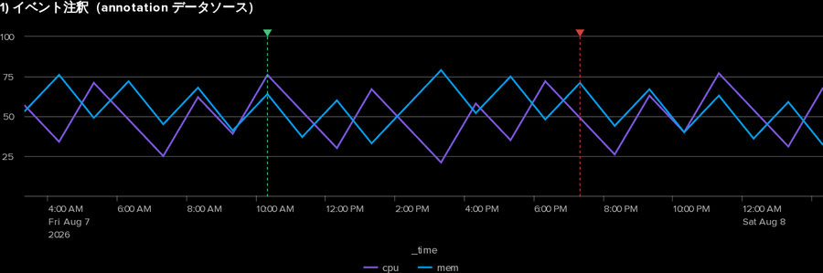

*↑ 緑（デプロイ）と赤（障害検知）の縦線が入り、上端に▼マーカーが出る。
**色はデータ側の `color` 列から来ている**（オプションに色を書いていない）。*

注釈側の SPL（3列にすること）:
```spl
| makeresults count=2 | streamstats count as n
| eval _time=now()-if(n=1,8,17)*3600,
       label=if(n=1,"デプロイ","障害検知"),
       color=if(n=1,"#3fc77a","#d93f3c")
| table _time label color
```

### 2.2 トレリス（ホスト別に小さく並べる）

1枚のチャートを**カテゴリごとに分割**して小さく並べる。

```jsonc
"options": {
    "splitByLayout":      "trellis",   // ← これが有効化キー
    "trellisSplitBy":     "host",
    "trellisColumns":     3,
    "trellisSharedScale": true
}
```

| キー | 既定 | 値 |
|---|---|---|
| `splitByLayout` | `"off"` | `off` / `trellis` |
| `trellisSplitBy` | （SPL の `by` 句から自動） | フィールド名 |
| `trellisColumns` | `3` | 1 以上 |
| `trellisSharedScale` | `true` | 全パネルで軸を揃えるか |
| `trellisMinColumnWidth` | `250` | px |
| `trellisRowHeight` | `180` | px |

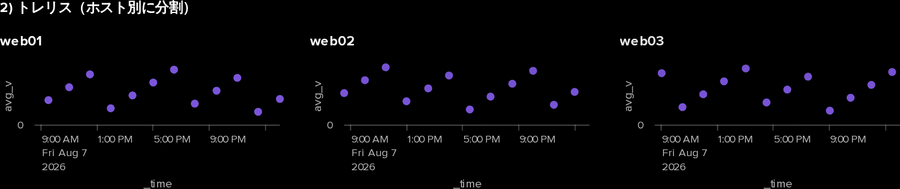

*↑ 1枚のチャートが `web01` / `web02` / `web03` の3枚に分割された。*

> **⚠ `trellisEnabled` というキーは存在しない。**
> 最初これを書いて「トレリスが効かない」と誤診した。書いても**無視されて1枚に潰れる**だけで、
> エラーは出ない。有効化キーは `splitByLayout`。

### 2.3 テーブル（`splunk.table`）

実機から抜いた**本物のスキーマ**（`default` は実測）:

| オプション | 既定 | 説明 |
|---|---|---|
| `showInternalFields` | **`true`** | `_` 始まりの列を表示するか。**`false` にしても `_time` は残る** |
| `showFooterTotals` | `false` | 合計行を最下部に追加 |
| `showFooterPercentages` | `false` | 割合行を最下部に追加 |
| `showRowNumbers` | `false` | 先頭に行番号列 |
| `fontSize` | `"default"` | 10px〜16px（既定 14px） |
| `font` | `"proportional"` | `proportional` / `monospace` |
| `headerVisibility` | `"inline"` | ヘッダ行の出し方 |
| `paginateDataSourceKey` | `"primary"` | ページング・ソートの対象 ds |

**合計行・割合行**（`showFooterTotals` / `showFooterPercentages` / `showRowNumbers`）:

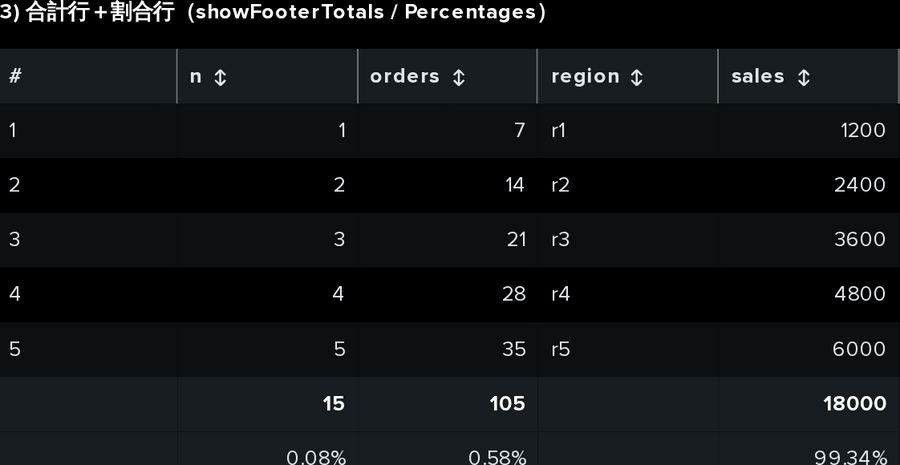

*↑ 最下部に合計（15 / 105 / 18000）と割合の2行が追加され、左端に行番号が付いている。*

**`showInternalFields` の使いどころ**（実機確認済み）:
`_` 始まりのフィールドは**既定では表示される**ので、`_` を付けただけでは隠れない。
`false` を明示して初めて「データとしては持つが列としては見せない」が成立する。

**`"showInternalFields": true`** … `_color_hex` `_rank` が列として見えている:

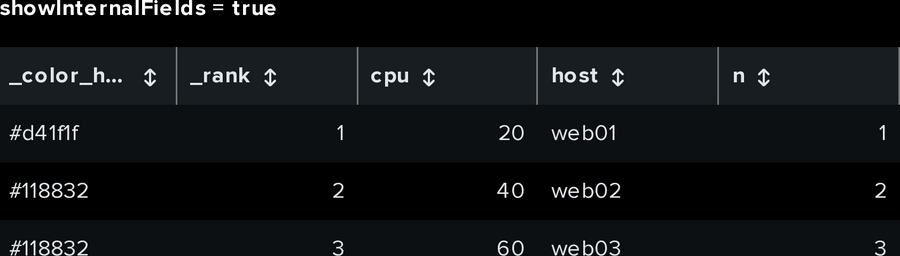

**`"showInternalFields": false`** … `_` 始まりの列だけが消える（`cpu` `host` `n` は残る）:

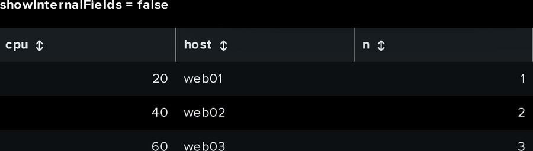

**未指定** … `true` と同じ結果。→ **既定値は `true`**（ドキュメントに明記が無く、これで実測確定）:

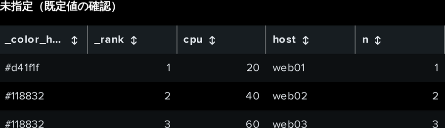

→ 次の §2.3.1 の「隠しフィールドで色を決める」がこの用途の本命。

#### 2.3.1 ⭐ 隠しフィールドの値で他カラムの色を決める（2026-08-07 実機確認済み）

**できる。** `columnFormat.<列名>.rowBackgroundColors` に
**「別の列を指す DOS 式」**を渡すと、その列の値（16進カラーコード）が
**1行ずつ**背景色として使われる。色の元にした列は `showInternalFields: false` で隠せる。

**① `cpu` 列だけを塗る** … 色の元の `_color_hex` は**列として出ていない**:

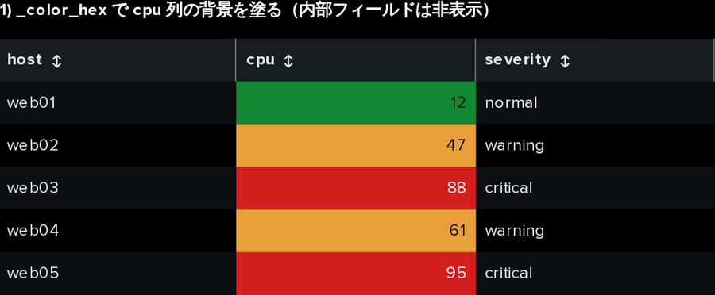

**② 同じ式を3列に書く** … 行全体が塗れる（`host` `cpu` `severity` に同じ DOS 式を指定）:

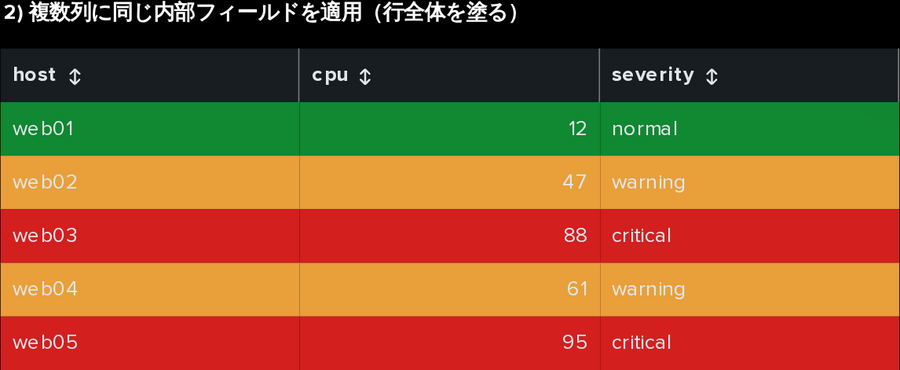

**③ 対照：`showInternalFields: true` にすると色の元が見えてしまう**
… ①②では確かに隠れていた、という証拠。`_text_hex` が文字色（赤背景=白 / 緑背景=黒）に
使われていることも読み取れる:

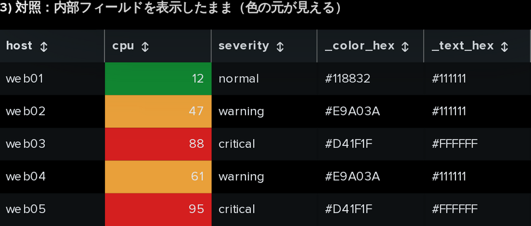

```jsonc
"options": {
    "showInternalFields": false,          // 色の元（_color_hex）を列としては見せない
    "columnFormat": {
        "cpu": {
            "rowBackgroundColors": "> table | seriesByName(\"_color_hex\")",
            "rowColors":           "> table | seriesByName(\"_text_hex\")"   // 文字色も同様
        }
    }
}
```

対応する SPL（**色は SPL 側で決める**ので、しきい値ロジックを SPL に寄せられる）:

```spl
| makeresults count=5 | streamstats count as n
| eval host="web0".n, cpu=case(n=1,12,n=2,47,n=3,88,n=4,61,true(),95),
       severity=case(cpu>=80,"critical", cpu>=40,"warning", true(),"normal"),
       _color_hex=case(cpu>=80,"#D41F1F", cpu>=40,"#E9A03A", true(),"#118832"),
       _text_hex =case(cpu>=80,"#FFFFFF", true(),"#111111")
| table host cpu severity _color_hex _text_hex
```

**要点**（すべて実機で描画確認）:
- `rowBackgroundColors` / `rowColors` はスキーマ上**「色の配列」**。
  `seriesByName()` で列を渡すと**行数分の配列**として解釈され、行ごとに違う色になる。
- **同じ式を複数の列に書けば行全体を塗れる**（`host` / `cpu` / `severity` に同じ式を指定して確認）。
- **色の元の列は `_` 始まりにして `showInternalFields: false` で隠す**のが定石。
  `_` を付けなくても動くが、その場合は色の元の列が表として見えてしまう。
- **文字色（`rowColors`）も併せて指定する**。背景を濃い赤にすると既定の文字色では読めない。

`columnFormat.<列名>` の他のプロパティ（実機のスキーマから抽出）:

| プロパティ | 用途 |
|---|---|
| `rowBackgroundColors` | セル背景色の配列（**行ごと**） |
| `rowColors` | セル文字色の配列（**行ごと**） |
| `width` | 列幅（px。最小 30） |
| `align` / `headerAlign` | `left` / `center` / `right` / `auto` |
| `textOverflow` | `anywhere` / `break-word` / `ellipsis` |
| `cellTypes` | `TextCell` / `ArrayCell` / `SparklineCell` |
| `sparklineColors` / `sparklineAreaColors` / `sparklineTypes` | セル内スパークラインの色・種別 |
| `footer` | 合計行の書式（DSL 式） |

> **補足**：カスタム viz で `editor.tableDynamicColor` / `editor.tableColumnFormatter` は
> **編集パネルが操作不能になる**ため使えない（[studio-extension-viz.md](studio-extension-viz.md)）。
> だが**標準テーブルなら上記の `columnFormat` で同じことができる**。
> 「値→色」だけが目的ならカスタム viz を作る必要はない。

#### 2.3.2 ⭐ カラーコード列を持たずに「値の範囲」で色を決める（2026-08-07 実機確認済み）

**§2.3.1 のように SPL 側で 16進コードを作る必要はない。**
DOS の **`rangeValue()`（数値の範囲）** と **`matchValue()`（値の一致）** を使えば、
**配色ルールをダッシュボード側（`context`）に置ける**。SPL は素の値だけを返せばよい。

**以下の3枚とも、データには色の列が1つも無い**（`host` / `cpu` / `severity` だけ）。

**どちらを選ぶか**:

| 状況 | 使うもの | 配色ルールの置き場所 |
|---|---|---|
| しきい値が**数値の範囲** | **`rangeValue()`** | ダッシュボードの `context` |
| **文字列カテゴリ**（severity 等）に色を割り当てる | **`matchValue()`** | ダッシュボードの `context` |
| 配色ロジックを**SPL 側に持たせたい**（SPL だけで完結させる） | §2.3.1 の `_color_hex` 方式 | SPL の `eval` |

##### `rangeValue()` — 数値の範囲

```jsonc
"visualizations": {
    "viz_range": {
        "type": "splunk.table",
        "dataSources": { "primary": "ds_main" },
        "options": {
            "columnFormat": {
                "cpu": {
                    "rowBackgroundColors": "> table | seriesByName(\"cpu\") | rangeValue(cpuRange)"
                }
            }
        },
        "context": {                         // ← viz と同じ階層。options の中ではない
            "cpuRange": [
                { "to": 40, "value": "#118832" },              // 40 未満
                { "from": 40, "to": 80, "value": "#E9A03A" },  // 40 以上 80 未満
                { "from": 80, "value": "#D41F1F" }             // 80 以上
            ]
        }
    }
}
```

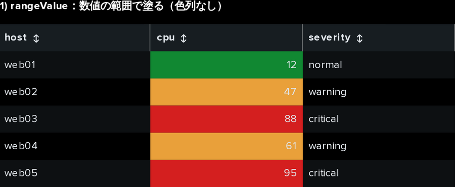

**境界の扱い**（実装を読んで確認）：`from` は **以上**、`to` は **未満**（`e >= from && e < to`）。
`from` だけなら「以上」、`to` だけなら「未満」。**どこにも当たらないと色が付かない**ので、
上端・下端は `from` / `to` を省いて開区間にしておく。

##### `matchValue()` — 文字列・値の一致

```jsonc
"options": {
    "columnFormat": {
        "severity": {
            "rowBackgroundColors": "> table | seriesByName(\"severity\") | matchValue(sevMatch)"
        }
    }
},
"context": {
    "sevMatch": [                                    // ← 配列を直接渡す
        { "match": "critical", "value": "#D41F1F" },
        { "match": "warning",  "value": "#E9A03A" },
        { "match": "normal",   "value": "#118832" }
    ]
}
```

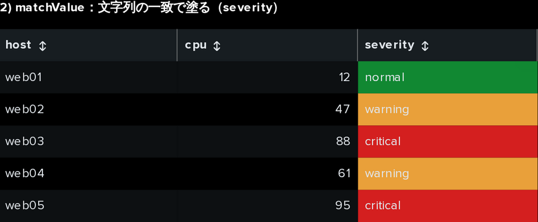

> **⚠ `matchValue` の引数は「配列そのもの」。**
> `{ "matches": [...], "default": "..." }` のようなオブジェクトで包むと**色が付かない**
> （エラーは出ない。実機で一度これで失敗した）。実装は `this.matches = rawTree(引数)` で、
> 既定値は**第2引数**（`matchValue(config, defaultColor)`）。

**ワイルドカードが使える**（実装で確認・実機で描画確認）：`match` に `*` を書ける。
`"web0*"` は `web01`〜`web05` すべてに一致した。`"*"` は全一致（既定色として使える）。
複数当たった場合は**より具体的なパターンが優先**される（`*` の数が少ないほど優先）。

##### 別の列の値で塗れる（重要）

`seriesByName()` に**塗りたい列とは違う列**を指定してよい（実機確認済み）。
「cpu の値で host 列を塗る」ができるので、**数値を見せずに状態だけ色で伝える**使い方ができる。

```jsonc
"columnFormat": {
    "host": { "rowBackgroundColors": "> table | seriesByName(\"cpu\") | rangeValue(cpuRange)" }
}
```

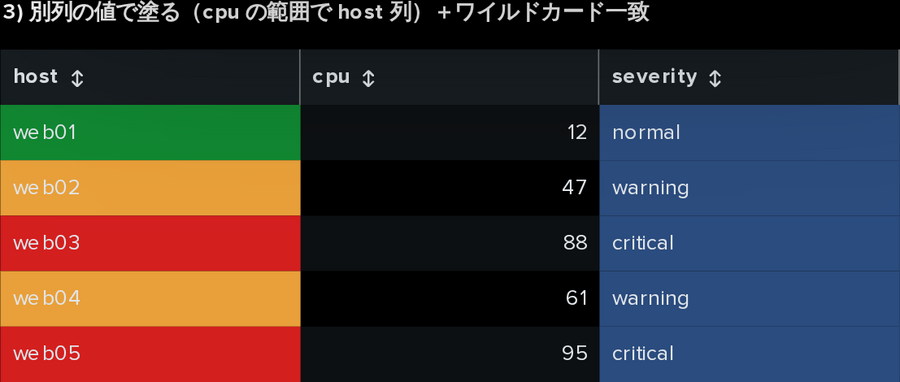

*↑ **`host` 列が cpu の値で塗られている**（cpu 列自体は無色）。
右の `severity` 列は `matchValue` の `web0*` ワイルドカードが全行に当たって青一色。*

##### 使い分けの指針

- **配色を運用側で変えたい**（しきい値をダッシュボード編集で調整）→ `rangeValue` / `matchValue`
- **配色ロジックが複雑**（複数フィールドの組み合わせで決まる）→ §2.3.1 の `_color_hex` 方式
  （`case()` に任意の条件を書けるので表現力はこちらが上）

#### 2.3.3 ⭐ DOS フォーマッタ関数の一覧（裏技の宝庫・2026-08-07 実機確認済み）

`rangeValue` / `matchValue` は**氷山の一角**。バンドル内の**関数レジストリ**に
**17 個**の DOS フォーマッタが登録されている（`| 関数名(引数)` の形でパイプでつなげる）:

```
gradient  lerp  matchValue  prefix  rangeValue  pick  multiFormat  type
formatByType  frame  prepend  objects  setColorChannel  maxContrast
renameSeries  divideBy  subtract
```

**17個すべてを実機で描画確認した**：`gradient` / `maxContrast` / `divideBy` / `subtract` /
`lerp` / `prefix` / `multiFormat` / `pick` / `setColorChannel` / `type` / `formatByType` /
`rangeValue` / `matchValue` / `frame` / `renameSeries` / `prepend` / `objects`。

**書く場所が2種類ある**（ここを間違えると無反応になる）:

| 対象 | 書く場所 | 例 |
|---|---|---|
| **セルの値・色**（列単位） | `options.columnFormat.<列名>.{data,rowBackgroundColors,rowColors}` | `gradient` / `rangeValue` / `divideBy` / `pick` |
| **表の構造**（列の増減・順序・見出し・行の追加） | **`options.table`** ＋ `options.headers` | **`frame` / `renameSeries` / `prepend`** |
| 表全体を見て振り分け | `options.columnFormat.<列名>.data` に**列指定なし**で | `multiFormat` |
| **入力の選択肢** | **`inputs.<id>.options.items`** | **`objects`**（§2.14 レシピ2） |

**ほぼ公式ドキュメントに無い。** 以下は実機で描画確認したもの。

**以下、関数ごとに実機画面を1枚ずつ載せる**（同じデータ・同じテーブルで、式だけを変えたもの）。

##### `gradient(config)` — しきい値を決めずに連続グラデーション

値の最小〜最大を色の配列に写像する。**しきい値を1つも決めなくてよい**のが利点。

```jsonc
"columnFormat": { "cpu": {
    "rowBackgroundColors": "> table | seriesByName(\"cpu\") | gradient(heat)" } },
"context": { "heat": { "colors": ["#118832", "#E9A03A", "#D41F1F"] } }
```

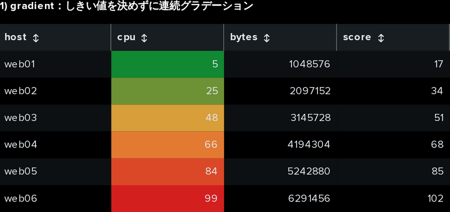

*↑ **しきい値を1つも書いていない**のに、値の小→大が緑→橙→赤に連続で変化している。*

`rangeValue` との使い分け：**区分が意味を持つ**（normal/warning/critical）なら `rangeValue`、
**相対的な大小を見たい**（ヒートマップ的）なら `gradient`。

##### `maxContrast(config)` — 文字色を自動で読みやすくする ⭐

**背景色を渡すと、候補色の中から最もコントラストが高いものを返す。**
`_text_hex` を手で管理する必要がなくなる（§2.3.1 でやっていたことが不要になる）。

```jsonc
"columnFormat": { "cpu": {
    "rowBackgroundColors": "> table | seriesByName(\"cpu\") | gradient(pale)",
    "rowColors":           "> table | seriesByName(\"cpu\") | gradient(pale) | maxContrast(bw)" } },
"context": {
    "pale": { "colors": ["#FFF7B2", "#FFD166", "#0B3D2E"] },
    "bw":   { "colors": ["#FFFFFF", "#000000"], "default": "#FFFFFF" }
}
```

**実機で効果を確認**：明るい黄色の行では黒文字、濃い緑の行では白文字に自動で切り替わった。

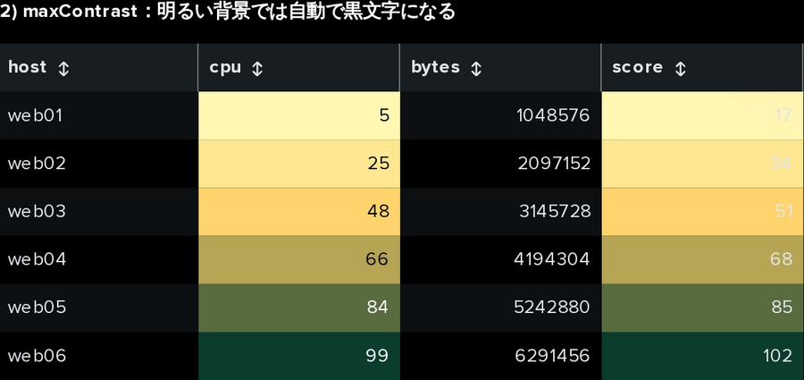

*↑ **1枚の中に対照が入っている。** `cpu` 列（`maxContrast` あり）はどの行も読めるが、
**`score` 列は背景が同じなのに上3行がほぼ読めない**（文字色が既定の白のまま）。
違いは文字色の指定だけ。*

⚠ **入力が `type:"color"` のときだけ働く**（実装より）。`gradient` / `rangeValue` /
`matchValue` の**後ろにパイプでつなぐ**こと。生の数値に対しては何もしない。
⚠ 検証時の注意：**緑/橙/赤のような中間輝度のパレットでは白黒のコントラスト差がほぼ無く、
効果が見た目に出ない**。最初これで「効いていないのでは」と誤解しかけた。
明暗差の大きいパレットで確認すること。

##### `divideBy(n)` — SPL を変えずに単位を変える（`subtract(n)` は同型・未検証）

```jsonc
"columnFormat": { "bytes": {
    "data": "> table | seriesByName(\"bytes\") | divideBy(1048576)" } }
```
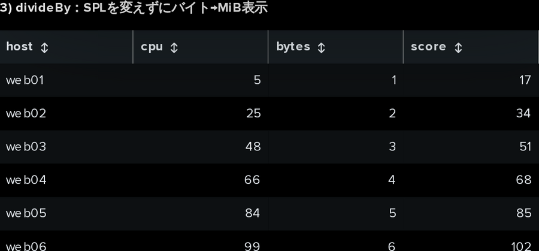

*↑ `bytes` 列が `1048576` → `1`、`2097152` → `2` … と MiB になっている（SPL は無変更）。
同じサーチを複数パネルで使い回しているときに、片方だけ単位を変えられる。*

##### `lerp(config)` — 値域を別の値域に写像

```jsonc
"data": "> table | seriesByName(\"score\") | lerp(toRatio) | formatByType(round2)",
"context": {
    "toRatio": { "inputMin": 0, "inputMax": 102, "outputMin": 0, "outputMax": 1 },
    "round2":  { "number": { "precision": 2 } }
}
```
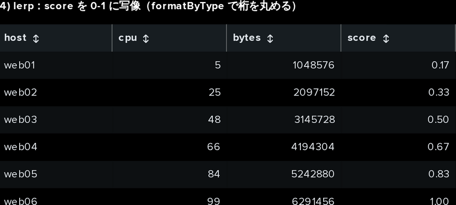

*↑ `score`（17〜102）が 0.17〜1.00 に写像されている。*

**4つとも有限数でないと例外**（`inputMin`/`inputMax`/`outputMin`/`outputMax`）。
⚠ **そのままだと `0.16666666666666666` のように出る**ので、
`formatByType({number:{precision:N}})` を**後ろにつないで丸める**（上の画像は丸めた後）。

##### `prefix("文字")` — 値の前に文字を足す

```jsonc
"data": "> table | seriesByName(\"host\") | prefix(\"srv-\")"
```
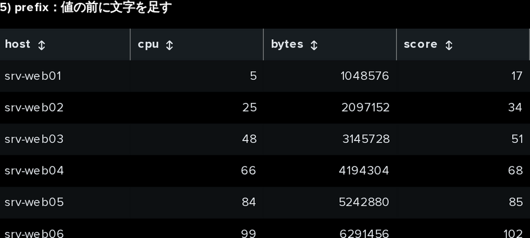

*↑ `host` 列が `web01` → `srv-web01`。表示だけ変わり、**元の値は変わらない**
（ソートや色判定は元の値のまま）。*

##### `multiFormat(config)` — 行ごとに違う書式を当てる ⭐

**1つの列の中で、行によって別々のフォーマッタを使い分ける。**
「単位がバラバラの値が1列に入っている」ときに効く。

```jsonc
"columnFormat": { "amount": { "data": "> table | multiFormat(mf)" } },
"context": {
    "mf": {
        "nameField":  "unit",      // ← この列の値で振り分ける
        "valueField": "amount",    // ← 実際に整形する列
        "formatters": {
            "bytes": { "type": "divideBy", "config": 1024 },
            "pct":   { "type": "prefix",   "config": "%" },
            "ms":    { "type": "prefix",   "config": "ms " }
        }
    }
}
```

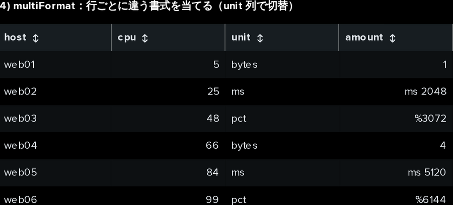

*↑ `unit` 列の値に応じて `amount` の書式が変わる。`bytes` の行は 1024→`1` に割られ、
`ms` の行は `ms 2048`、`pct` の行は `%3072` になっている。*

⚠ **`| multiFormat(...)` は `seriesByName()` を挟まずテーブル全体に対して書く**
（`nameField` / `valueField` で列を指定するため）。
`formatters` の `type` にはレジストリの関数名を書く（未知の名前は
`unknown formatter type "..."` で例外）。

##### `pick(array)` — データと無関係に行ごとの値を配る（ゼブラ縞）

**値を見ずに行番号で配列を巡回する**（実装は `config[行番号 % 配列長]`）。
データに色の情報が無くても**交互に色を変えられる**。

```jsonc
"columnFormat": {
    "host":   { "rowBackgroundColors": "> table | seriesByName(\"host\")   | pick(zebra)" },
    "cpu":    { "rowBackgroundColors": "> table | seriesByName(\"cpu\")    | pick(zebra)" }
},
"context": { "zebra": ["#1A1C20", "#24262B"] }
```

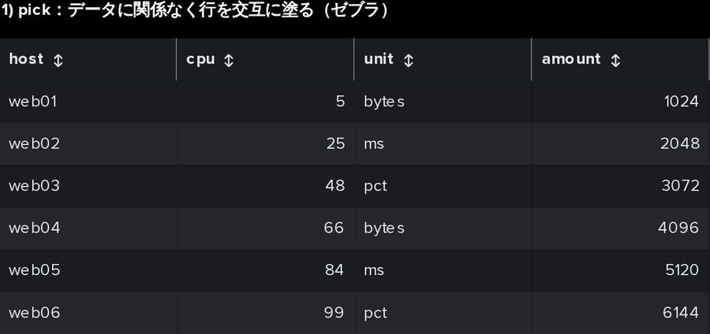

*↑ 値に関係なく1行おきに背景が変わっている。**全列に同じ式を書く**必要がある。*

##### `setColorChannel(config)` — 色の1チャンネルだけを変える

`channel`（`hsv.v` / `hsv.s` / `rgb.r` など）と `value` を指定して、
**既存の色の明度・彩度だけを変える**。同じ配色の「弱い版」を作れる。

```jsonc
"columnFormat": {
    "cpu":    { "rowBackgroundColors": "> table | seriesByName(\"cpu\") | gradient(heat)" },
    "amount": { "rowBackgroundColors": "> table | seriesByName(\"cpu\") | gradient(heat) | setColorChannel(dim)" }
},
"context": {
    "heat": { "colors": ["#118832", "#E9A03A", "#D41F1F"] },
    "dim":  { "channel": "hsv.v", "value": 0.35 }
}
```

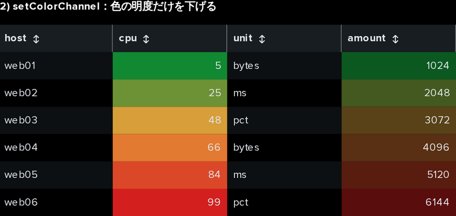

*↑ 左の `cpu` 列と右の `amount` 列は**同じグラデーション**だが、右は明度 0.35 に落として
沈ませてある。主役の列だけを鮮やかにし、補助列は暗く、という使い分けができる。*

⚠ `maxContrast` と同じく**入力が色のときだけ働く**。`transparent` には使えない（例外になる）。

##### `type()` — 値の型を出す（null 検出）

```jsonc
"columnFormat": { "num": { "data": "> table | seriesByName(\"num\") | type()" } }
```

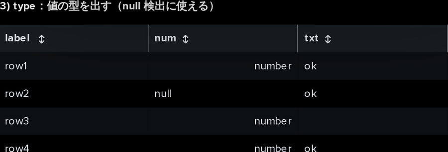

*↑ 値そのものではなく **`number` / `null` という型名**が出る。
2行目の `num` が `null`、3行目の `txt` が空欄（＝`null`）だと分かる。
**SPL を変えずに「どのセルが欠損か」を可視化できる**。*

##### `subtract(n)` — 基準値からの差分にする

```jsonc
"columnFormat": { "cpu": { "data": "> table | seriesByName(\"cpu\") | subtract(100)" } }
```

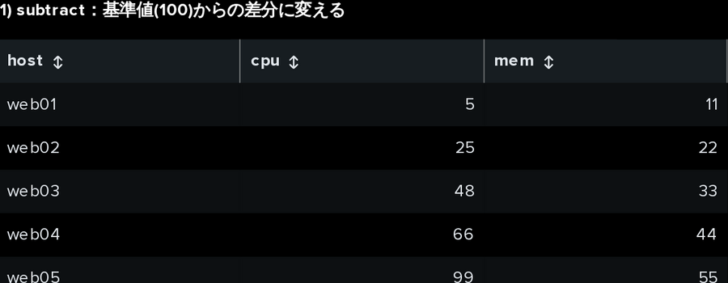

*↑ 105 → 5、199 → 99。「基準値からの乖離」を見せたいときに SPL を変えずに済む。*

##### ⭐ `frame` / `renameSeries` / `prepend` — 表そのものを組み立て直す

**この3つは `columnFormat` ではなく `options.table` に書く**（表全体を差し替える）。
Splunk 標準 viz 自身が `> frame(label, value) | prepend(...)` の形で使っている。

**列を選んで並べ替える**（`frame`）:

```jsonc
"options": {
    "table":   "> frame(colMem, colHost)",     // ← この順に列が並ぶ
    "headers": "> table | getField()"
},
"context": {
    "colMem":  "> primary | seriesByName(\"mem\")",
    "colHost": "> primary | seriesByName(\"host\")"
}
```

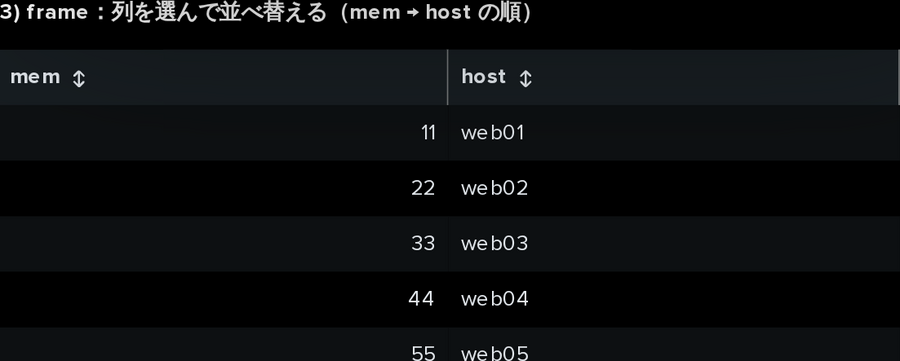

*↑ 元データは `host, cpu, mem` の順だが、**`mem` → `host` の2列だけ**に組み替わっている
（`cpu` は出ない）。SPL の `| table` を書き換えずに、パネルごとに違う列構成にできる。*

**列見出しを変える**（`renameSeries`）:

```jsonc
"context": {
    "colCpu": "> primary | seriesByName(\"cpu\") | renameSeries(\"CPU使用率\")"
}
```

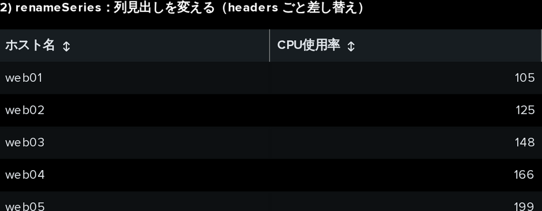

*↑ 見出しが `host` `cpu` → **`ホスト名` `CPU使用率`** になった。
SPL の `rename` を使わずに、**同じサーチを使い回したまま**パネルごとに見出しを変えられる。*

> **⚠ `columnFormat.<列>.data` に `renameSeries` を書いても見出しは変わらない**（実機で確認）。
> 見出しは `headers`（既定 `> table | getField()`）から来るので、
> **`options.table` ごと差し替えて `headers` に拾わせる**必要がある。
> 最初これで「`renameSeries` は効かない」と誤診しかけた。

**先頭に行を差し込む**（`prepend`）:

```jsonc
"context": {
    "colHost2": "> primary | seriesByName(\"host\") | prepend(\"合計\")",
    "colCpu2":  "> primary | seriesByName(\"cpu\")  | prepend(743)"
}
```

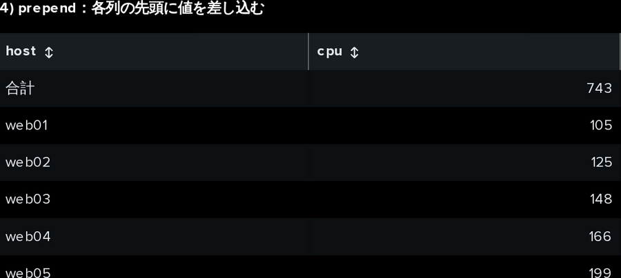

*↑ 最上部に「合計 / 743」の行が入った。`showFooterTotals` は**下**にしか出せないので、
**上に置きたいときはこれ**。値は自分で計算して渡す。*

##### `objects()` — 入力の選択肢を組み立てる（実機確認済み）

DataFrame を「1行＝1オブジェクト」の配列に変換する。**用途は入力（`input.dropdown` /
`input.multiselect`）の `items`** で、テーブル表示用ではない。
`> frame(label, value) | prepend(staticRow) | objects()` の形で使う。
→ **具体例と実機画面は §2.14 レシピ2**。
ソート用のキーも `_ord` にしておけば `fields - ord` が不要になる。

### 2.4 第2Y軸（単位の違う2系列を1枚に）

```jsonc
"options": {
    "overlayFields":      "mem",    // 重ねるフィールド（複数可）
    "showOverlayY2Axis":  true,     // 右側に第2Y軸を出す
    "y2AxisScale":        "linear"  // linear / log
}
```
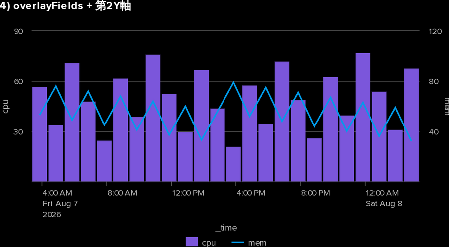

*↑ 棒（cpu・左軸 0〜90）と線（mem・右軸 0〜120）が**別々の軸**で1枚に収まっている。*

`lineWidth`（既定 2）と `lineDashStyle`（既定 `solid`）でオーバーレイ線の見た目を変えられる。

### 2.5 軸・欠損・積み上げ

| オプション | 既定 | 値 |
|---|---|---|
| `yAxisScale` / `xAxisScale` / `y2AxisScale` | `"linear"` | `linear` / `log` |
| `nullValueDisplay` | `"gaps"` | `gaps`（欠く）/ `zero`（0扱い）/ `connect`（線を繋ぐ） |
| `stackMode` | `"auto"` | `auto` / `stacked` / `stacked100` |
| `dataValuesDisplay` | `"off"` | `off` / `all` / `minmax`（**データラベルの表示**） |
| `legendDisplay` | `"right"` | `right` / `left` / `top` / `bottom` / `off` |
| `legendTruncation` | `"ellipsisEnd"` | `ellipsisEnd` / `ellipsisMiddle` / `ellipsisStart` / `ellipsisOff` |

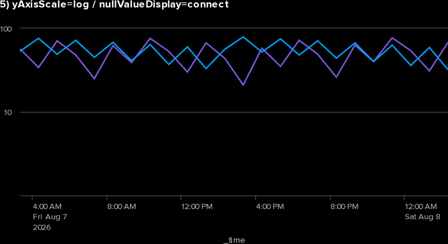

*↑ `yAxisScale: "log"`。Y軸の目盛が 10 / 100 と対数間隔になっている。*

`stacked100` は「構成比の推移」をそのまま出せる（SPL 側で割合を計算しなくてよい）。
`dataValuesDisplay: "minmax"` は**最大最小だけラベルを出す**ので、線が汚れずに済む。

### 2.6 Single Value の飾り

| オプション | 既定 | 値 |
|---|---|---|
| `sparklineDisplay` | `"below"` | **`before` / `after` / `below` / `off`** |
| `trendDisplay` | `"absolute"` | `percent` / `absolute` / `off` |
| `unit` / `unitPosition` | — / `"after"` | `before` / `after` |
| `shouldUseThousandSeparators` | `true` | 桁区切り |
| `showSparklineAreaGraph` | `false` | 折れ線ではなく塗り |
| `showSparklineTooltip` | `false` | スパークラインにツールチップ |
| `sparklineNullValueDisplay` | `"gaps"` | `gaps` / `zero` / `connect` |

### 2.7 `splunk.punchcard`（曜日×時刻の密度）

```spl
| ... | table day hour hits      ← 3列に絞ること
```

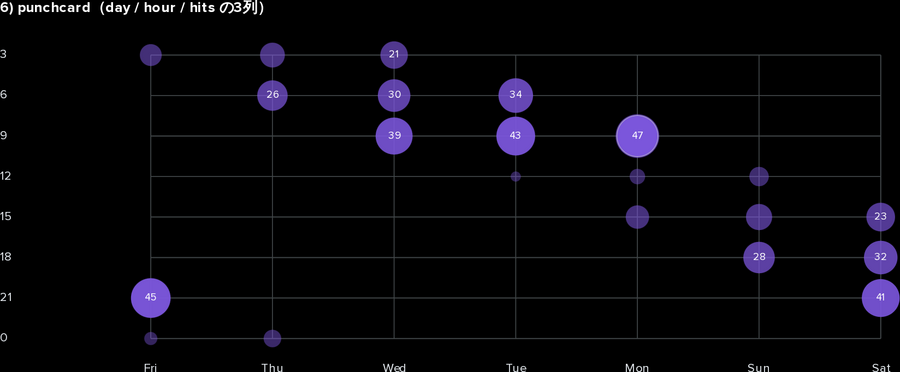

*↑ 曜日（横）×時刻（縦）の位置に、件数の大小が円の大きさで出る。*

> **⚠ 列が3つ（x, y, サイズ）でないと空になる。**
> 5列のデータを渡して**真っ白**になり、一度「punchcard は動かない」と誤診した。
> 実際は列数が合っていなかっただけで、3列にしたら描画された（実機確認済み）。

### 2.8 `ds.chain`（1本のサーチを使い回す）

同じサーチ結果に別の後処理をかけたパネルを増やすとき、**サーチを実行し直さない**。

```jsonc
"ds_chained": {
    "type": "ds.chain",
    "options": {
        "extend": "ds_chain_base",          // 親のデータソース
        "query":  "| stats sum(bytes) as total by region"
    }
}
```

### 2.9 `splunk.markdown`（サーチ不要のテキスト）

```jsonc
"viz_md": {
    "type": "splunk.markdown",
    "options": {
        "markdown": "### 見出し\n\n- 手順や注記\n- `コード` も書ける",
        "fontSize": "medium"
    }
}
```
`dataSources` を**書かない**（データ不要）。ヘッダ・フッタ・注記に使う。

---

### 2.10 ⭐ `ds.test` — サーチを1行も書かずにデータを表示する（2026-08-07 実機確認済み）

**データソースの種類は `ds.search` / `ds.chain` / `ds.savedSearch` だけではない。
`ds.test` は JSON に直接データを書ける。**

```jsonc
"dataSources": {
    "ds_test": {
        "type": "ds.test",
        "options": {
            "data": {
                "fields":  [ { "name": "host" }, { "name": "cpu" } ],
                "columns": [ ["alpha", "beta", "gamma"], [11, 22, 33] ]   // ← 列ごとの配列
            }
        },
        "name": "サーチ不要のダミーデータ"
    }
}
```

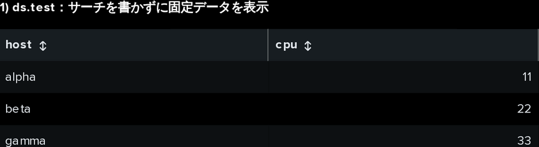

*↑ **サーチを1本も実行していない**のにテーブルが描画されている。*

**使いどころ**:
- **凡例・注記の代わり**（色見本の表など、検索する必要がない固定表）
- **レイアウト検討**：サーチの完了を待たずに配置を確認できる（撮影も速い）
- **カスタム viz の動作確認**：データ側の揺らぎを排除して viz だけを試せる

⚠ `columns` は**「行の配列」ではなく「列の配列」**（`fields` の順に対応）。
⚠ 編集 UI からの作成はフィーチャーフラグで塞がれていることがある（**JSON に直接書けば動く**）。

### 2.11 パネルタイトルにトークンを埋め込む

`title` に `$トークン名$` を書くと**そのまま展開される**（実機確認済み）。

```jsonc
"title": "2) パネルタイトルにトークン → 選択中: $tok_host$"
```

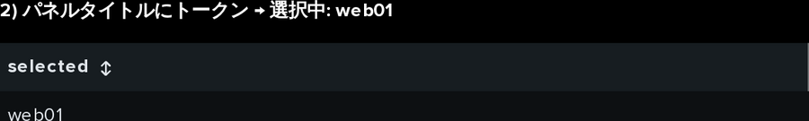

*↑ ドロップダウンで選んだ `web01` がタイトルに出ている。
「今どの条件で見ているのか」をパネル自身に語らせられる。*

### 2.12 `splunk.rectangle` / `splunk.ellipse` — サーチ不要の図形

```jsonc
"viz_shape": {
    "type": "splunk.rectangle",
    "options": { "fillColor": "#1E3A5F", "strokeColor": "#4FA3E3", "strokeWidth": 3, "rounded": true }
}
```

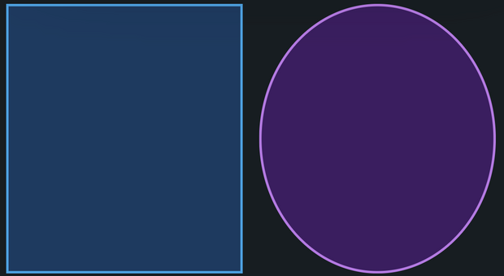

*↑ 左が `splunk.rectangle`（`rounded: true`）、右が `splunk.ellipse`。*

**背景の区切り・グルーピング枠**として使える（パネルの後ろに敷く）。
⚠ **図形パネルにはタイトルバーが出ない**（`title` を書いても表示されない。実機で確認）。
`dataSources` は不要。

---

### 2.13 ⭐ 入力（inputs）で踏んだ落とし穴（2026-08-07 実機確認済み）

**Simple XML で使えた入力オプションの多くが Studio では無効**。バンドルの移行マップで
`{delimiter:!1, valuePrefix:!1, valueSuffix:!1, prefix:!1, suffix:!1}` と
**`!1`（=false／未対応）** になっている。

#### multiselect は「カンマ区切り」で固定 → SPL 側で分解する

```jsonc
"in_multi": {
    "type": "input.multiselect",
    "options": {
        "token": "tok_hosts",
        "defaultValue": ["web01", "web03"],
        "items": [ {"label":"web01","value":"web01"}, … ]
    }
}
```

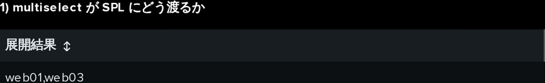

*↑ トークンには **`web01,web03`（カンマ区切り）** がそのまま入る。*

> **⚠ `delimiter` / `prefix` / `suffix` / `valuePrefix` / `valueSuffix` は Studio では効かない**
> （実機で確認。エラーも警告も出ずに**黙って無視される**）。
> Simple XML では `(host="web01" OR host="web03")` を組み立てられたが、**Studio ではできない**。

**正しい書き方**：`split()` と `IN` で SPL 側に寄せる（実機で動作確認済み）。

```spl
| where host IN (split("$tok_hosts$", ","))
```

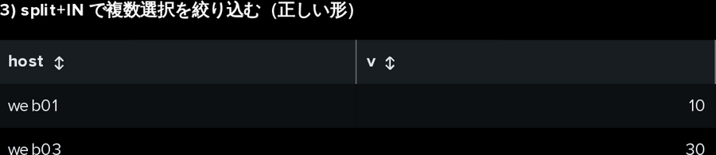

*↑ `web01` と `web03` だけに絞り込めている。*

#### timerange は「文字列トークン」ではない

```jsonc
"in_time": {
    "type": "input.timerange",
    "options": { "token": "global_time", "defaultValue": "-24h@h,now" }   // ← 文字列
},
"ds_x": {
    "type": "ds.search",
    "options": {
        "query": "… | addinfo | eval 開始=strftime(info_min_time,\"%m/%d %H:%M\") …",
        "queryParameters": { "earliest": "$global_time.earliest$", "latest": "$global_time.latest$" }
    }
}
```

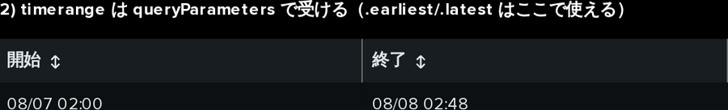

*↑ `-24h@h,now` が実際に検索へ適用され、`08/07 02:00 〜 08/08 02:47` と出ている。*

**踏んだ間違い3つ**（すべて実機で症状を確認）:

| 書き方 | 症状 |
|---|---|
| `"defaultValue": {"earliest":"-24h@h","latest":"now"}`（オブジェクト） | **`Invalid earliest_time.`**。正しくは**カンマ区切りの文字列** `"-24h@h,now"` |
| SPL 本文に `"$tok_time$"` と書く | **`[object Object]`** になる。時間トークンは**文字列として展開できない** |
| SPL 本文に `"$tok_time.earliest$"` と書く | **`Set token value to render visualization`**。`.earliest` が使えるのは **`queryParameters` の中だけ** |

**適用中の時間範囲を画面に出したい**なら **`| addinfo`** を付けて
`info_min_time` / `info_max_time` を読む（`makeresults` だけでは**この2つが存在しない**ので
0件になる。これも実機で踏んだ）。

---

## 2.14 ⭐ 実用レシピ（検証済み DOS の組み合わせ）

個々の関数より、**組み合わせたときに効く**。以下はすべて実機で描画確認済み。

### レシピ1：SLO 表（換算・丸め・改名・色分け・文字色を一度に）

**6つの DOS 関数を1枚のパネルで連結**している例:

```jsonc
"options": {
    "table":   "> frame(colSvc, colRate)",
    "headers": "> table | getField()",
    "columnFormat": {
        "達成率(%)": {
            "rowBackgroundColors": "> table | seriesByName(\"達成率(%)\") | rangeValue(sloRange)",
            "rowColors":           "> table | seriesByName(\"達成率(%)\") | rangeValue(sloRange) | maxContrast(bw)"
        }
    }
},
"context": {
    "colSvc":  "> primary | seriesByName(\"service\") | renameSeries(\"サービス\")",
    "colRate": "> primary | seriesByName(\"success\") | divideBy(1000) | formatByType(p2) | renameSeries(\"達成率(%)\")",
    "p2": { "number": { "precision": 2 } },
    "sloRange": [
        { "to": 99,            "value": "#D41F1F" },
        { "from": 99, "to": 99.9, "value": "#E9A03A" },
        { "from": 99.9,        "value": "#118832" }
    ],
    "bw": { "colors": ["#FFFFFF", "#000000"], "default": "#FFFFFF" }
}
```

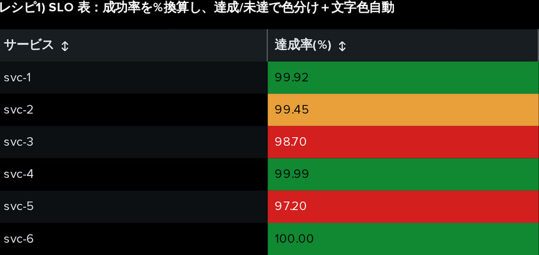

*↑ 生データは `success=99920 / total=100000`。それを **÷1000 → 小数2桁 → 日本語見出し →
99.9% 未満で橙・99% 未満で赤 → 文字色は自動**まで、**SPL を一切変えずに**やっている。*

**なぜ嬉しいか**：しきい値（99 / 99.9）が**ダッシュボード JSON 側にある**ので、
SLO の目標値を変えるときに**サーチを触らなくてよい**。同じサーチを別パネルで
別のしきい値で見ることもできる。

### レシピ2：サーチ結果から作る動的ドロップダウン（「すべて」付き）

**Splunk 標準の入力が内部で使っている書き方**（`frame` → `prepend` → `objects`）:

```jsonc
"in_dyn": {
    "type": "input.dropdown",
    "dataSources": { "primary": "ds_hosts" },
    "options": {
        "token": "tok_host",
        "defaultValue": "*",
        "items": "> frame(label, value) | prepend(staticRow) | objects()"
    },
    "context": {
        "label":     "> primary | seriesByName(\"host\") | renameSeries(\"label\")",
        "value":     "> primary | seriesByName(\"host\") | renameSeries(\"value\")",
        "staticRow": [["すべて"], ["*"]]      // ← 先頭に固定の選択肢を足す
    }
}
```

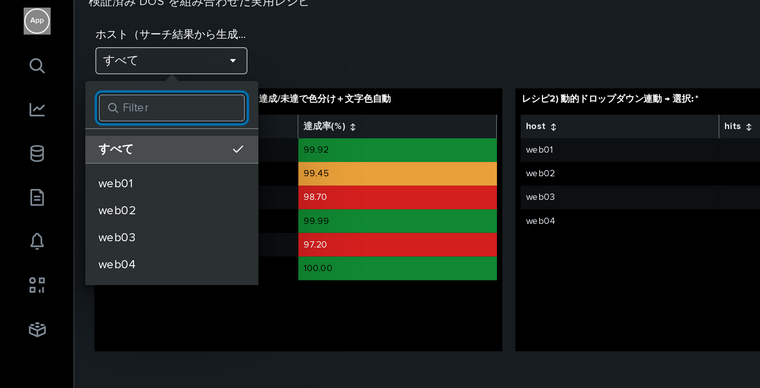

*↑ **選択肢がサーチ結果から生成**され（web01〜web04）、先頭に固定の「すべて」が入っている。
実機で取得した選択肢：`["すべて","web01","web02","web03","web04"]`。
絞り込み用の Filter 欄も自動で付く。*

**これで `objects()` の用途も判明した**（§2.3.3 で未検証としていたもの）:
**入力の `items` を組み立てるための関数**で、テーブル表示用ではない。

⚠ `staticRow` は **「列ごとの配列」**（`[[ラベル列], [値列]]`）。
`ds.test` の `columns` と同じ並びで、**行の配列ではない**。

### レシピ3：ゼブラ縞＋単位付き

```jsonc
"columnFormat": {
    "total": {
        "rowBackgroundColors": "> table | seriesByName(\"total\") | pick(zebra)",
        "data":                "> table | seriesByName(\"total\") | divideBy(1000) | formatByType(p0)"
    }
},
"context": {
    "zebra": ["#16181C", "#20242A"],
    "p0": { "number": { "precision": 0, "unit": "k", "unitPosition": "after" } }
}
```

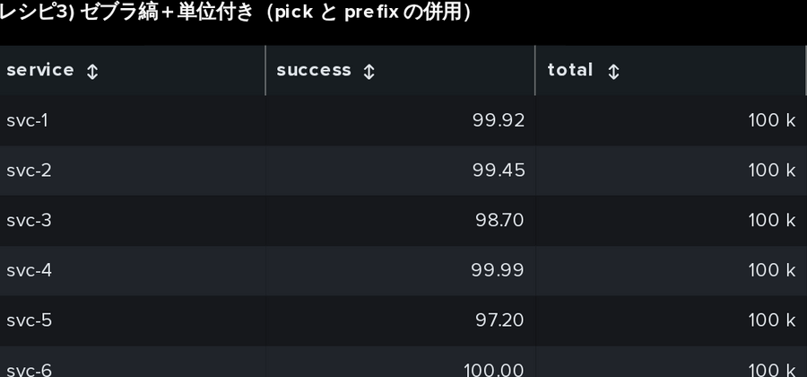

*↑ 行が交互に沈み、`100000` が **`100 k`** になっている
（`formatByType` は `unit` / `unitPosition` も受け取れる）。*

---

## 2.15 ⭐⭐ DOS で変換した列は、ドリルダウンに「変換後」の値が渡る（2026-08-07 実機確認済み）

**結論：`columnFormat.<列>.data` で変換すると、トークンに入るのも変換後の値。**
生の値は**取れない**。**これは実害が出やすいので必ず意識すること。**

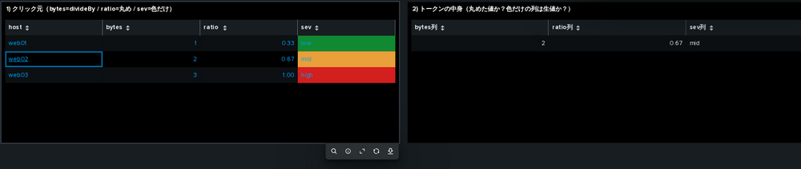

*↑ 左でクリックした `web02` の行に対し、右がトークンの中身。
`bytes` は生値 **2097152** ではなく **`2`**（`divideBy(1048576)` の結果）、
`ratio` は **0.6666…** ではなく **`0.67`**（`formatByType` で丸めた結果）が渡っている。*

検証に使った設定:

```jsonc
"options": {
    "columnFormat": {
        "bytes": { "data": "> table | seriesByName(\"bytes\") | divideBy(1048576)" },
        "ratio": { "data": "> table | seriesByName(\"ratio\") | formatByType(p2)" },
        "sev":   { "rowBackgroundColors": "> table | seriesByName(\"sev\") | matchValue(sevMap)" }
    }
},
"eventHandlers": [
    { "type": "drilldown.setToken", "options": { "tokens": [
        { "token": "tok_row_bytes", "key": "row.bytes.value" },
        { "token": "tok_row_ratio", "key": "row.ratio.value" },
        { "token": "tok_row_sev",   "key": "row.sev.value"   }
    ] } }
]
```

### 分かれ目は「`data` を変えたか」だけ

| 何をしたか | 表示 | **トークンに入る値** |
|---|---|---|
| `columnFormat.<列>.**data**` で変換（`divideBy` / `formatByType` / `prefix` など） | 変換後 | **変換後**（生値は失われる） |
| `columnFormat.<列>.**rowBackgroundColors** / **rowColors**` だけ（`matchValue` / `gradient` など） | 色が付くだけ | **生値のまま** |

上の画像の `sev` 列がその証拠で、**色は付いているのにトークンには生の `mid` が入っている**。
**「色付けだけの DOS はドリルダウンに影響しない」**（実機確認済み）。

### 実務上の対処

**単位換算した列をクリックさせるなら、後段のサーチが「変換後の値」を前提にする**か、
以下のどちらかで生値を確保する:

#### ⭐ 対処1：生値を「隠し列」に持たせる（実機確認済み・おすすめ）

```spl
| eval bytes = n*1048576, _bytes_raw = bytes      ← 生値を内部フィールドとして複製
| table host bytes _bytes_raw
```

```jsonc
"options": {
    "showInternalFields": false,                                    // 隠し列は表に出さない
    "columnFormat": { "bytes": { "data": "> table | seriesByName(\"bytes\") | divideBy(1048576)" } }
},
"eventHandlers": [ { "type": "drilldown.setToken", "options": { "tokens": [
    { "token": "tok_row_bytes", "key": "row.bytes.value"      },    // 変換後（表示と同じ）
    { "token": "tok_raw",       "key": "row._bytes_raw.value" }     // ★ 隠し列から生値
] } } ]
```

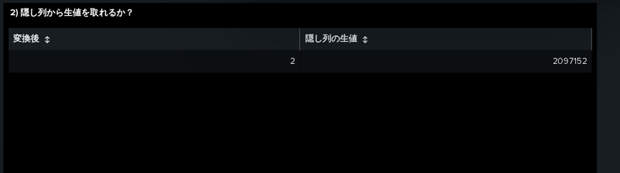

*↑ **`変換後 = 2` / `隠し列の生値 = 2097152`**。
**表示は MiB のまま、トークンには生のバイト数**を渡せている。*

**`_` 始まりの隠し列でも `row._bytes_raw.value` で引ける**（実機で確認）。
`showInternalFields: false` で**列としては見えないのに、ドリルダウンでは使える**のがポイント。
§2.3.1 の「隠し列で色を決める」と同じ発想の応用。

#### 対処2：換算を SPL 側でやる

`| eval mib = round(bytes/1048576, 2)` として `bytes` と `mib` の両方を列に持つ。
**クリック用と表示用を分けられる**が、DOS の利点（サーチを変えずに済む）は失う。

> **⚠ `key` の書き方は `row.<フィールド名>.value`**（実機で確認）。
> `row.<フィールド名>` だけでは値が入らない。
> 参考実装：`Splunk-Dashboard-Examples/soc_incident_console_dashboard.json`。

---

## 2.16 ⭐ バンドルから抜いたレジストリ全体（2026-08-09 実機取得）

§0 の手法を `eventHandlers` / `ds` / `input` に広げて抽出したもの（Splunk 10.4.2 / JS 182本・69MB）。
**ただし「バンドルに名前がある＝実在」ではない**（§2.16.3）。

### 2.16.1 eventHandlers の type は9種ある（docs はほぼ `setToken` しか触れない）

```
drilldown.customUrl        drilldown.linkToDashboard   drilldown.linkToReport
drilldown.linkToSearch     drilldown.resetTokens       drilldown.setTimeRange
drilldown.setToken         drilldown.switchToTab       drilldown.unsetTokens
```

**`drilldown.switchToTab`**（クリックで別タブへ移動）と **`drilldown.setTimeRange`**
（クリックした点の時刻に時間範囲を合わせる）は使いどころが多い。
**`drilldown.resetTokens` / `unsetTokens`** は「絞り込みを解除するボタン」を作れる。
（一覧の抽出は実機確認済み。**個々の動作は未検証**）

### 2.16.2 ds と input の型（未文書のものがある）

```
ds.search  ds.chain  ds.savedSearch  ds.test  ds.spl2  ds.spl2.view  ds.o11y
input.dropdown  input.multiselect  input.text  input.timerange
input.number  ★  input.button  ★  input.dimensionFilter  input.dimensionMultiFilter
```

**`input.number` と `input.button` は実機で描画確認済み**（下の画像）。既存ナレッジに無かったもの。

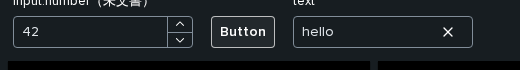

*↑ 左が `input.number`（スピナー付き）、中央が `input.button`。*

```jsonc
"in_num": {
    "type": "input.number",
    "options": { "token": "tok_num", "defaultValue": 42, "min": 0, "max": 100, "step": 1 }
}
```

> **⭐ `input.button` はトークンに値を入れない**（実機で確定）。
> 既定でも、**押した後でも** `Set token value to render visualization` のままだった。
> これは不具合ではなく、**「送信ボタン」＝他の入力の確定用**だから
> （クラシックの `submitButton` に相当）。**値を運ぶ入力として使わないこと。**
> 対して `input.number` は `42`、`input.text` は `hello` が**そのままトークンに入る**（確認済み）。

### 2.16.3 ⚠ `splunk.fillerGauge` / `splunk.markerGauge` はバンドルに名前があるが**使えない**

```
splunk.fillerGauge is not defined     ← 実機のパネルに出たエラー
splunk.markerGauge is not defined
```

**針のあるゲージ・温度計型ゲージは Studio には無い**（実機で確定）。
クラシックには**ある**ので、要件になったらそちらを検討する
→ [classic-dashboard.md](classic-dashboard.md) §1.4。

**`splunk.linkgraph` は逆に「描画された」**（`splunk.networkGraph` とは別物）:

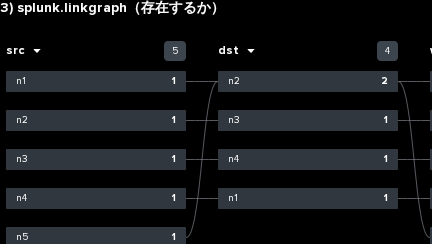

*↑ `src` / `dst` / `w` の3列から**左右2列のノードを線で結ぶ図**が描かれた。
`splunk.sankey` に似ているが、**ノードをリスト状に並べる**点が違う。*

> これは既存ナレッジ [bundle-schema-not-registry] の**追加事例が2件**という意味になる:
> **名前があっても使えない**（fillerGauge / markerGauge）／
> **一覧に無くても使える**（linkgraph）。**実在判定は「置いて撮る」以外にない。**

---

## 2.17 ⭐⭐ eventHandlers 9種の実機検証（2026-08-09）

§2.16.1 で名前だけ抽出していたものを**実際に発火させて確認した**（9種中8種を確認）。
**docs はほぼ `setToken` しか説明していないので、ここが一番の空白地帯だった。**

### 2.17.1 まずスキーマをバンドルから抜く（推測しない）

オプション名を推測して2回外した（下の「外した2件」）。**正解はバンドルの JSON Schema にある**:

```js
// 各 drilldown.* の周辺を切り出すと options の schema が読める
const re = new RegExp(`drilldown\\.${type}`, 'g');
all.slice(m.index - 700, m.index + 700)
```

抽出した**本物のスキーマ**（Splunk 10.4.2）:

| type | options | 備考 |
|---|---|---|
| `drilldown.setToken` | `tokens[]`（`{token,key}` **または** `{token,value}`）, `events`, `fields` | `key`/`token` の**直書きは deprecated** |
| `drilldown.unsetTokens` | **`tokenNames[]`**, `tokenNamespaces[]`, `events`, `fields` | ⚠ `tokens` ではない |
| `drilldown.resetTokens` | **`tokenNames[]`**, `events`, `fields` | 同上 |
| `drilldown.setTimeRange` | `token`, **`events`（必須・`["range.select"]`固定）** | ⚠ クリックでは発火しない |
| `drilldown.switchToTab` | **`tabId`**, `events`, `fields` | `tabId` は **`layoutId`** を指す |
| `drilldown.customUrl` | `url`, `newTab`, `events`, `fields` | |
| `drilldown.linkToSearch` | （`events`/`fields` ほか） | 下の §2.17.3 |
| `drilldown.linkToDashboard` | `app`, `dashboard`, `tabId`, `events`, `fields` | 未検証 |
| `drilldown.linkToReport` | （同系） | **未検証**（保存レポートが要る） |

> **⭐ 全ハンドラ共通で `events` と `fields` を取れる**（これが効く）。
> `fields` は**「どの列をクリックしたときだけ発火するか」**の絞り込み。

### 2.17.2 ⭐ `fields` で列を限定＋固定値トークン（実機確認済み）

```jsonc
"eventHandlers": [{
    "type": "drilldown.setToken",
    "options": {
        "fields": ["cpu"],                    // ← cpu 列を押したときだけ発火
        "tokens": [
            { "token": "tok_c",     "key":   "row.cpu.value" },
            { "token": "tok_fixed", "value": "固定文字列" }   // ← データに無い固定値も入れられる
        ]
    }
}]
```

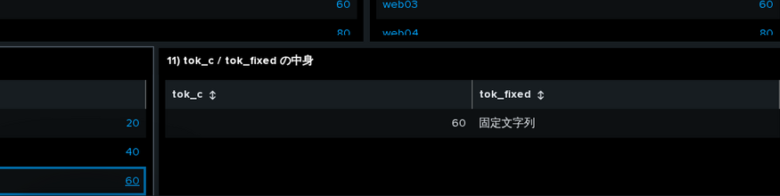

*↑ **cpu 列の「60」を押した**結果。`tok_c=60`（クリック値）と `tok_fixed=固定文字列`（固定値）が
両方入っている。**host 列を押したときは何も起きなかった**（`fields` が効いている証拠）。*

**使いどころ**：1つの表で「この列は絞り込み、あの列はリンク」と**列ごとに違う挙動**を割り当てられる。
`value`（固定値）は「どのパネルから来たか」を後段に伝えるフラグに使える。

### 2.17.3 ⭐ `linkToSearch` は「パネルのSPL＋クリック行の絞り込み」を自動生成する

**これが一番使える。** `query` オプションを書かなくても、
**パネル自身のサーチに `| search <クリックした列>=<値>` を足して**サーチ画面を開く:

```
/en-US/app/<app>/search
  ?q=| makeresults count=4 | … | search host%3Dweb01     ← ★自動で付いた
  &earliest=-24h@h&latest=now                             ← 時間範囲も引き継ぐ
```

> ⚠ **自分で書いた `query` オプションは無視された**（実機で確認）。
> 「クリックした行の生データを見に行く」用途に特化していると考えるのが正しい。

### 2.17.4 `setTimeRange` は**ドラッグ選択**でしか発火しない

```jsonc
{ "type": "drilldown.setTimeRange", "options": { "token": "tr", "events": ["range.select"] } }
```

**クリックでは何も起きない**（最初これで「効かない」と誤診した）。
チャート上を**横にドラッグして範囲を選ぶ**と発火する。

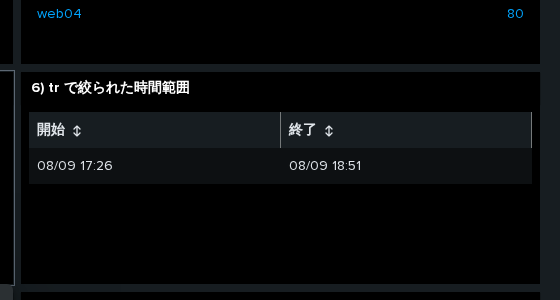

*↑ ドラッグ後、URL に `form.tr.earliest` / `form.tr.latest`（**epoch 秒**）が入り、
`queryParameters` に `$tr.earliest$` / `$tr.latest$` を渡した別パネルが
**17:26〜18:51 に絞り込まれた**。*

### 2.17.5 ⭐ トークンは URL に載る（＝状態を共有できる）

**実機で判明した副産物。** Studio はトークンを**クエリ文字列に反映する**:

```
studio_probe2?tab=layout_1&form.tok_a=初期値A&form.tok_b=web03
```

→ **「今見ている絞り込み状態」をそのまま URL でコピーして人に渡せる**。
`tab=<layoutId>` も載るので**タブ位置も再現される**。

### 2.17.6 外した2件（推測でオプション名を書いた）

| 書いたもの | 症状 | 正解 |
|---|---|---|
| `unsetTokens` に `tokens: ["tok_a"]` | **たまたま動いた**が全トークンが消えた | `tokenNames: ["tok_a"]`。**指定が効かず「全消し」にフォールバックしていた** |
| `setTimeRange` に `earliest`/`latest`/`$trigger.*$` | 無反応 | `events: ["range.select"]` が必須。**クリックではなくドラッグ** |

**教訓**：`additionalProperties: true` なので**知らないキーを書いてもエラーにならない**。
「動いた」も疑う（上の1件目は**間違ったキーなのに副作用で動いて見えた**）。

---

## 2.18 ⭐ DOS は表専用ではない（2026-08-09 実機確認済み）

**既存ナレッジは `columnFormat`（表）中心だったが、`singlevalue` や chart 系のオプションにも
DOS 式をそのまま書ける。** スキーマの説明文にも
*"You can use a data source ... to apply the color"* と明記されている。

### 2.18.1 singlevalue の値を DOS で加工する

```jsonc
"options": {
    "majorValue": "> primary | seriesByName(\"v\") | divideBy(1048576) | formatByType(p2)",
    "unit": "MiB"
},
"context": { "p2": { "number": { "precision": 2 } } }
```

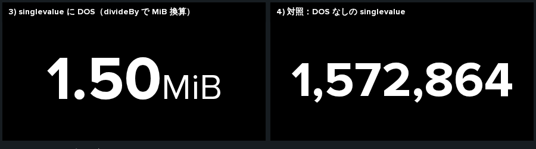

*↑ 左が DOS あり（**1.50 MiB**）、中央が対照の DOS なし（**1,572,864**）。
**同じサーチのまま**パネル側で単位を変えられる。*

### 2.18.2 ⭐ singlevalue のパネル全体を閾値の色で塗る

**【訂正】** classic-dashboard.md に「Studio の singlevalue は文字色しか変えられない」と
書いたが**誤り**。`backgroundColor` に DOS を渡せば**パネル全面を塗れる**（＝クラシックの
`colorMode=block` 相当が Studio でもできる）:

```jsonc
"options": {
    "backgroundColor": "> primary | seriesByName(\"v\") | lastPoint() | rangeValue(vRange)"
},
"context": { "vRange": [
    { "to": 40, "value": "#118832" },
    { "from": 40, "to": 80, "value": "#E9A03A" },
    { "from": 80, "value": "#D41F1F" }
] }
```

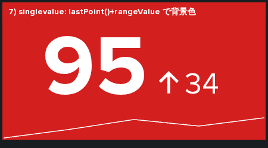

*↑ 値 95 が `from:80` に当たり、**パネル全体が赤**になった。*

> ⚠ **`lastPoint()` が要る。** `backgroundColor` は**単一の色**を期待するので、
> 複数行の系列をそのまま渡すと**何も起きない**（エラーも出ない）。最初これで失敗した。
> 表の `rowBackgroundColors`（＝行数分の配列）とは**要求される形が違う**。

### 2.18.3 chart 系の色

- `seriesColorsByField`（`{"v": "#D41F1F"}`）… **列名→色**。実機確認済み
- `seriesColors`（配列）… pie のスライス色などに効く。実機確認済み
- ⚠ **`seriesColors` に `rangeValue` を渡しても「値ごとに色が変わる棒」にはならない**
  （系列単位の色なので、全部同じ色になる）。**棒を値で塗り分けたいなら表＋DOS か
  カスタム viz**（実機確認済み）。

---

## 2.19 `ds.spl2` — SPL2 がデータソースとして使える（2026-08-09 実機確認済み）

```jsonc
"ds_spl2": {
    "type": "ds.spl2",
    "options": { "query": "from [{ 'a': 1 }]" }
}
```

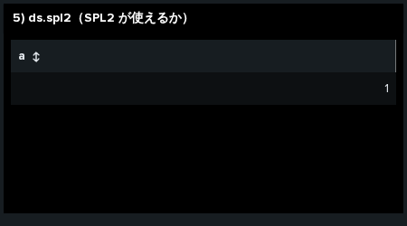

*↑ **SPL2 の構文がそのまま実行され**、`a=1` の表が描画された。*

`ds.search`（SPL1）・`ds.chain`・`ds.savedSearch`・`ds.test` に加えて
**SPL2 も選べる**（未文書）。`ds.spl2.view` もレジストリに存在する（**未検証**）。

## 2.20 `splunk.markdown` はトークンを展開する（2026-08-09 実機確認済み）

```jsonc
"options": { "markdown": "直書き: **$tok_md$**" }
```

入力で `tok_md` を設定すると、**markdown 本文の `$tok_md$` がその値に置き換わった**。
→ **サーチ不要の「今の絞り込み条件」表示**が作れる（パネルタイトルのトークン展開と同じ発想）。

---

## 3. 検証の型（同じことをやるとき）

```bash
# 1. JSON を書く → 定義と突き合わせ
node tools/dashboard-loop/src/validate-dashboard.mjs <probe.json>

# 2. SPL が実機で結果を返すか（0行・エラーを先に潰す）
node tools/dashboard-loop/src/spl-check.mjs <probe.json>

# 3. push して撮影 → PNG を Read で見る
node tools/dashboard-loop/src/sync.mjs <probe.json> --name viz_check_<名前> --out <出力先>
```

**1パネル=1機能**にして並べると、どれが効いてどれが効かないか一目で分かる。
「未指定」のパネルも並べると**既定値が実測できる**（`showInternalFields` の既定が
`true` だと確定できたのはこの方法）。

---

## 4. この検証で外した3件（同じ誤診を繰り返さないため）

いずれも**「描画されない → 非対応だ」と結論しかけた**が、実際は**前提条件の不足**だった。

| 症状 | 最初の解釈 | 実際の原因 |
|---|---|---|
| punchcard が真っ白 | 「この viz は使えない」 | **列が5つあった**。x/y/サイズの**3列**に絞ったら描画された |
| トレリスが1枚に潰れる | 「トレリスは標準にない」 | **キー名が違った**（`trellisEnabled` ではなく `splitByLayout`） |
| 注釈線が出ない | 「注釈は Simple XML だけの機能」 | **`options` の DOS 式が抜けていた**（ds を足すだけでは描かれない） |
| `matchValue` で色が付かない | （危うく「文字列には使えない」と書きかけた） | **引数の形を推測した**。`{matches:[...]}` ではなく**配列そのもの**。バンドルの実装（`this.matches=rawTree(e)`）を読んで判明 |
| `renameSeries` を書いても見出しが変わらない／`frame`・`prepend` が "No data!" | 「この3つは表では使えない」 | **書く場所が違った**。`columnFormat` ではなく **`options.table`**。標準 viz 自身が `> frame(label, value) \| prepend(...)` と書いているのを見て判明。**同じ DOS 関数でも「セル用」と「表構造用」で置き場所が違う** |
| multiselect の `delimiter` / `valuePrefix` が効かない | （危うく「書き方が悪い」と探し続けるところだった） | **Studio では未対応**。移行マップに `{delimiter:!1,…}` と**明示的に false** で載っていた。Simple XML の機能を Studio に期待していた。→ `split()` + `IN` で SPL 側に寄せる |
| `timerange` の `defaultValue` をオブジェクトで書いた | `Invalid earliest_time.` | **文字列 `"-24h@h,now"` が正**。**リポジトリ内の既存ダッシュボード6枚が全部正しい書き方をしていた**ので、そこを見れば一発だった。**手元の実例を先に見る** |

**教訓**：**「描画されない＝非対応」ではない。**
Studio はオプション名を間違えても**エラーを出さずに黙って無視する**ので、
「効かない」と「存在しない」の区別がつかない。否定的な結論を出す前に、
**必要な列数・必須オプション・DOS 式**という前提条件を疑うこと。
これは [studio-extension-viz.md](studio-extension-viz.md) の
「4通り試して全滅 → 実は config の宣言漏れ」と同じ構図。

---

## 5. 検証用ダッシュボード（実機に残してある）

本文の画像は**すべてこれらのダッシュボードの実機スクリーンショット**（`images/` に格納）。

### ⭐ ドキュメント用の画像は「パネル単位」で撮る

**ダッシュボード全体を1枚で撮ると、説明とのリンクが分からなくなる。**
「左が…、中央が…」という書き方は読者に位置の対応付けを強いるので、
**1つの主張につき1枚**にする。`--panels` を付けると**パネルごとに個別の PNG が出る**:

```bash
node tools/dashboard-loop/src/shot.mjs <dashboard-name> --out <出力先> --panels
```

**出力名は `<dashboard>__<visualizations のキー>.png`** になる。
つまり **JSON で付けたキーがそのままファイル名になる**ので、
`viz_gradient` → `dos-gradient.png` のように**説明と1対1で対応させられる**。
→ 検証用ダッシュボードを作る時点で、**キー名を「何を示すパネルか」が分かる名前にしておく**とよい。

トリミングと縮小（**色や文字は無加工**。余白を落として横幅を揃えるだけ）:

```bash
convert <元>.png -bordercolor '#0d1117' -border 1 -fuzz 8% -trim +repage \
        -resize 900x\> -strip -quality 92 <出力>.png
```

`-border` を先に付けてから `-trim` するのは、**背景と同色の枠を足しておかないと
端が背景と地続きで削れすぎる**ため。パネル個別撮影は下部に余白が入る
（実測 646〜780px の縦 → トリム後 256〜425px）ので、この処理はほぼ必須。

| 名前 | 内容 |
|---|---|
| `viz_check_internal_fields` | `showInternalFields` の true / false / 未指定（既定値の確認） |
| `viz_check_studio_features` | overlay 各種・sparkline・radial・ds.chain・markdown・punchcard |
| `viz_check_studio_features2` | 注釈・トレリス・合計行・第2Y軸・log 軸・punchcard（3列版） |
| `viz_check_hidden_color` | **隠しフィールドで列の色を決める**（§2.3.1）。非表示／複数列／対照の3枚 |
| `viz_check_range_color` | **色列なしで範囲・一致から色を決める**（§2.3.2）。rangeValue／matchValue／別列参照＋ワイルドカード |
| `viz_check_dos_tricks` | **DOS フォーマッタ**（§2.3.3）。gradient／maxContrast／divideBy／lerp／prefix |
| `viz_check_dos_tricks2` | **DOS フォーマッタ 第2弾**（§2.3.3）。pick／setColorChannel／type／multiFormat |
| `viz_check_dos_tricks3` | **DOS フォーマッタ 第3弾**（§2.3.3）。subtract／frame／renameSeries／prepend |
| `viz_check_nondos` | **DOS 以外**（§2.10〜2.12）。ds.test／タイトルのトークン／図形 |
| `viz_check_recipes` | **実用レシピ**（§2.14）。SLO 表／動的ドロップダウン／ゼブラ縞 |
| `viz_check_inputs` | **入力の落とし穴**（§2.13）。multiselect の展開／timerange／split+IN |
| `viz_check_drilldown` | **ドリルダウンに渡る値**（§2.15）。DOS 変換後の値／隠し列からの生値取得 |

不要になったら削除してよい（`dashboard_loop_test` アプリ内）。

---

## 参考

- [Table（Dashboard Studio）](https://help.splunk.com/en/splunk-enterprise/create-dashboards-and-reports/dashboard-studio/9.3/visualizations/table)
- [Add secondary data sources to your visualization](https://help.splunk.com/en/splunk-enterprise/create-dashboards-and-reports/dashboard-studio/9.3/use-data-sources/add-secondary-data-sources-to-your-visualization)（注釈の `seriesByIndex` の出典）
- **⚠ `showInternalFields` は Simple XML のリファレンスには載っていない**（Studio 専用）。
  Simple XML 側を探して見つからず遠回りした。**方式を取り違えると docs も見つからない。**
