# Splunk Custom Visualizations

Splunk **Dashboard Studio** 向けのカスタムビジュアライゼーション集（React/JSX）です。
標準ビジュアライゼーションでは表現できない図を、データドリブン（サーチ結果に応じて描画が変わる）・
ダークライト両テーマ対応・完全オフライン（外部通信なし）で実装しています。

各ビジュアライゼーションは `custom-viz-<name>/` ディレクトリに独立して収められており、
それぞれ単体でビルド・パッケージ・デプロイできます。編集画面のオプションはすべて日本語ラベルです。

---

## ビジュアライゼーション一覧

### フロー・関係の可視化

| プレビュー | 名前 / バージョン | 概要 |
| --- | --- | --- |
| 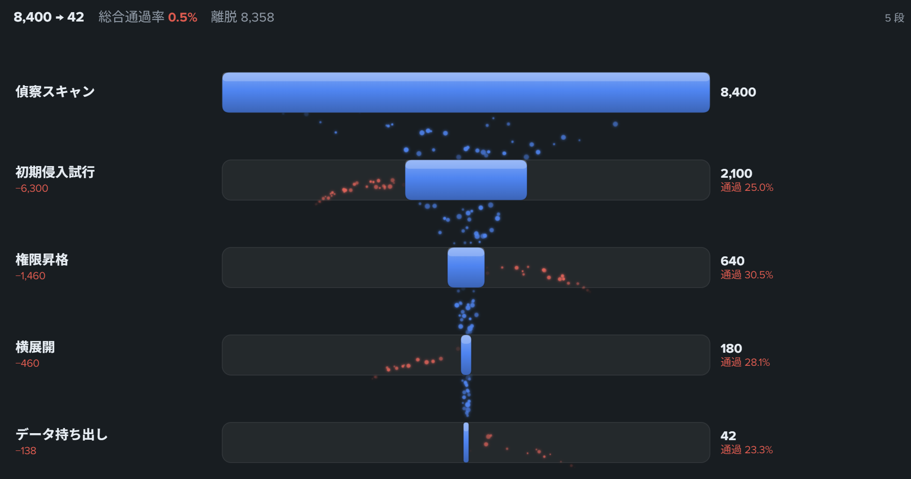 | **[Funnel Leak](custom-viz-funnel-leak/)**<br>v1.0.1 | アニメ付きファネル×リーク図。各段の通過を下へ流し、離脱分を左右にこぼれ落ちる粒子で可視化。コンバージョン／攻撃チェーンの生存分析に。 |
| 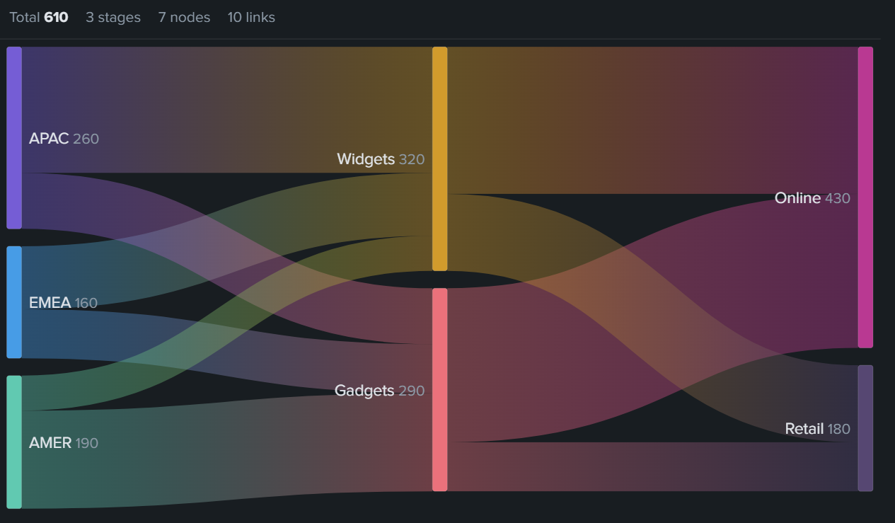 | **[Sankey Flow](custom-viz-sankey-flow/)**<br>v1.0.1 | 多段サンキー図。グラデーションのリンク、ホバー強調、値ベースのリンク色スケール。 |
|  | **[Chord Flow](custom-viz-chord-flow/)**<br>v1.0.1 | アニメ付きコード図。リング上のエンティティ間の相互フローをグラデーションリボンで結び、方向付き発光粒子が流れる。 |
| 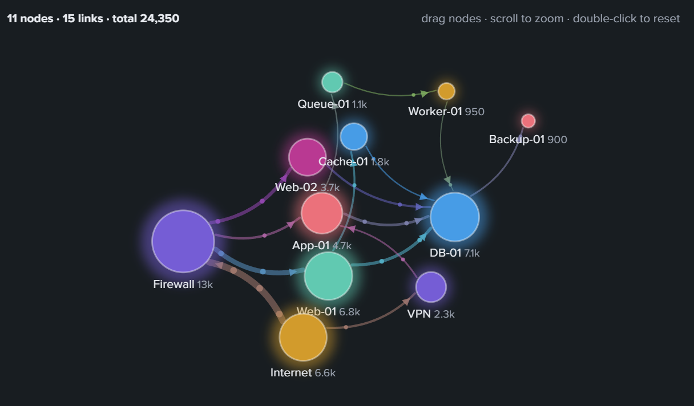 | **[Network Graph](custom-viz-network-graph/)**<br>v1.0.1 | 力学ベースのフォースダイレクテッド・ネットワーク図。流れる破線エッジ、線幅連動の矢印、ドラッグ／ズーム／パン対応。 |
| — | **[Link Line](custom-viz-link-line/)**<br>v1.5.0 | サーバ間コネクタ線。表示画面の「✎ 線を編集」でキャンバス上の線を直接編集（ドラッグ移動・折れ点追加・削除）、「🎨 色を設定」で標準の動的色設定を再現したパネル（範囲/一致・プリセットパレット・反転・＋追加）から値→色を設定し、ダッシュボードの編集→保存で確定。質感4種（フラット／ソフトシャドウ／ネオン／立体パイプ）・破線・流れアニメ・パルス対応。 |

### 分布・多変量の可視化

| プレビュー | 名前 / バージョン | 概要 |
| --- | --- | --- |
|  | **[Radar Chart](custom-viz-radar-chart/)**<br>v1.0.1 | レーダー（スパイダー）チャート。共通軸上に複数系列を重ねて比較。 |
| 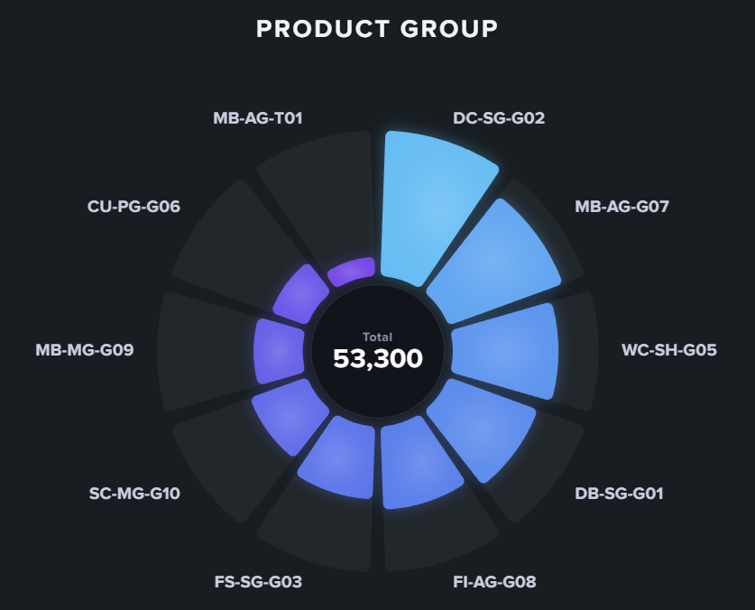 | **[Radial Bar](custom-viz-radial-bar/)**<br>v1.0.2 | 放射状カラムチャート。各カテゴリを等角のくさびで描き、値をバーの外側への伸びで表現。中央に合計 KPI、値ベースのカラースケール、フィールド選択、ホバー連動（背景トラックにも反応）、ライト／ダーク両対応。 |
| 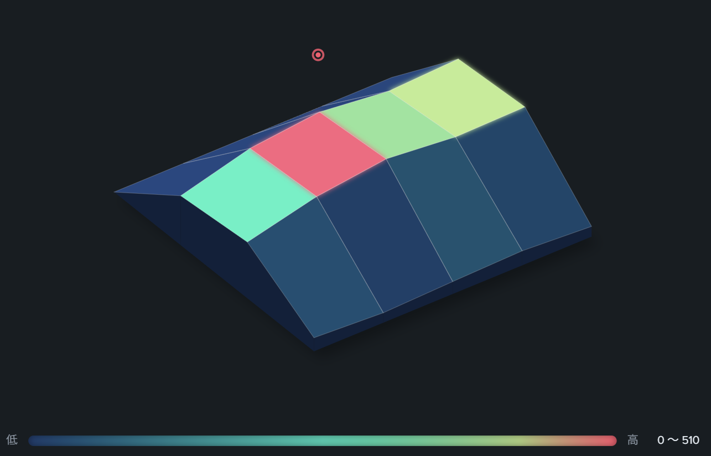 | **[Metric Terrain](custom-viz-metric-terrain/)**<br>v1.0.1 | 等角投影の疑似3D地形。値の起伏を地形として描き、リアルタイムの陰影・落ち影・回転に対応。 |
| 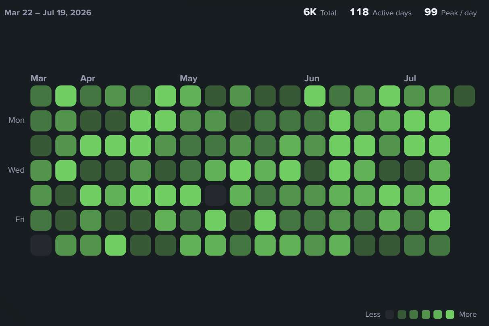 | **[Calendar Heatmap](custom-viz-calendar-heatmap/)**<br>v1.0.1 | GitHub 風カレンダーヒートマップ。オートフィットと、編集可能な低／高値カラースケール。 |
| 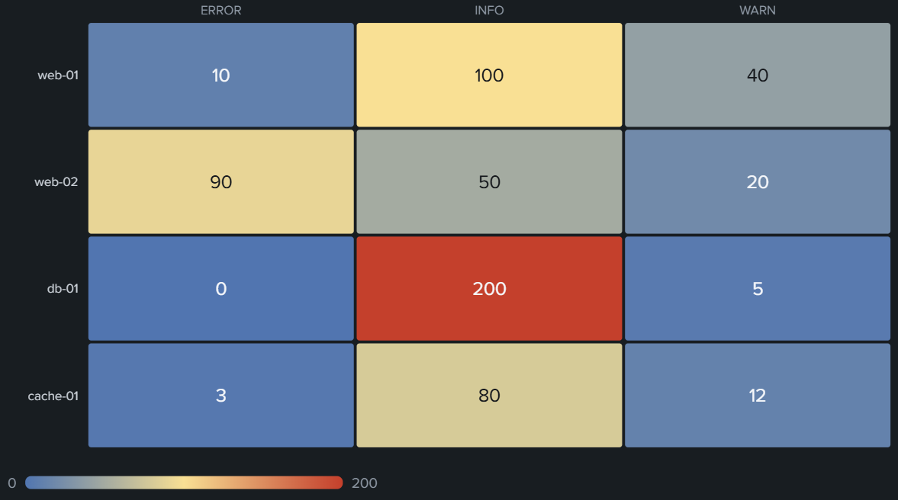 | **[Heat Matrix](custom-viz-heat-matrix/)**<br>v1.0.1 | 汎用ヒートマップ・マトリクス。任意の2軸クロス集計を連続カラースケールの色行列で表示。縦持ち（`stats by A B`）／クロス集計（`chart`・`timechart by`）の自動判別、行／列ごとの色正規化、合計マージン、合計順ソート、時刻ラベル自動整形に対応。 |

### 時系列・集計の可視化

| プレビュー | 名前 / バージョン | 概要 |
| --- | --- | --- |
| 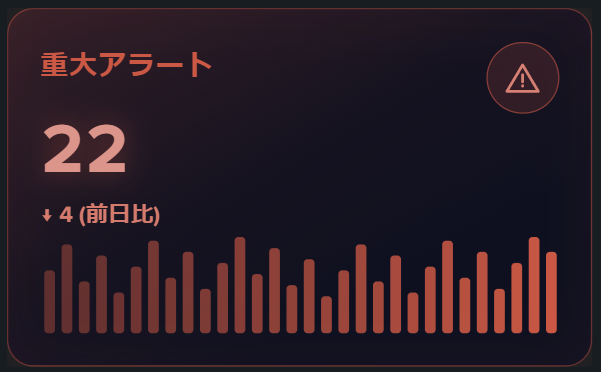 | **[KPI Tile](custom-viz-kpi-tile/)**<br>v1.2.1 | SOC 風 KPI 統計タイル。大数値＋前日比＋スパークライン＋選択式アイコンバッジをアクセントカラーで統一したネオン調カード。編集モード中はタイル上のアイコンをクリックして変更可能。カード背景の不透明度調整・スパークラインの線グラフ切替（グラデ面塗り＋最新点ドット）対応。 |
|  | **[Bullet Graph](custom-viz-bullet-graph/)**<br>v1.0.1 | ブレットグラフ KPI リスト。実績バー＋目標ティック＋良／可／不可の質的バンドを 1 行に重畳し、多数の指標を目標比つきで高密度に一覧。達成度の自動色分け・達成率表示・目標／比較列の名前自動検出・range 列の絶対バンド指定に対応。 |
| 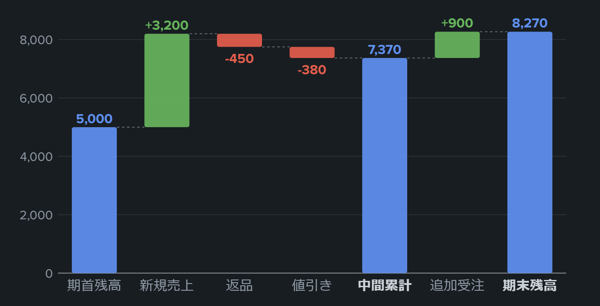 | **[Waterfall Chart](custom-viz-waterfall-chart/)**<br>v1.0.1 | ウォーターフォール（滝／ブリッジ）チャート。増減の積み上げが合計へ届く過程を階段状バーで可視化。種別列（start/total）の自動検出、累計値モード、合計バー自動追加、破線コネクタ付き。 |
| 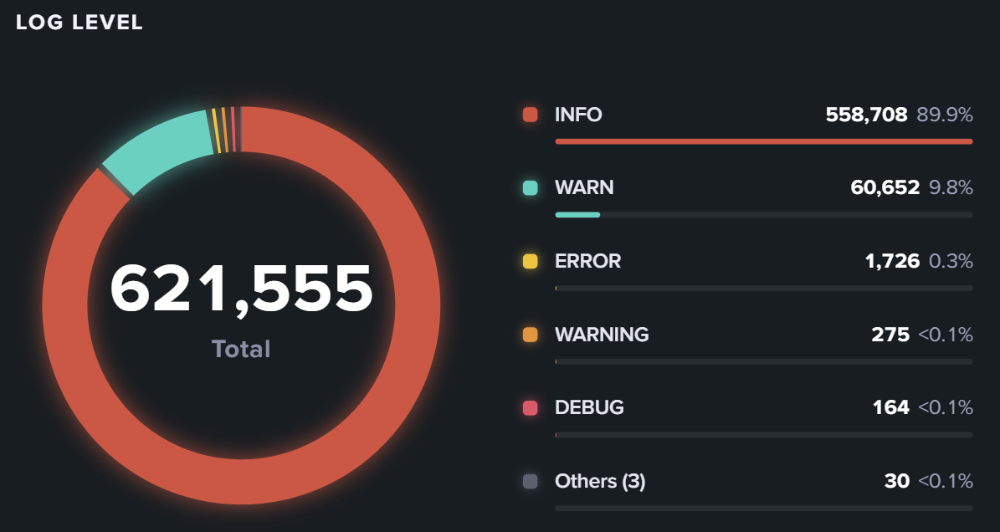 | **[Donut Graph](custom-viz-donut-graph/)**<br>v1.0.1 | ドーナツチャート。中央に合計、詳細な凡例付き。 |
| 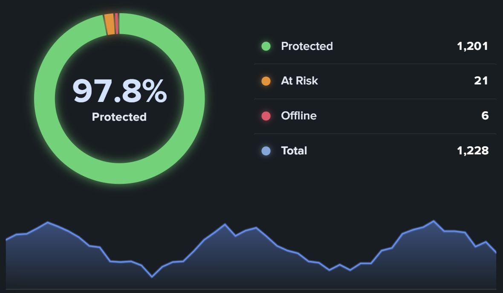 | **[Donut Timechart](custom-viz-donut-timechart/)**<br>v1.0.1 | ドーナツ＋詳細凡例＋トレンド・スパークラインを組み合わせたステータスカード。 |
|  | **[Gradient Bar](custom-viz-gradient-bar/)**<br>v1.0.1 | グラデーションの縦棒グラフ。 |
| 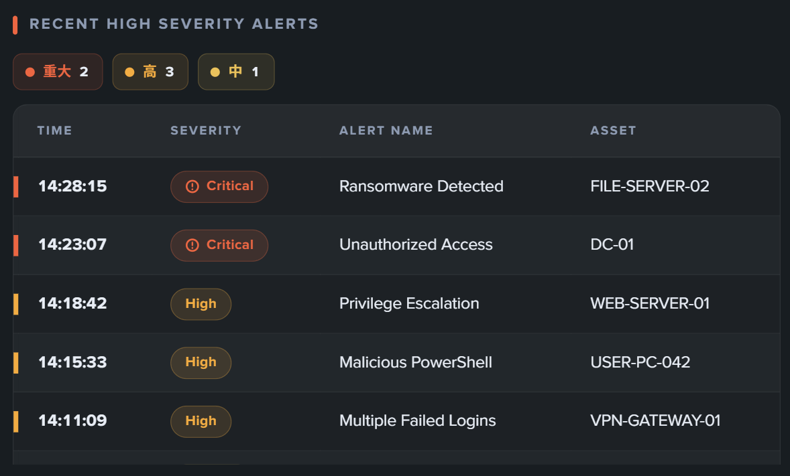 | **[Severity Table](custom-viz-severity-table/)**<br>v1.0.2 | 重要度を色分けするテーブル。深刻度ソート・件数サマリ・表示スタイル・色をカスタマイズ可能。 |

### 地理の可視化

| プレビュー | 名前 / バージョン | 概要 |
| --- | --- | --- |
| 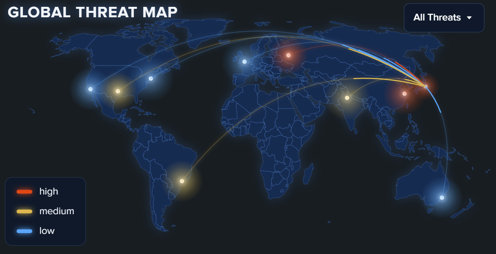 | **[World Map](custom-viz-world-map/)**<br>v1.1.1 | 世界地図上に値を可視化するコロプレス／マーカー地図。 |
| 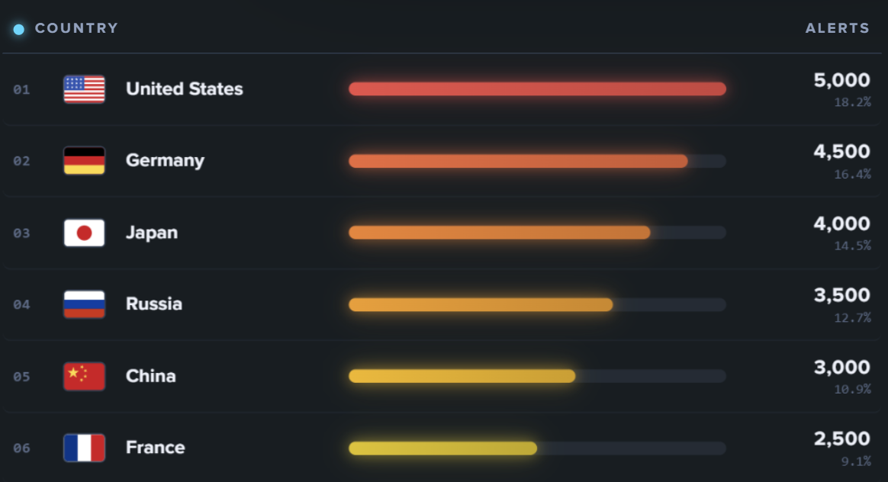 | **[Country Graph](custom-viz-country-graph/)**<br>v1.0.1 | 国旗付きの国別ランキング棒グラフ。上位 N 制限・ソート・低／高値カラースケール。 |

> 各ビジュアライゼーションの詳細（データ仕様・編集オプション・サンプル SPL）は、
> それぞれのディレクトリ内 `README.md` を参照してください。

---

## ディレクトリ構成

```
custom-viz/
├── README.md                       ← このファイル（全体一覧）
├── .gitignore
├── custom-viz-<name>/              ← 各ビジュアライゼーション（独立してビルド可能）
│   ├── README.md                   ← 個別の詳細ドキュメント
│   ├── package.json / build.mjs / package.mjs
│   ├── build-plugins/
│   ├── package/app/app.conf        ← Splunk アプリ定義（id, version, label…）
│   ├── examples/example.png        ← プレビュー画像
│   ├── test/verify.mjs             ← happy-dom によるローカル検証
│   └── visualizations/custom_viz_<name>/
│       ├── config.json             ← dataContract, optionsSchema, editorConfig
│       └── src/visualization.jsx   ← 実装本体
└── Splunk-Dashboard-Examples/      ← Splunk 公式サンプル（参考資料）
```

---

## 開発コマンド（各 viz ディレクトリ内で実行）

```bash
cd custom-viz-<name>
yarn install
yarn build        # dist/custom_viz_<name>/visualization.js を生成（esbuild）
yarn verify       # happy-dom によるローカル検証（Splunk 実機不要）
yarn package      # dist/*.spl を生成
```

## デプロイ（アンインストール・再起動なし）

1. `npm version <patch|minor> --no-git-tag-version` でバージョンを上げ、`package/app/app.conf` の version も同期。
2. `yarn build && yarn package` で新しい `.spl` を生成。
3. Splunk Web「Install app from file」で **"Upgrade app"（上書き）にチェック**して `.spl` をアップロード。
4. `https://<host>:8000/en-US/_bump` で **Bump version**（Splunk 再起動の代替）→ ブラウザをハードリロード（Ctrl+Shift+R）。

---

## 新しいビジュアライゼーションを追加するには

1. 既存の viz（例 `custom-viz-donut-graph`）をベースディレクトリごと複製する。
2. 識別子を置換する：
   - `package.json` … `name`, `description`, `version`
   - `package/app/app.conf` … `[package] id`, `[id] name`, `[ui] label`, `[launcher] description`
   - `visualizations/custom_viz_<new>/config.json` … `config.name`, `config.description`, `optionsSchema`, `editorConfig`
   - `visualizations/custom_viz_<new>/src/visualization.jsx` … 実装本体
3. `examples/example.png` に表示例のスクリーンショットを置く。
4. 個別 `README.md` を作成し、本ファイル（ルート README）の一覧表にも 1 行追加する。

---

## 設計上の共通ルール

- **完全オフライン**：外部 API フェッチ・CDN 読み込みは禁止。依存はすべてバンドルに同梱。
- **テーマガード**：`useTheme()` が undefined の間はレンダリングせず、取得後のみ描画。
- **データ正規化**：`rows` / `columns` 両形式に対応し、欠損・型不一致・マルチバリューでも落とさない。
- **オートフィット**：`ResizeObserver` でコンテナ実寸を測り、領域いっぱいに描画。
- **値→色**：`editor.dynamicColor` はカスタム viz で使えないため、値ベースのカラースケールを自前実装。
- 編集画面のオプションラベルはすべて日本語（キー名は英語）。
