# Splunk Custom Visualizations

Splunk **Dashboard Studio** 向けのカスタムビジュアライゼーション集（React/JSX）です。
標準ビジュアライゼーションでは表現できない図を、データドリブン（サーチ結果に応じて描画が変わる）・
ダークライト両テーマ対応・完全オフライン（外部通信なし）で実装しています。
一部にはデータを描くのではなく、**ダッシュボードを操作する**ための部品（タブ等）も含まれます。

各ビジュアライゼーションは `visualizations/<name>/` ディレクトリに独立して収められており、
それぞれ単体でビルド・パッケージ・デプロイできます。編集画面のオプションはすべて日本語ラベルです。

---

## ビジュアライゼーション一覧

### ダッシュボードの操作（データを「見せる」のではなく「絞り込む」）

他のビジュアライゼーションがサーチ結果を描くのに対し、こちらは**ダッシュボード自体を操作する**部品です。
標準の入力（input）では作れない見た目・挙動のコントロールを、ビジュアライゼーションとして実装しています。

| プレビュー | 名前 / バージョン | 概要 |
| --- | --- | --- |
| 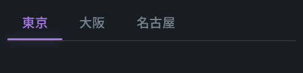 | **[Tab Selector](visualizations/tab-selector/)**<br>v1.3.2 | クリックでトークンを切り替えるタブバー。サーチを紐づけずに単体で置け、ダッシュボード上部のナビゲーション（表示の切り替え）に使う。 |

### フロー・関係の可視化

| プレビュー | 名前 / バージョン | 概要 |
| --- | --- | --- |
| 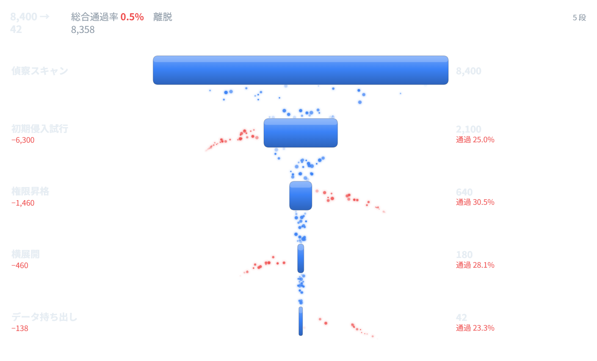 | **[Funnel Leak](visualizations/funnel-leak/)**<br>v1.1.4 | 各段の通過と離脱を粒子アニメで見せるファネル図。コンバージョンや攻撃チェーンの離脱分析に。 |
| 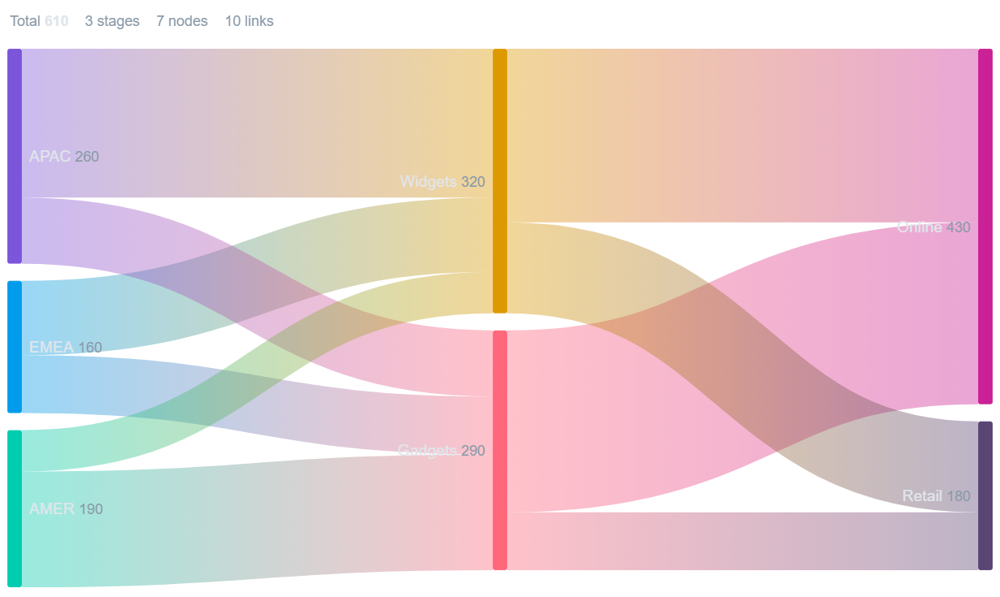 | **[Sankey Flow](visualizations/sankey-flow/)**<br>v2.0.2 | 4列以上の多段データに対応するサンキー図（標準 `splunk.sankey` は3列目以降を捨てる）。段をまたぐ流量の追跡・損失分析に。 |
| 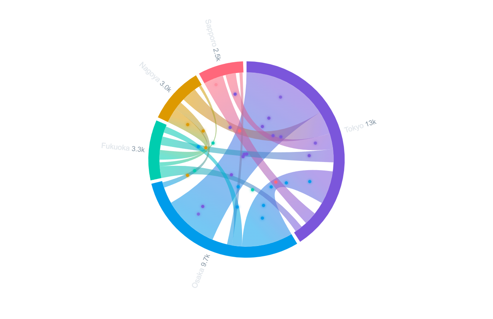 | **[Chord Flow](visualizations/chord-flow/)**<br>v1.1.4 | エンティティ間の相互フローをリボンで結ぶアニメ付きコード図。多対多の通信・依存関係の俯瞰に。 |
| 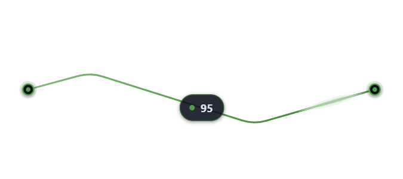 | **[Link Line](visualizations/link-line/)**<br>v1.11.2 | サーバ間を結ぶコネクタ線。画面上で線やラベルを直接ドラッグ編集でき、構成図に重ねて死活・スループット表示を作るときに。 |
|  | **[Spotlight Frame](visualizations/spotlight-frame/)**<br>v1.2.3 | サーチ結果を OK／WARNING／CRITICAL に判定し、パネル外周の枠色・点滅で示すステータス枠。他パネルに重ねて異常時だけ目立たせる用途に。 |

### 分布・多変量の可視化

| プレビュー | 名前 / バージョン | 概要 |
| --- | --- | --- |
| 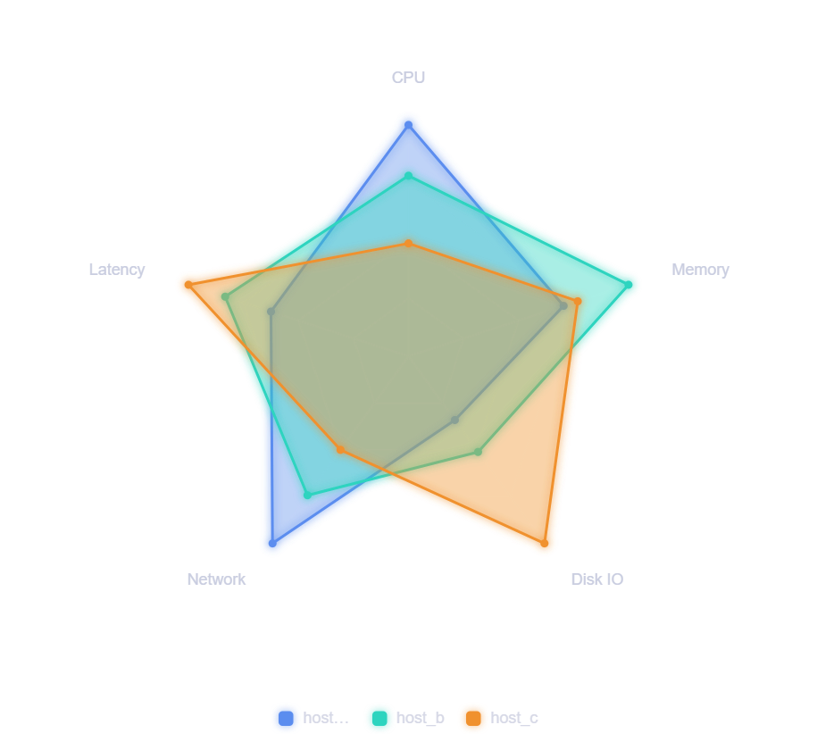 | **[Radar Chart](visualizations/radar-chart/)**<br>v1.2.3 | 複数系列を共通軸で重ねるレーダー（スパイダー）チャート。多軸のバランス比較に。 |
| 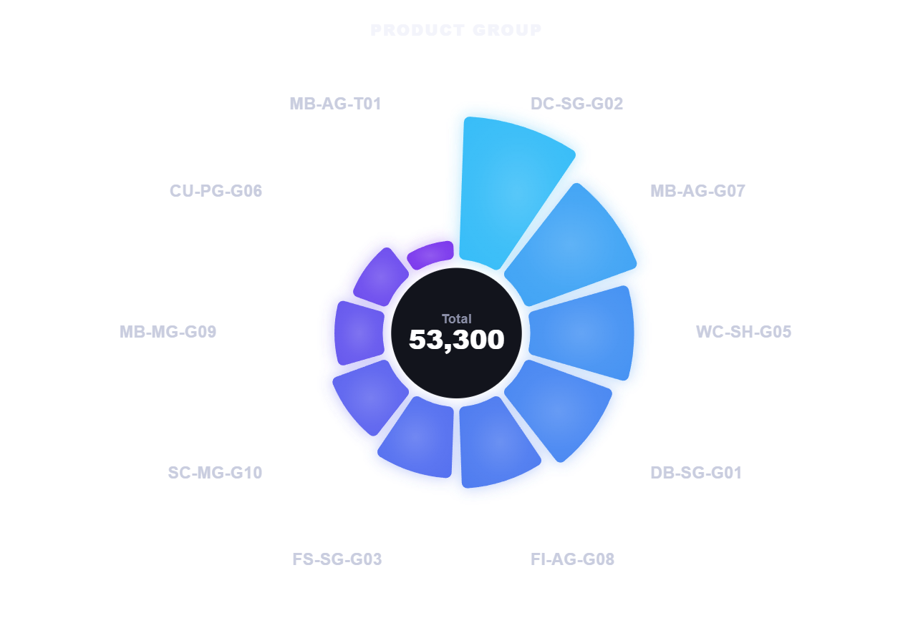 | **[Radial Bar](visualizations/radial-bar/)**<br>v1.1.3 | 値をくさびの伸びで表す放射状カラムチャート。カテゴリ比較を円形レイアウトで見せたいときに。 |
| 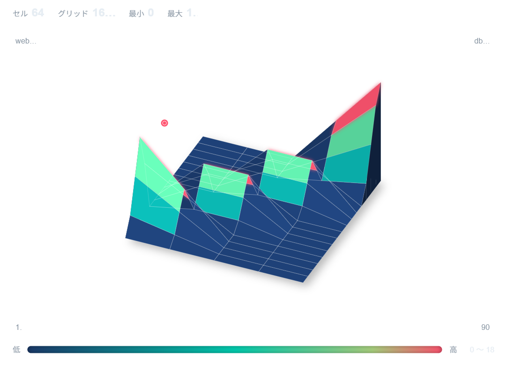 | **[Metric Terrain](visualizations/metric-terrain/)**<br>v1.1.4 | 値の起伏を疑似3D地形として描く等角投影チャート。2軸グリッドの分布を立体で俯瞰する展示向け。 |
| 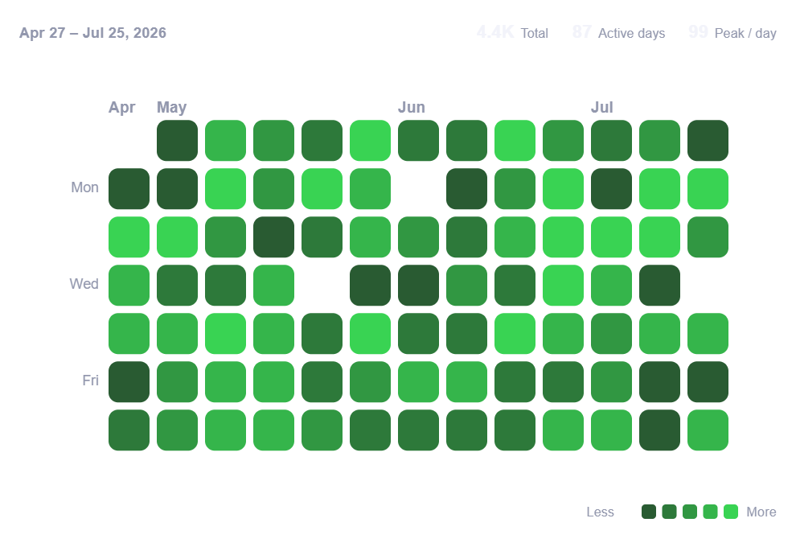 | **[Calendar Heatmap](visualizations/calendar-heatmap/)**<br>v1.1.4 | GitHub 風カレンダーヒートマップ。日単位の活動量の濃淡を長期間ながめるときに。 |
| 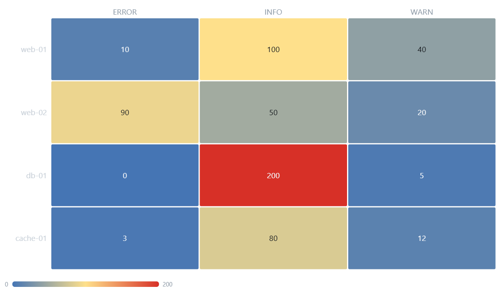 | **[Heat Matrix](visualizations/heat-matrix/)**<br>v1.1.4 | 任意の2軸クロス集計を色行列で表す汎用ヒートマップ。時間×ホストのような偏り・ホットスポットの俯瞰に。 |

### 階層の可視化

| プレビュー | 名前 / バージョン | 概要 |
| --- | --- | --- |
| 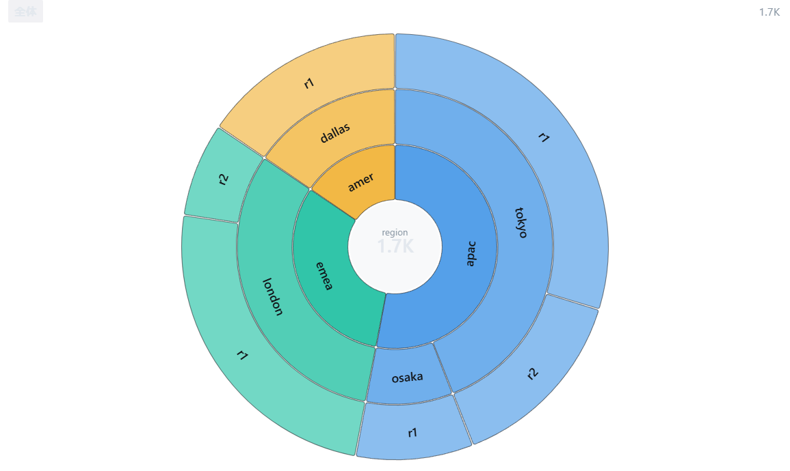 | **[Sunburst](visualizations/sunburst/)**<br>v1.3.4 | 階層構造を同心円の輪で表す放射状チャート。クリックで掘り下げられ、「どこで枝分かれしているか」の構造を読むのに向く（面積の大小を比べるなら Treemap）。 |
| 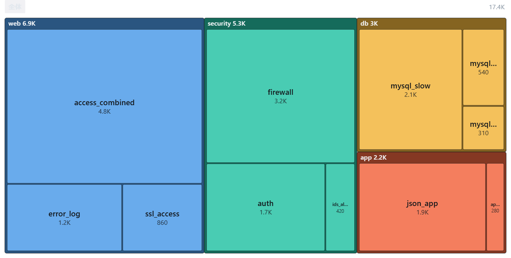 | **[Treemap](visualizations/treemap/)**<br>v1.2.4 | 階層構造を面積で表すツリーマップ。`index > sourcetype > host` のような入れ子で、どこが容量・件数を食っているかを見るのに向く（構造を読むなら Sunburst）。 |

### 時系列・集計の可視化

| プレビュー | 名前 / バージョン | 概要 |
| --- | --- | --- |
| 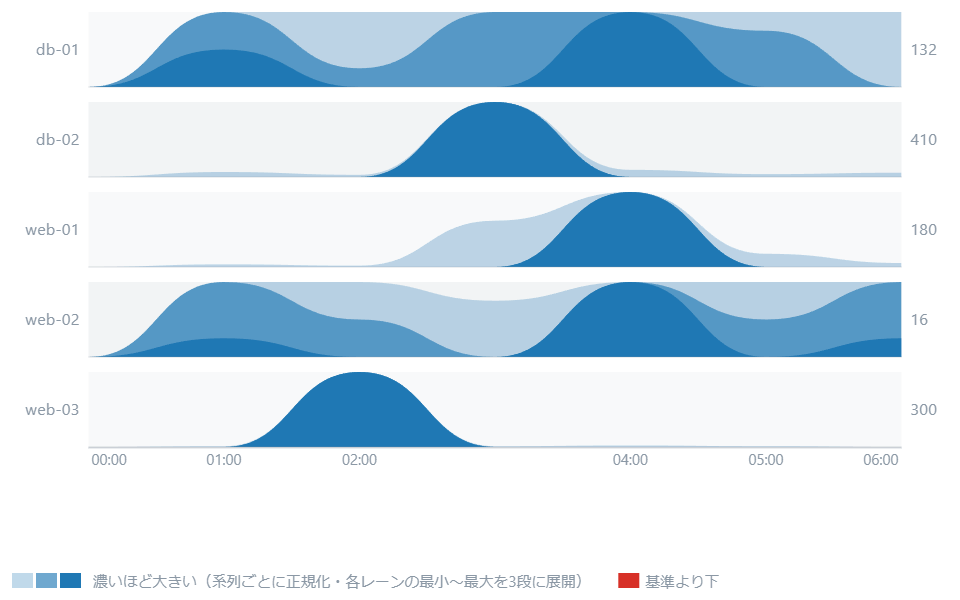 | **[Horizon Chart](visualizations/horizon-chart/)**<br>v1.1.4 | 多数の時系列を色帯に畳むホライズンチャート。数十系列を縦に並べ「どこが同時に跳ねたか」を見るときに（標準 timechart は5本程度で読めなくなる）。 |
| 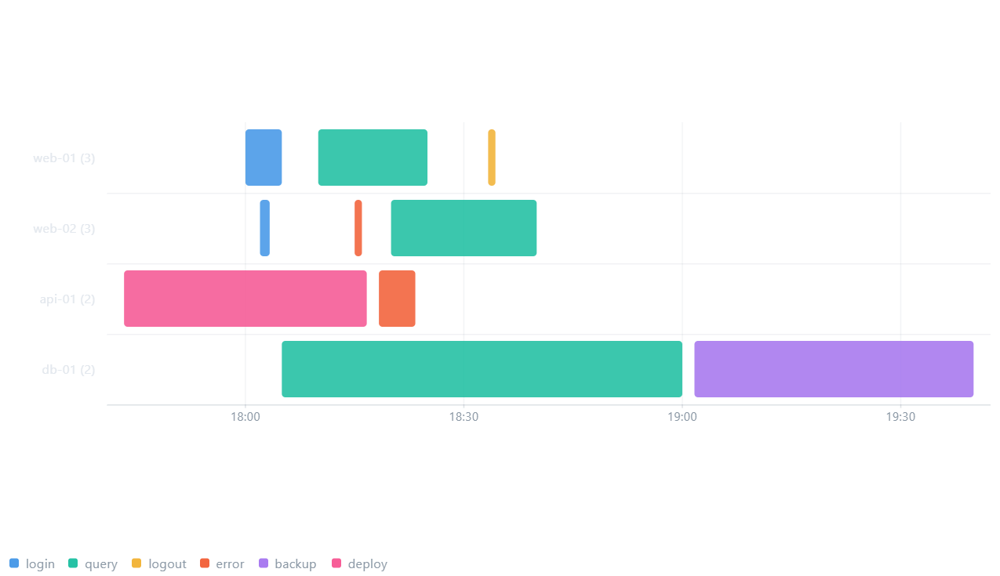 | **[Timeline Swimlane](visualizations/timeline-swimlane/)**<br>v1.3.4 | エンティティ（host/user 等）ごとのレーンにイベントを時刻順で並べるタイムライン。インシデント調査で個々のイベントの前後関係を追うときに。 |
| 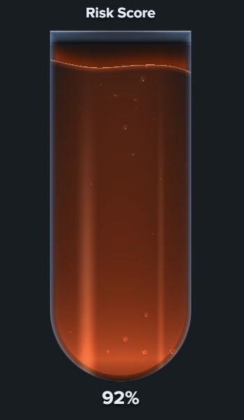 | **[Liquid Tube](visualizations/liquid-tube/)**<br>v1.0.2 | 試験管の液面で単一値を表すゲージ（WebGL2 必要）。屈折・気泡まで描く質感重視の展示向け。 |
| 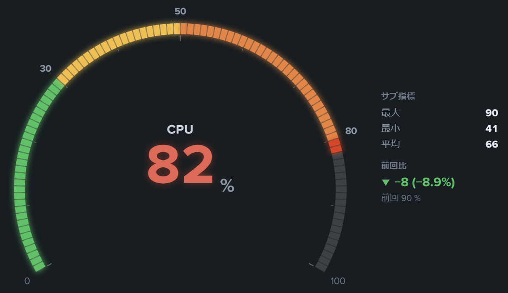 | **[Gauge Arc](visualizations/gauge-arc/)**<br>v1.4.2 | 単一値のアークゲージ＋サブ情報パネル。1つの KPI をしきい値の色帯・前回比・内訳つきで大きく見せるときに。 |
| 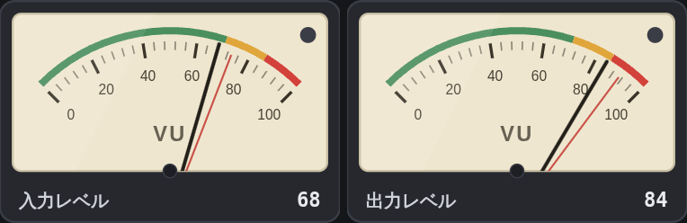 | **[VU Console](visualizations/vu-console/)**<br>v1.0.0 | 複数メトリクスをアナログ VU メーター（針の計器）で並べる調整卓風コンソール。多数の値を計器盤の雰囲気で一望する（1値を深く見るなら Gauge Arc）。 |
| 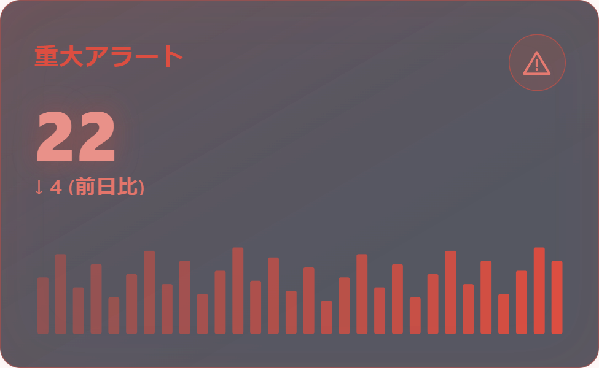 | **[KPI Tile](visualizations/kpi-tile/)**<br>v1.5.2 | 大数値＋前日比＋スパークライン＋アイコンのネオン調 KPI カード。SOC 風ダッシュボードの統計タイルに。 |
|  | **[Icon Status](visualizations/icon-status/)**<br>v1.1.6 | 単一値を立体アイコンの色変化そのもので見せるステータスタイル（12種）。壁掛けの状態表示に（数値を主役にするなら KPI Tile）。 |
| 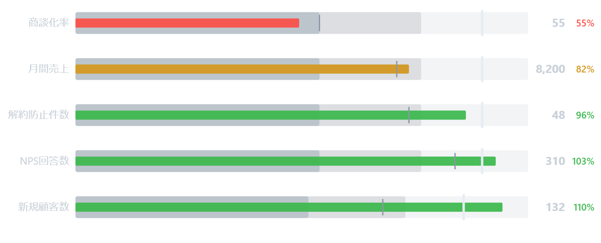 | **[Bullet Graph](visualizations/bullet-graph/)**<br>v1.1.4 | 実績バー＋目標ティック＋質的バンドを1行に重ねるブレットグラフ。多数の KPI を目標比つきで高密度に一覧するときに。 |
| 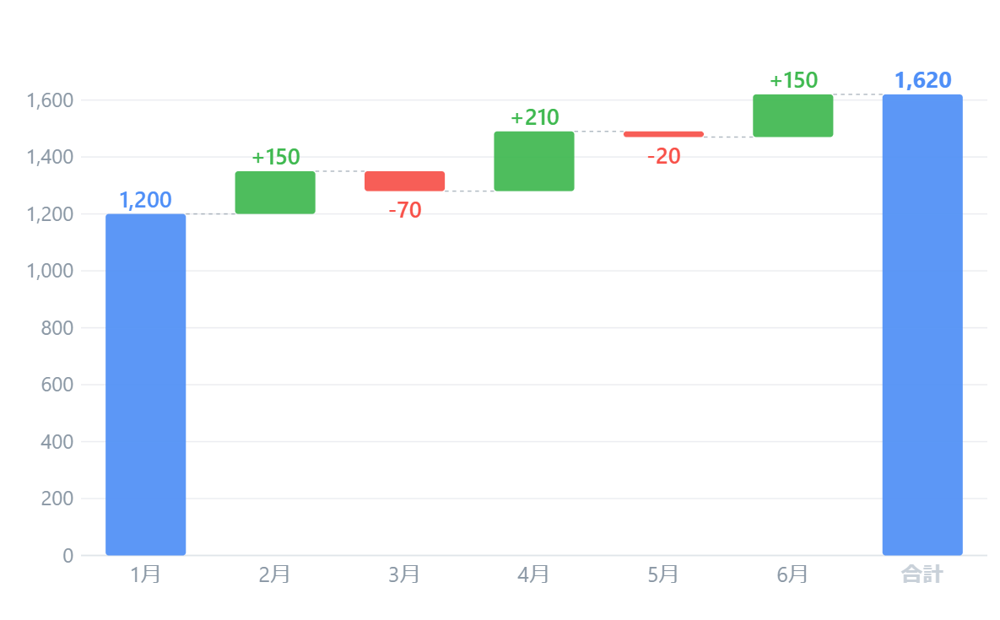 | **[Waterfall Chart](visualizations/waterfall-chart/)**<br>v1.1.4 | 増減の積み上げが合計へ届く過程を階段状バーで見せるウォーターフォールチャート。差分の内訳説明に。 |
| 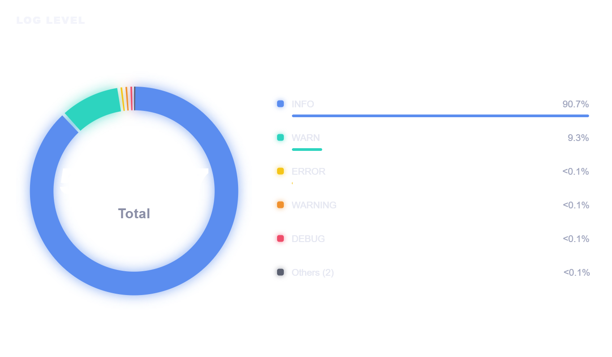 | **[Donut Graph](visualizations/donut-graph/)**<br>v1.1.3 | 中央に合計を出すドーナツチャート。構成比の表示に。 |
| 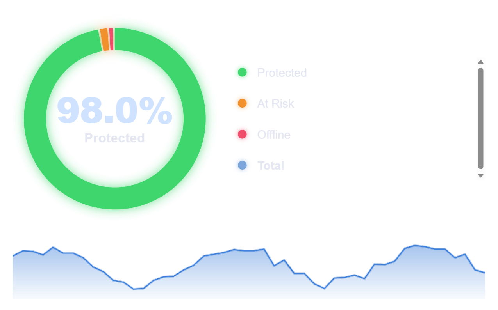 | **[Donut Timechart](visualizations/donut-timechart/)**<br>v1.1.4 | ドーナツ＋詳細凡例＋スパークラインのステータスカード。構成比と推移を1枚で見せるときに。 |
| 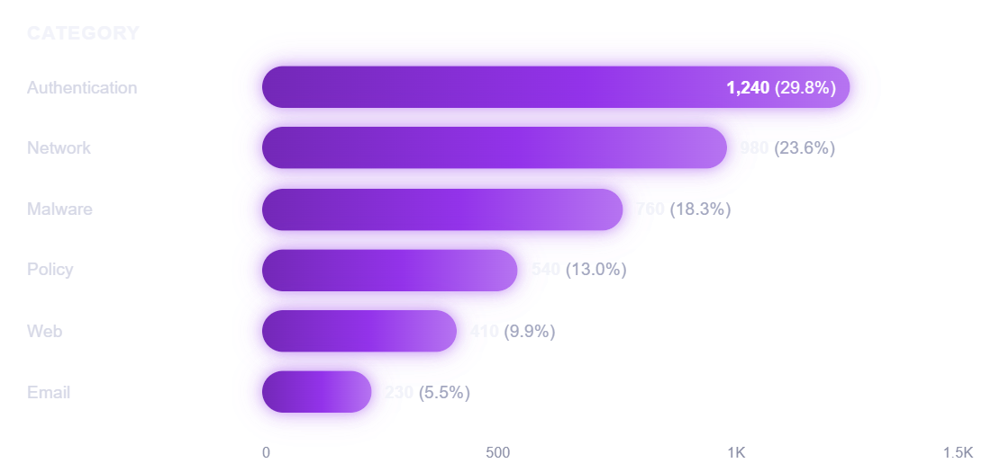 | **[Gradient Bar](visualizations/gradient-bar/)**<br>v1.1.4 | グラデーションの縦棒グラフ。 |
| 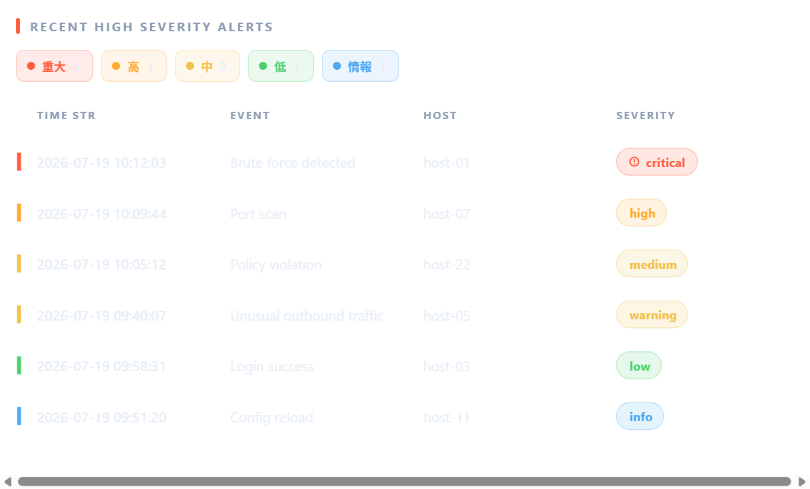 | **[Severity Table](visualizations/severity-table/)** <br>v2.2.3 | 重要度で行を色分けするテーブル。判定ルール（順位・別名・色）を編集画面で定義でき、アラート一覧に。 |

### 地理の可視化

| プレビュー | 名前 / バージョン | 概要 |
| --- | --- | --- |
|  | **[Attack Globe](visualizations/attack-globe/)**<br>v1.1.2 | 回転する3D地球儀に攻撃フローの弧を描くアタックマップ（WebGL2 必要・データ仕様は World Map と共通）。展示・壁掛け向け（分析には平面の World Map）。 |
| 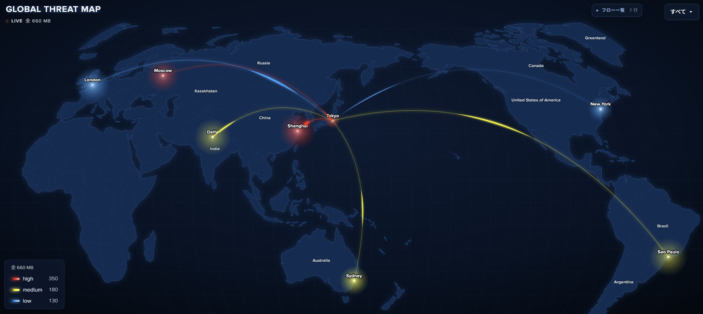 | **[World Map](visualizations/world-map/)**<br>v2.1.1 | 世界地図に起点→終点のフローを光の帯で描くフローマップ。攻撃元や通信の地理的な俯瞰に。ズーム・カテゴリ色分け・フロー一覧テーブルの重ね表示に対応。 |
| 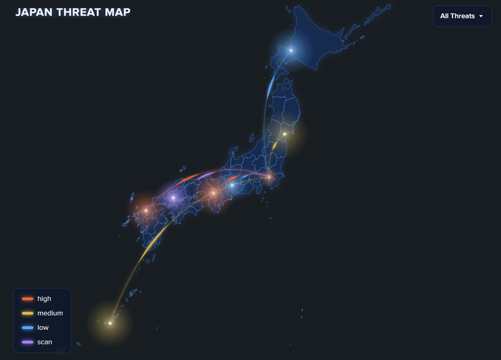 | **[Japan Map](visualizations/japan-map/)**<br>v1.2.3 | World Map の日本地図版（都道府県境つき・データ仕様共通）。国内の拠点間フローの可視化に。 |
| 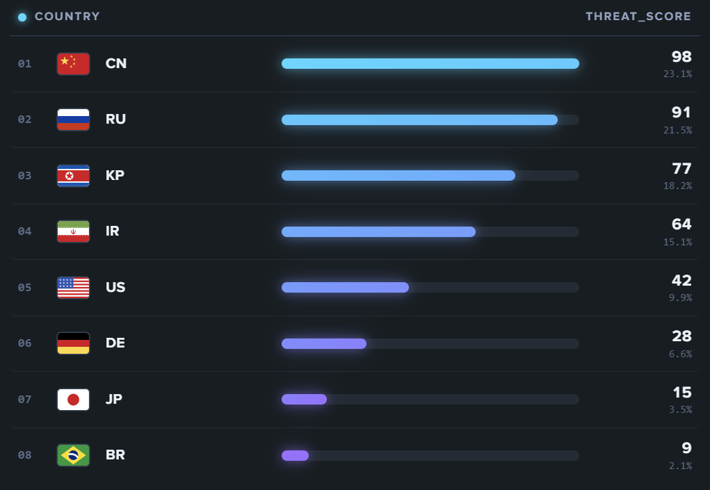 | **[Country Graph](visualizations/country-graph/)**<br>v1.1.4 | 国旗付きの国別ランキング棒グラフ。国別の上位 N 比較に。 |

> 各ビジュアライゼーションの詳細（データ仕様・編集オプション・サンプル SPL）は、
> それぞれのディレクトリ内 `README.md` を参照してください。

---

## ディレクトリ構成

```
custom-viz/
├── README.md                           ← このファイル（全体一覧）
├── .gitignore
├── visualizations/                     ← 各ビジュアライゼーション（独立してビルド可能）
│   └── <name>/                         ← 例: horizon-chart, sunburst, treemap …
│       ├── README.md                   ← 個別の詳細ドキュメント
│       ├── package.json / build.mjs / package.mjs
│       ├── build-plugins/
│       ├── package/app/app.conf        ← Splunk アプリ定義（id, version, label…）
│       ├── examples/example.png        ← プレビュー画像
│       ├── test/verify.mjs             ← happy-dom によるローカル検証
│       └── visualizations/custom_viz_<name>/
│           ├── config.json             ← dataContract, optionsSchema, editorConfig
│           └── src/visualization.jsx   ← 実装本体
└── Splunk-Dashboard-Examples/          ← これらの viz を並べた Dashboard Studio の JSON（そのまま取り込めます）

※ フォルダ名は `<name>`（例 `horizon-chart`）、Splunk のアプリ ID は
　 `custom_viz_<name>`（例 `custom_viz_horizon_chart`）で対応します。
```

---

## 開発コマンド（各 viz ディレクトリ内で実行）

```bash
cd visualizations/<name>
yarn install
yarn build        # dist/custom_viz_<name>/visualization.js を生成（esbuild）
yarn verify       # happy-dom によるローカル検証（Splunk 実機不要）
yarn package      # dist/*.spl を生成
```

## デプロイ（アンインストール・再起動なし）

1. `npm version <patch|minor> --no-git-tag-version` でバージョンを上げ、`package/app/app.conf` の version も同期。
2. `yarn build && yarn package` で新しい `.spl` を生成。
3. Splunk Web「Install app from file」で **"Upgrade app"（上書き）にチェック**して `.spl` をアップロード。
4. `https://<host>:8000/en-US/_bump` で **Bump version**（Splunk 再起動の代替）→ ブラウザをハードリロード（Ctrl+Shift+R）。

---

## 新しいビジュアライゼーションを追加するには

1. 既存の viz（例 `visualizations/donut-graph`）をベースディレクトリごと複製する。
2. 識別子を置換する：
   - `package.json` … `name`, `description`, `version`
   - `package/app/app.conf` … `[package] id`, `[id] name`, `[ui] label`, `[launcher] description`
   - `visualizations/custom_viz_<new>/config.json` … `config.name`, `config.description`, `optionsSchema`, `editorConfig`
   - `visualizations/custom_viz_<new>/src/visualization.jsx` … 実装本体
3. `examples/example.png` に表示例のスクリーンショットを置く。
4. 個別 `README.md` を作成し、本ファイル（ルート README）の一覧表にも 1 行追加する。

---

## 設計上の共通ルール

- **完全オフライン**：外部 API フェッチ・CDN 読み込みは禁止。依存はすべてバンドルに同梱。
- **テーマガード**：`useTheme()` が undefined の間はレンダリングせず、取得後のみ描画。
- **データ正規化**：`rows` / `columns` 両形式に対応し、欠損・型不一致・マルチバリューでも落とさない。
- **オートフィット**：`ResizeObserver` でコンテナ実寸を測り、領域いっぱいに描画。
- **値→色**：`editor.dynamicColor` はカスタム viz で使えないため、値ベースのカラースケールを自前実装。
- 編集画面のオプションラベルはすべて日本語（キー名は英語）。
- **データ未取得時のメッセージ**：全 viz 共通で
  「データがありません。サーチ結果を確認してください。」をパネル中央に表示する。
  データ形式の案内が要る場合は、この文言を本文として残したうえで副文（小さめ・薄め）で添える。
  ※ 例外は2つ。Link Line はデータが無くても線をニュートラル色で描き続ける仕様。
  Tab Selector は**そもそもサーチ結果を使わない**ため、代わりに
  「タブが設定されていません。」と設定手順を案内する。
- **サーチを使わない viz の `dataContract`**：`requiredDataSources` だけでなく
  **`optionalDataSources` も空配列**にする。`primary` を「任意」で挙げているだけで
  ホストがデータソースの指定を求め、**サーチを紐づけないと設定できなくなる**
  （データ不要の標準 viz＝Markdown / RichText / Image と同じ形にする）。
- **ソースに生の制御文字を書かない**：マップのキー区切り等で NUL を使う場合も
  `'\u0000'` のようにエスケープで書く。生のバイトが入ると grep がファイルを
  バイナリ扱いし、検索・レビューができなくなる。
