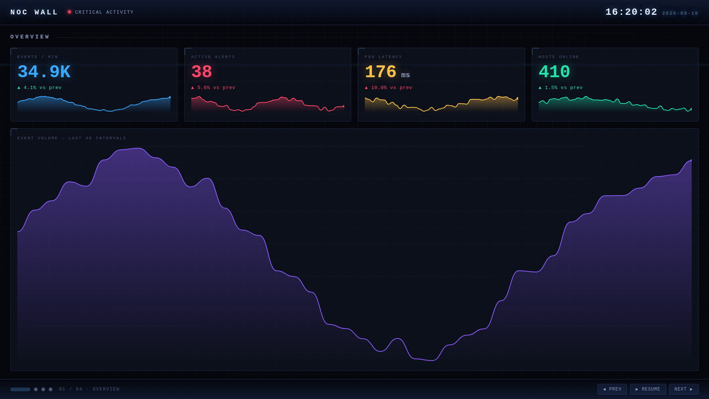
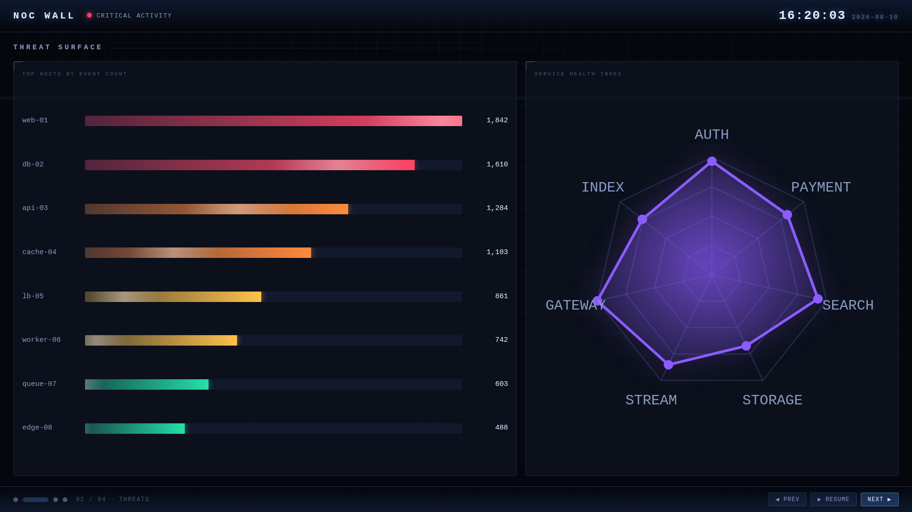
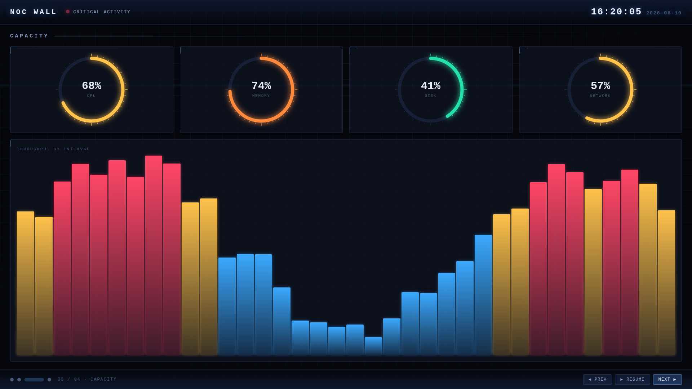
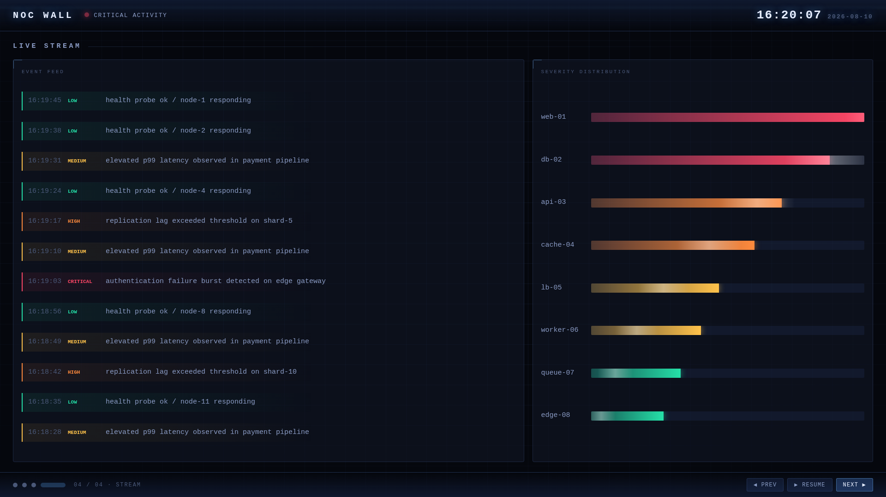

# NOC Wall

**壁掛けモニタ用のウォールボード。** 4 つのセクションを自動で送り続ける常時表示画面。

これは**カスタム viz（ダッシュボードのパネル）ではない**。
[Splunk App with React](../ops-console/) と同じ「独立 React ページ」方式で、
**画面 1 枚をまるごと自作している**ため、Splunk のダッシュボードでは作れない構成になっている。

**2026-08-10 に実機（Splunk Enterprise 10.4.2 / 1920×1080）で全 4 セクションの描画と
自動送りの周回を確認済み。**

URL: `/en-US/app/noc_wall/wall`



---

## なぜダッシュボードではなくページなのか

Dashboard Studio では作れない／作りにくいものを狙って入れてある:

| やっていること | ダッシュボードでは |
|---|---|
| **画面全体を占有**（Splunk のヘッダごと隠す） | パネルの枠から出られない |
| **セクションの自動送り**（9 秒ごと・ループ） | 標準機能に無い |
| 発光・走査線・グリッドなど**画面単位の演出** | パネル単位でしか効かない |
| 1 ページで **6 本のサーチ**を自前で並行実行 | パネルごとに分かれる |
| キーボード操作（←→ / Space） | 無い |

## 4 つのセクション

| # | セクション | 中身 |
|---|---|---|
| 1 | **OVERVIEW** | KPI 4 枚（スパークライン付き）＋ 大きな面グラフ |
| 2 | **THREAT SURFACE** | 上位ホストの横棒 ＋ サービス健全性のレーダー |
| 3 | **CAPACITY** | 円環ゲージ 4 つ ＋ 時系列の縦棒 |
| 4 | **LIVE STREAM** | ログの流れる一覧 ＋ severity 分布 |





## 操作

放置していれば **9 秒ごとに自動で次のセクションへ進み、最後まで行くと先頭に戻る**
（実機で 45 秒観測して周回を確認済み）。手元で操作もできる:

| 操作 | 動作 |
|---|---|
| `→` / `NEXT` | 次のセクション |
| `←` / `PREV` | 前のセクション |
| `Space` / `PAUSE` | 一時停止・再開 |
| 下部のドット | そのセクションへ直接ジャンプ |

下部のドットは**進捗バーを兼ねている**（現在のセクションだけ横に伸び、残り時間が減っていく）。

---

## 実装のポイント

### テーマは dark 固定（ユーザー設定に追従しない）

壁掛け常時表示が前提なので、`getUserTheme()` を呼ばず `theme: 'dark'` を直接渡している。
明るい背景では発光表現が成立せず、大画面では眩しいため。
配色は [`theme.js`](src/main/webapp/components/theme.js) に集約してある。

### Splunk のヘッダを隠す

```css
body > header { display: none !important; }
```

⚠ **クラス名では狙えない。** 10.4 実機のヘッダには
styled-components が生成したクラス（`.sc-gsFSXq` 等）しか付いておらず、
**ビルドのたびに変わる**（DOM を probe して確認）。実体は `body` 直下の素の `<header>` なので
**構造で指定する**。

### セクションの重ね合わせ

非表示のセクションも同じ矩形を占有するため、`opacity: 0` だけでは
**透明な要素が上に乗って下のセクションが透けて二重に見える**（実機で発生）。
`visibility` と `z-index` を併用して解決している。

### 自動送りは「経過時刻」で判定する

`setInterval` の発火回数で数えると、**タブが非アクティブな間に間隔が詰まって一気に飛ぶ**。
[`useAutoAdvance.js`](src/main/webapp/components/useAutoAdvance.js) は
開始時刻からの経過で判定するため、復帰しても飛ばない。

### 時刻はサーバで文字列化しない

⚠ SPL の `strftime()` は **Splunk サーバのタイムゾーン**で解釈されるため、
ブラウザ側で描く時計と数時間ズレる（実機で発生。UTC 01:18 と JST 16:18 が並んだ）。
**エポック秒のまま返して、描画側で `toLocaleTimeString` する。**

### 堅牢性

- 6 本のサーチは**独立して失敗しうる**。1 本が失敗しても他のセクションは描画を続け、
  上部バーにエラーを 1 件だけ出す。
- データ 0 件のパネルは `AWAITING DATA…` を点滅表示（真っ白にしない）。
- レーダーは 3 軸未満だと図形にならないので描かない。
- 数値は整数なら整数のまま見せる（`38` を `50.4` のように見せない）。

---

## サーチ

6 本の SPL は [`searches.js`](src/main/webapp/components/searches.js) にまとめてある。
**実データが無い環境でも必ず絵が出るよう `makeresults` で自己完結**させてあるので、
インストールすれば何も用意しなくても動く。

実運用では中身を自分のインデックスを引くサーチに差し替える。
**返す列名さえ合っていれば描画側はそのまま動く**:

| 定数 | 必要な列 |
|---|---|
| `SPL_KPI` | `events` `alerts` `latency` `hosts`（各行が 1 時点） |
| `SPL_HOSTS` | `host` `severity` `count` |
| `SPL_SERVICES` | `service` `score` |
| `SPL_TIMELINE` | `label` `count` |
| `SPL_RESOURCES` | `metric` `pct`（0〜100） |
| `SPL_STREAM` | `epoch`（エポック秒） `severity` `msg` |

差し替え例（上位ホストを実データにする）:

```spl
index=* earliest=-1h
| stats count BY host
| eval severity = case(count>1500,"critical", count>1000,"high", count>500,"medium", true(),"low")
| sort - count | head 8
| table host severity count
```

既定の SPL（そのまま動く確認用）:

```spl
| makeresults count=1
| eval raw="web-01 critical 1842,db-02 critical 1610,api-03 high 1284,cache-04 high 1103,lb-05 medium 861,worker-06 medium 742,queue-07 low 603,edge-08 low 488"
| makemv delim="," raw
| mvexpand raw
| rex field=raw "(?<host>\S+)\s(?<severity>\S+)\s(?<count>\d+)"
| eval count=tonumber(count)
| table host severity count
| sort - count
```

---

## ビルドとインストール

```bash
cd apps/noc-wall
yarn install
yarn build            # 本番ビルド
yarn package          # dist/noc_wall-<ver>-<hash>.spl

node ../../tools/dashboard-loop/src/install-viz.mjs $(ls -t dist/*.spl | head -1)
```

インストール後は `/en-US/app/noc_wall/wall` を開く。**splunkd の再起動は要らない**
（`appserver/static/` は静的アセットなので `_bump` で反映される）。

撮影:

```bash
node ../../tools/dashboard-loop/src/shot-page.mjs \
     /en-US/app/noc_wall/wall --out /tmp/shots --width 1920 --height 1080
```

⚠ アニメーションするので `settled: false` で終わるのが正常。

---

## 実機で確認したこと / していないこと

**確認済み（2026-08-10 / Splunk Enterprise 10.4.2 / 1920×1080）**

- 全 4 セクションが 1920×1080 で余白なく描画される
- **自動送りが放置で周回する**（9 秒ごと・STREAM の次に OVERVIEW へ戻る。45 秒観測）
- PAUSE / NEXT / PREV / ドットのジャンプが効く
- Splunk のヘッダが消えて全画面を占有する
- JS エラー（pageerror）が出ない
- 6 本のサーチが並行して完走する

**未確認**

- **4K（3840×2160）での見え方**は未検証。レイアウトは相対値中心だが、
  フォントサイズは固定 px なので**大画面では小さく見える可能性がある**。
- **キーボード操作は実機で押していない**（コードは入れてあるが、確認したのは
  画面上のボタンとドットのみ）。
- 長時間（数時間〜数日）の連続表示でのメモリ挙動は未検証。
- 実データ（`index=*` 等）に差し替えたときの描画は未検証。
  既定の `makeresults` でのみ確認している。

---

## リリースノート

---

### [1.0.0] - 2026-08-10

#### 追加

- 新規作成（初回リリース）。壁掛けモニタ向け NOC ウォールボード。
- 4 セクションの自動ページ送り（9 秒ごと・ループ・進捗バー付きドット）。
- 手動操作：NEXT / PREV / PAUSE / ドットジャンプ / キーボード（←→・Space）。
- 自作 SVG チャート 4 種：スパークライン・円環ゲージ・レーダー・縦棒。
- 6 本の SPL を並行実行し、60 秒ごとに自動更新。
- Splunk のヘッダを隠した全画面表示。dark 固定。
- 生成物：`dist/noc_wall-1.0.0-7daa3f1.spl`
