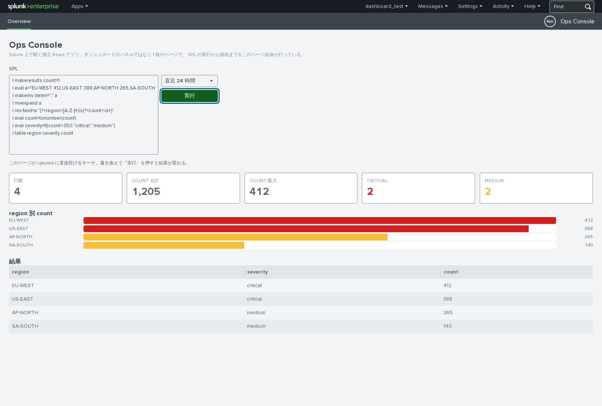

# Ops Console

**Splunk 上で動く独立 React アプリ**（Splunk App with React）の実証。

ダッシュボードのパネル（カスタム viz）ではなく、**Splunk のナビから開く 1 枚のページそのもの**を
React で作っている。SPL の実行から描画まで、このページ自身が行う。

**2026-08-10 に実機（Splunk Enterprise 10.4.2）で描画・サーチ実行・テーマ追従を確認済み。**

URL: `/en-US/app/ops_console/overview`



---

## これは何が違うのか（カスタム viz との対比）

このリポジトリの `visualizations/` は「ダッシュボードに載せるパネル」だが、これは**ページ**。

| | Studio 拡張 viz | classic カスタム viz | **このアプリ** |
|---|---|---|---|
| 成果物 | パネル 1 個 | パネル 1 個 | **ページ 1 枚（アプリ全体）** |
| どこに出るか | ダッシュボード内 | ダッシュボード内 | **アプリのナビから開く URL** |
| データ | ホストが渡す（受動） | 自分で増分要求できる | **自分で SPL を投げる（能動）** |
| iframe 隔離 | あり（制約多い） | なし | **なし** |
| ダッシュボードに載る | ○ | ○ | **✕** |

**この方式でしかできないこと**（＝実装の主眼）:

- **ページ自身がサーチを組み立てて splunkd に投げる。** viz は「渡されたデータを描く」だけだが、
  ここでは画面上で SPL を書き換えて実行できる（実機確認済み）。
- **iframe に閉じ込められていない。** ログイン中のセッションのまま splunkd の REST を叩ける。
  拡張 viz で全滅する cookie / 認証付き fetch の制約（`references/studio-hacks.md`）が**そもそも無い**。
- **ページ全体のレイアウトを自分で決められる。** パネルの枠に収まる必要がない。

**逆にできないこと**: ダッシュボードのパネルとしては使えない。
ダッシュボードに載せたいなら従来どおりカスタム viz を作る。

---

## 実装のポイント

### ページの器（Mako テンプレートは自分で書かない）

`default/data/ui/views/overview.xml` の 5 行がページの器。

```xml
<view template="pages/splunk_ui_app.html" type="html">
    <label>Overview</label>
</view>
```

`template="pages/splunk_ui_app.html"` は **Splunk 同梱の共通テンプレート**で、
ビューと同名の JS（`appserver/static/pages/overview.js`）を自動で読み込む。

> ⚠ `@splunk/create` には自前の Mako テンプレート（`${make_url(...)}` を書いた `.html`）を
> 生成する **legacy モード**もあるが、そちらは使っていない。共通テンプレートを使えば
> Mako を 1 行も書かずに済む。

### サーチの実行（`useSearch.js`）

`@splunk/splunk-utils` の `createRESTURL` + `defaultFetchInit` で splunkd を叩く。
`defaultFetchInit` に CSRF ヘッダとセッションが入るので、認証処理を自分で書く必要はない。

```
POST search/jobs               … exec_mode=blocking でジョブ完了まで待つ（ポーリング不要）
GET  search/jobs/<sid>/results … 結果を JSON で取得
```

> `@splunk/search-job` という公式パッケージもあるが、**採用しなかった**。
> 最新の 3.1.0 が `rxjs@5` と `@splunk/splunk-utils@3` を要求し、
> ページ側で使う `splunk-utils@4` と衝突するため。REST を直接叩けば依存が増えない。

### 堅牢性

- **列名を決め打ちしない。** 数値列・ラベル列を実データから推定するので、
  `count` が無い SPL でも表とバーが出る（実機で `region/severity/count` に差し替えて確認済み）。
- **古い応答で新しい結果を上書きしない。** 世代番号（`generation`）で判定する。
- 0 件・エラー・ロード中はそれぞれ専用の表示を出す（真っ白にしない）。
- テーマ取得に失敗してもページは必ず描画する（`catch` で light にフォールバック）。

---

## ビルドとインストール

```bash
cd apps/ops-console
yarn install
yarn build            # 本番ビルド（stage/ に成果物が出る）
yarn package          # dist/ops_console-<ver>-<hash>.spl を作る

# 実機へ入れる（viz と同じツールがそのまま使える）
node ../../tools/dashboard-loop/src/install-viz.mjs \
     $(ls -t dist/*.spl | head -1)
```

インストール後は `/en-US/app/ops_console/overview` を開く。

**画面を撮って確認する**（`shot.mjs` はダッシュボード専用なので、ページ用に `shot-page.mjs` を追加した）:

```bash
node ../../tools/dashboard-loop/src/shot-page.mjs \
     /en-US/app/ops_console/overview --out /tmp/shots
```

### 再起動は要らない

`appserver/static/` 配下は静的アセットなので、インストール＋`_bump` で反映される
（`install-viz.mjs` が `_bump` までやる）。
カスタム viz の `config.json` のような splunkd キャッシュ問題は**この方式には無い**
（`optionsSchema` 相当のものが存在しないため）。

---

## サンプル SPL

画面の SPL 欄は自由に書き換えられる。既定値はデータが無い環境でも動くよう自己完結させてある。

```spl
| makeresults count=1
| eval src="10.0.0.1 web-01,10.0.0.2 db-02,10.0.0.3 api-03,10.0.0.4 cache-04,10.0.0.5 lb-05,10.0.0.6 worker-06"
| makemv delim="," src
| mvexpand src
| rex field=src "(?<ip>\S+)\s(?<host>\S+)"
| eval count = 20 + (random() % 180)
| eval severity = case(count > 150, "critical", count > 100, "high", count > 60, "medium", true(), "low")
| table host ip severity count
| sort - count
```

列名を変えても動くことの確認用（実機で使ったもの）:

```spl
| makeresults count=1
| eval a="EU-WEST 412,US-EAST 388,AP-NORTH 265,SA-SOUTH 140"
| makemv delim="," a
| mvexpand a
| rex field=a "(?<region>[A-Z-]+)\s(?<count>\d+)"
| eval count=tonumber(count)
| eval severity=if(count>350,"critical","medium")
| table region severity count
```

---

## 実機で確認したこと / していないこと

**確認済み（2026-08-10 / Splunk Enterprise 10.4.2）**

- `.spl` としてインストールでき、ナビにアプリが出る（`install_apps` 権限で足りた）
- ページが描画され、Splunk のヘッダ・アプリバーの中に React の画面が入る
- ページ自身が SPL を実行して結果を描く
- **画面上で SPL を差し替えて実行すると、列構成ごと結果が変わる**
- ダークテーマに追従する（`getUserTheme()` の値でページ全体が切り替わる）
- コンソールに JS エラーが出ない

**未確認・注意**

- **`edit_view_html` 権限は持っていないが、インストールは通った。** アプリに同梱した
  ビューは動いた。ただし **Splunk Web の画面から HTML ビューを新規作成・編集する**操作は
  この権限が要る可能性がある（未検証）。
- 大量データ（数万行）での描画性能は測っていない。現状は表示を 100 行に制限している。
- ページを複数枚にした場合（`pages/` に別ディレクトリを足す）の動作は未検証。
  webpack のエントリは自動生成なので通るはずだが、実機では 1 枚しか試していない。

---

## リリースノート

---

### [1.0.0] - 2026-08-10

#### 追加

- 新規作成（初回リリース）。Splunk 上で動く独立 React アプリの実証。
- ページ内で SPL を編集・実行できる（`useSearch` フック）。
- 結果に応じた KPI カード・横棒グラフ・テーブルの描画。数値列とラベル列は自動推定。
- ライト／ダークテーマへの追従。
- `bin/package.mjs`：`stage/` を `.spl` に固める（sourcemap 混入チェック付き）。
- 生成物：`dist/ops_console-1.0.0-7daa3f1.spl`
