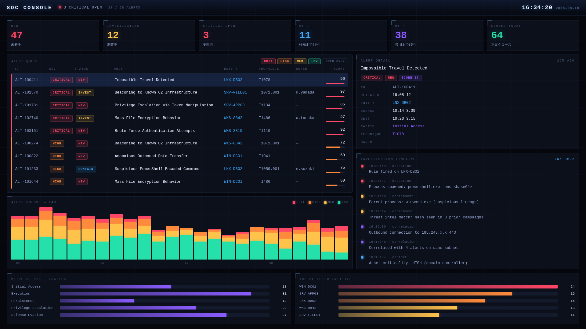
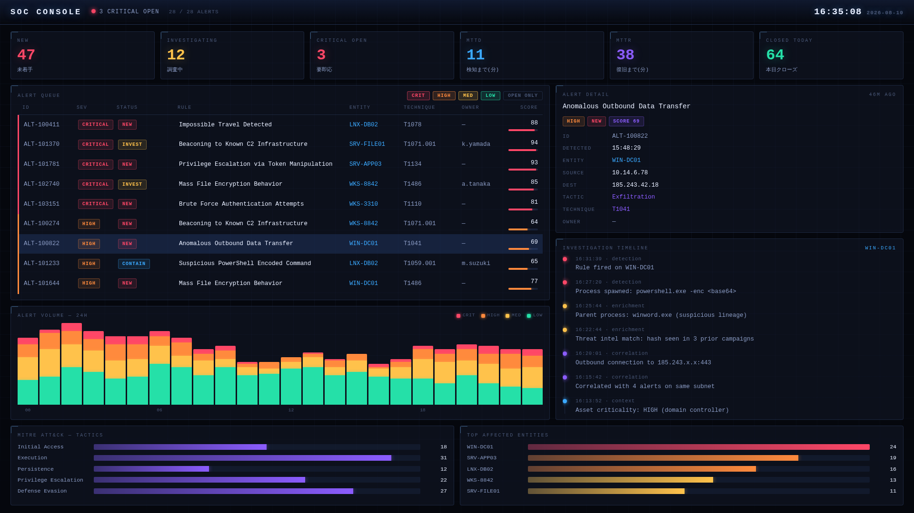
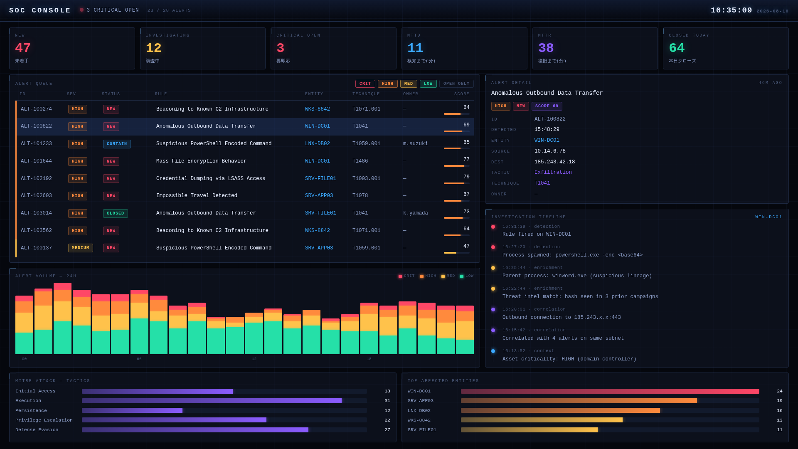

# SOC Console

**SOC アラートトリアージ用の 1 ページコンソール。**
アラート一覧を選ぶと、右側の詳細と調査タイムラインがその場で追従する。

[NOC Wall](../noc-wall/) と同じ「独立 React ページ」方式だが、性格は正反対:
NOC Wall が**壁掛けで眺める**画面なのに対し、こちらは**座って操作する**画面。

**2026-08-10 に実機（Splunk Enterprise 10.4.2 / 1920×1080）で
描画・選択駆動・フィルタを確認済み。**

URL: `/en-US/app/soc_console/triage`



---

## 画面の構成（1 ページ・14 パネル相当）

```
┌ KPI ×6 ─────────────────────────────────────────────┐
│ NEW / INVESTIGATING / CRITICAL OPEN / MTTD / MTTR / CLOSED │
├────────────────────────┬────────────────────────────┤
│ ALERT QUEUE            │ ALERT DETAIL               │
│  （28件・選択可）       │  （選択したアラートの詳細） │
│  severity フィルタ付き  ├────────────────────────────┤
├────────────────────────┤ INVESTIGATION TIMELINE     │
│ ALERT VOLUME — 24H     │  （選択した資産の関連事象） │
│  （severity 積み上げ）  │                            │
├────────────────────────┴────────────────────────────┤
│ MITRE ATT&CK — TACTICS  │  TOP AFFECTED ENTITIES    │
└─────────────────────────────────────────────────────┘
```

## 中心にある考え方：選択駆動

**アラート一覧が主役で、他のパネルはその選択に従属する。**
これが「並べただけのダッシュボード」との違い。

行をクリックすると:

1. 行がハイライトされる
2. **ALERT DETAIL** が差し替わる（ID・時刻・送信元/宛先・戦術・技法・担当者）
3. **INVESTIGATION TIMELINE** が**その資産で検索し直される**（新しいサーチが飛ぶ）



実機で確認した実際の遷移（`ALT-100411` → `ALT-100822` をクリック）:

| | 変化前 | 変化後 |
|---|---|---|
| ID | ALT-100411 | **ALT-100822** |
| Entity | LNX-DB02 | **WIN-DC01** |
| Tactic | Initial Access | **Exfiltration** |
| タイムラインの対象 | LNX-DB02 | **WIN-DC01** |

## 操作

| 操作 | 動作 |
|---|---|
| 行をクリック | そのアラートを選択（詳細・タイムラインが追従） |
| `↑` `↓` | 一覧を上下に移動（連続トリアージ用） |
| `CRIT`/`HIGH`/`MED`/`LOW` | severity で絞り込む（トグル） |
| `OPEN ONLY` | クローズ済みを隠す |



フィルタは**ヘッダの件数表示に即反映**される（`23 / 28 ALERTS`）。
実機で CRIT を切って 28 → 23 になることを確認済み。

---

## 実装のポイント

### 並び順は「SOC が見る順序」

severity の重い順 → 同じ severity なら新しい順。
`severityRank()` で数値化してから 2 段ソートしている。
アルファベット順や単純な時刻順では、critical が下に埋もれて使い物にならない。

### 「何も選ばれていない」状態を作らない

```js
const selected = filtered.find((r) => r.id === selectedId) || filtered[0] || null;
```

フィルタで選択中の行が消えても、**先頭に落ちる**ので詳細ペインが空にならない。
`selectedId` を state に持ちつつ、**表示は常に「今見えている行」から解決する**のが要点。

### タイムラインのサーチは entity が変わったときだけ飛ばす

`useMemo` で SPL 文字列を組み立て、`useSearch` に渡している。
文字列が同じなら再検索されない（`useSearch` の依存が SPL 文字列そのものなので）。

### ⚠ SPL に値を埋め込むときはサニタイズする

タイムラインの SPL は選択した `entity` を埋め込むため、
`buildTimelineSPL()` で**英数字・`.`・`_`・`-` 以外を除去**している。

```js
const safe = String(entity || '').replace(/[^A-Za-z0-9._-]/g, '').slice(0, 64);
```

データ由来の文字列をそのまま SPL に連結すると、
**SPL が壊れるだけでなくコマンド注入になりうる**。ここは必ず通す。

### 時刻はサーバで文字列化しない

⚠ SPL の `strftime()` は Splunk サーバの TZ で解釈され、**ブラウザの時計とズレる**
（NOC Wall で実際に踏んだ。UTC と JST が同じ画面に並んだ）。
**エポック秒で受け取り、`timeLabel()` / `agoLabel()` でブラウザ側で整形する。**

### 列幅は実機で確かめる

⚠ `STATUS` 列に `INVESTIGATING`（13 文字）が入るとバッジが切れた（実機で発生）。
列を広げたうえで、一覧では `INVEST` に短縮している（原文は `title` 属性と詳細ペインに残す）。

### 堅牢性

- 5 本のサーチは独立して失敗しうる。1 本落ちても他は描画を続け、上部に 1 件だけエラーを出す。
- 0 件・ロード中はそれぞれ専用表示（真っ白にしない）。
- 数値は `Number.isFinite` で通してから使う（文字列が来ても NaN を描かない）。
- 一覧・タイムライン・下段は**それぞれ独立してスクロール**する（1 ページに収める前提）。

---

## サーチ

SPL は [`searches.js`](src/main/webapp/components/searches.js) にまとめてある。
**`makeresults` で自己完結**しているので、インストールすれば何も用意せず動く。

実運用では差し替える。**返す列名さえ合っていれば描画側はそのまま動く**:

| 定数 | 必要な列 |
|---|---|
| `SPL_ALERTS` | `id` `time`(エポック秒) `severity` `status` `rule` `entity` `src_ip` `dest_ip` `technique` `tactic` `score` `owner` |
| `SPL_KPI` | `new_count` `investigating` `critical_open` `mttd_min` `mttr_min` `closed_today` |
| `SPL_TREND` | `hour` `critical` `high` `medium` `low` |
| `SPL_TACTICS` | `tactic` `count` |
| `SPL_ENTITIES` | `entity` `severity` `count` |
| `buildTimelineSPL(entity)` | `time`(エポック秒) `stage` `action` |

`severity` は `critical`/`high`/`medium`/`low`、
`status` は `new`/`investigating`/`contained`/`closed` を想定
（未知の値でも色が付かないだけで描画は壊れない）。

### 差し替え例（Enterprise Security の notable を引く）

```spl
`notable`
| eval id = event_id, time = _time, entity = coalesce(dest, src, orig_host)
| eval severity = lower(urgency), status = lower(status_label)
| rename rule_name AS rule, annotations.mitre_attack AS technique
| eval score = coalesce(risk_score, 50), owner = coalesce(owner, "—")
| table id time severity status rule entity src_ip dest_ip technique tactic score owner
| head 200
```

### そのまま動く確認用（既定の SPL の一部）

```spl
| makeresults count=28
| streamstats count AS n
| eval id = "ALT-" . tostring(100000 + n*137)
| eval time = now() - (n * 420) - (random()%300)
| eval sevpick = (n * 7) % 10
| eval severity = case(sevpick<2,"critical", sevpick<5,"high", sevpick<8,"medium", true(),"low")
| eval status = case(n%9==0,"contained", n%5==0,"investigating", n%11==0,"closed", true(),"new")
| eval entity = case(n%6==0,"WIN-DC01", n%6==1,"SRV-APP03", n%6==2,"WKS-8842",
                     n%6==3,"LNX-DB02", n%6==4,"SRV-FILE01", true(),"WKS-3310")
| eval score = case(severity=="critical", 80+(random()%20), severity=="high", 60+(random()%20),
                    severity=="medium", 35+(random()%25), true(), 10+(random()%25))
| table id time severity status entity score
```

---

## ビルドとインストール

```bash
cd apps/soc-console
yarn install
yarn build            # 本番ビルド
yarn package          # dist/soc_console-<ver>-<hash>.spl

node ../../tools/dashboard-loop/src/install-viz.mjs $(ls -t dist/*.spl | head -1)
```

インストール後は `/en-US/app/soc_console/triage` を開く。
**splunkd の再起動は要らない**（`appserver/static/` は静的アセット。`_bump` で反映）。

撮影:

```bash
node ../../tools/dashboard-loop/src/shot-page.mjs \
     /en-US/app/soc_console/triage --out /tmp/shots --width 1920 --height 1080
```

⚠ ステータスの点滅があるので `settled: false` で終わるのが正常。

---

## 実機で確認したこと / していないこと

**確認済み（2026-08-10 / Splunk Enterprise 10.4.2 / 1920×1080）**

- 1920×1080 に全 14 パネルが**スクロールなしで収まる**
- **行クリックで詳細・タイムラインが追従する**（ID / entity / tactic の変化を実測）
- **タイムラインが選択資産で再検索される**（LNX-DB02 → WIN-DC01）
- **severity フィルタが効く**（CRIT off で 28 → 23 件）
- 選択行のハイライトが出る
- JS エラー（pageerror）が出ない
- 5 本のサーチが並行して完走する

**未確認**

- **キーボードの `↑` `↓` は実機で押していない**（実装済みだが、確認したのはクリックのみ）。
- **実データへの差し替えは未検証**。上の ES 用 SPL は**書いただけで実行していない**
  （`notable` マクロのある環境が手元に無い）。列名の対応は合わせてあるが、要確認。
- 1366×768 のような**狭い画面での見え方は未検証**。6 列の KPI は窮屈になる可能性がある。
- アラートが数百件を超えたときの描画性能は未検証（現状 28 件。一覧は仮想化していない）。

---

## リリースノート

---

### [1.0.0] - 2026-08-10

#### 追加

- 新規作成（初回リリース）。SOC アラートトリアージ用 1 ページコンソール。
- 選択駆動のレイアウト：アラート一覧の選択に詳細・調査タイムラインが追従。
- severity フィルタ（4 段）と OPEN ONLY トグル。
- KPI 6 種、24 時間の severity 積み上げ推移、MITRE ATT&CK 戦術別、影響資産上位。
- 深刻度 → 新しさの 2 段ソート。
- キーボード操作（`↑` `↓`）。
- SPL 埋め込み値のサニタイズ（`buildTimelineSPL`）。
- 生成物：`dist/soc_console-1.0.0-7daa3f1.spl`
