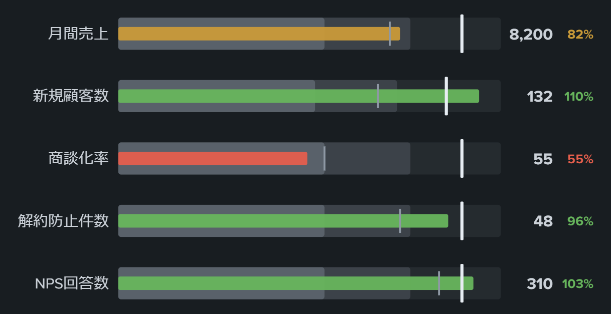

# Custom Viz Bullet Graph



Splunk Dashboard Studio 用のカスタムビジュアライゼーション。**ブレットグラフ（bullet graph）リスト**。Stephen Few がゲージの代替として設計した高密度 KPI 表現で、1 行＝1 指標として「実績バー」「目標ティック」「良／可／不可の質的バンド」を 1 本に重ねて表示する。Splunk 標準ビジュアライゼーション（bar / gauge / single value 等）では目標ティックと質的バンドの重畳を再現できない。

売上・案件数・SLA 達成率などの目標管理、キャパシティのしきい値監視、チーム別 KPI の一覧など「多数の指標を目標と比べて省スペースで並べる」用途に使える。kpi-tile（単一指標を大きく）と対になる「多数の指標を密度高く」のポジション。

## 特徴

- 実績バー＋目標ティック＋質的バンド（3 段グレー）を 1 行に重畳。行数分だけ縦に並ぶ
- 実績バーは達成度で自動色分け：不可＝赤／可＝黄／良＝緑（境界は目標比 %、既定 60% / 85%。色変更可・単色モードあり）
- 達成率（実績÷目標）を右端に表示。行ごとのツールチップに実績／目標／達成率／前回値
- 比較マーカー（前回値など）を細いティックで追加表示可能
- 目標列は `target` / `goal` / `目標` / `計画` 等のフィールド名で**自動検出**（無ければ 2 番目の数値列）。比較列も `prev` / `前回` / `前期` 等で自動検出
- `range1`〜`range3`（または `band1`〜`band3`）列があればバンド境界を**行ごとの絶対値**で指定可能
- ラベル・実績・目標・比較フィールドをドロップダウンで選択（editor.columnSelector、DOS 文字列を自前解決）
- 「全行で同一スケール」（同一単位の指標を比較）と「達成率が低い順に並べ替え」（問題のある指標を上に）
- マルチバリューセル救済、rows / columns 両形式対応、負値・目標ゼロにも安全
- コンテナ実寸へ自動フィット。行数が多いときは縦スクロール、小さいパネルでは達成率 → 値 → ラベルの順に段階退避
- バー伸長アニメーション（上から順に、オフ可）
- ライト／ダークテーマ対応、編集パネルは日本語ラベル

## データ仕様

| 列 | 内容 |
| --- | --- |
| ラベル列（既定: 数値でない最初の列） | 指標名 |
| 実績列（既定: 最初の数値列） | 実績値 |
| 目標列（任意） | 目標値。フィールド名 `target`/`goal`/`plan`/`budget`/`quota`/`目標`/`計画`/`予算`/`ノルマ` で自動検出。無ければ 2 番目の数値列 |
| 比較列（任意） | 前回値など。`prev`/`previous`/`last`/`prior`/`compare`/`baseline`/`前回`/`前期`/`前年`/`昨年` で自動検出 |
| `range1`〜`range3` 列（任意） | バンド境界の絶対値（行ごとに指定。目標比 % 指定より優先） |

バンド境界の既定は「目標 × 60%（ここ未満は不可）／ 85%（ここ未満は可）」。目標が無い行はスケール最大値比で計算する。

## サンプル SPL

基本（目標・前回列を自動検出）:

```spl
| makeresults format=csv data="KPI,実績,目標,前回
月間売上,8200,10000,7900
新規顧客数,132,120,95
商談化率,55,100,60
解約防止件数,48,50,41
NPS回答数,310,300,280"
```

絶対値バンド（行ごとに良／可／不可の境界を指定）:

```spl
| makeresults format=csv data="KPI,実績,目標,range1,range2
CPU余裕率,42,50,30,45
ディスク余裕率,18,40,20,35
メモリ余裕率,55,50,25,40"
```

実データ例（ホスト別イベント数 vs 目標）:

```spl
index=_internal earliest=-24h
| stats count as 実績 by host
| eval 目標=50000
| table host 実績 目標
```

## 開発

```bash
yarn install
yarn build     # dist/custom_viz_bullet_graph/visualization.js
yarn verify    # happy-dom によるローカル検証（Splunk 実機なし）
yarn package   # dist/custom_viz_bullet_graph-<ver>-<hash>.spl
```

## デプロイ

1. バージョンを上げて `yarn build && yarn package`
2. Splunk Web「App をファイルからインストール」で **「App のアップグレード」にチェック**して `.spl` をアップロード
3. `https://<host>:8000/en-US/_bump` で Bump version
4. ブラウザをハードリロード（Ctrl+Shift+R）

Dashboard Studio の JSON では `"type": "custom_viz_bullet_graph.custom_viz_bullet_graph"` を指定する。
