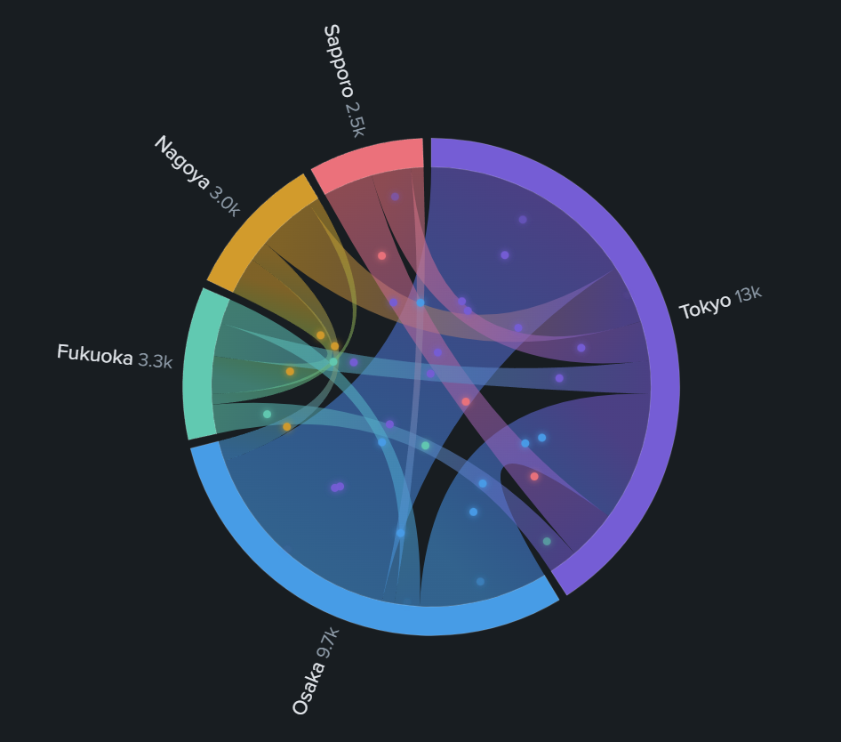

# Custom Viz Chord Flow



Splunk Dashboard Studio 向けのカスタムビジュアライゼーション。
**アニメーションパーティクル付き有向コード・ダイアグラム（弦グラフ）** です。

エンティティを円周上に配置し、相互のフローをグラデーションリボンで表現。リボンの上を
**流量に比例した密度の発光パーティクルが source → target 方向に流れ続け**、フローの
方向と量が一目で分かります。デフォルトビジュアライゼーションでは表現できない
**双方向・循環フロー**（A→B と B→A、A→B→C→A）をそのまま描画できます（Sankey は DAG 限定）。

## 特徴

- **有向コードレイアウト（自前実装）**: 弧の幅 = 入出フロー合計。弧の内側に「出フロー帯 →
  入フロー帯」の順でサブ弧を割り当て、リボンで結ぶ。双方向は独立した2本のリボン
- **フローパーティクル**: rAF ハイブリッド描画（React は構造、rAF ループは cx/cy/opacity のみを
  直接更新）。経路はリボンと同じ中心向き二次ベジェなのでリボン上を正確に流れる。
  速度・密度・サイズ・グロー（発光）をオプションで調整可能
- **フロー方向の視認性**: リボンを source 側で太く target 側で細くするテーパー（既定 ON）と、
  target 端に幅連動の三角矢印（任意）。パーティクルを止めても向きが一目で分かる
- **リング回転**: 度/秒指定でリング全体をゆっくり回すアンビエント演出（既定 OFF）
- **値→色カラースケール**: 低値色 →(中間色)→ 高値色の線形補間 + 反転。凡例グラデーション付き
  （`editor.dynamicColor` はカスタム viz で使えないため自前実装）
- **ホバーハイライト + クリックで選択固定**: 弧/リボンにホバーで関連フローだけ強調
  （パーティクルも連動して減光）。クリックすると選択をロック（再クリック／背景クリックで解除）し、
  マウスを離しても強調が残る。ツールチップに流量・入出内訳・全体比・逆方向流量
- **自己ループ表示（任意）**: source = target のフローを、弧の外側に膨らむ小さな戻り弧として描画
  （既定 OFF）。弧幅（入出合計）には算入しないのでリングのレイアウトは変わらない
- オートフィット（ResizeObserver）、ライト/ダークテーマ対応、上部サマリーヘッダー
- ガード処理: 空データ・列不足・非数値・自己ループ・空カテゴリ・rows/columns 両形式に対応。
  エンティティ上位 40 / リボン上位 400 に自動制限（切り捨てはヘッダーに表示）
- **マルチバリュー行の自動展開**: mvexpand し忘れ等で1行のセルに配列（または改行区切り）で
  届いたデータは、全カラムのトークン数が一致すれば自動で行に展開して描画する
- 巨大数（1e15 以上）は指数表記で表示しヘッダー崩壊を防ぐ
- **ラベル自動フィット**: ラベル余白は実ラベルの推定幅（CJK 対応）から計算。収まらない場合は
  「値の併記オフ → 名前を … で切り詰め → ラベル非表示（ツールチップで代替）」の順に段階退避し、
  小さいパネルでも見切れずリングを優先して描画する
- リボンのツールチップに逆方向（B→A）の流量も併記

## データ仕様

| 列 | 内容 |
|----|------|
| 第1列 | source（送り元エンティティ） |
| 第2列 | target（送り先エンティティ） |
| 最終列 | 数値（流量、> 0） |

上記は既定の割り当て。**編集画面の「Data」セクション（editor.columnSelector）で
Source / Target / Value に使うフィールドを任意に選択できる**（標準 viz の「データ設定」と同じ UI）。
選択結果は DOS 文字列（`> primary | seriesByName('src')`）で届くため、viz 側で
フィールド名をパースして列を解決する。生フィールド名・解決済み配列・`seriesByIndex(n)` にも対応し、
未設定/解決不能時は既定（第1列/第2列/最終列）にフォールバックする。
Source と Target に同じフィールドを選ぶと専用メッセージを表示する。

- 同じ (source, target) ペアは合算
- source→target と target→source は別リボン（双方向 OK、循環 OK）
- 空文字・非数値・0 以下は除外
- 自己ループ（source = target）は既定で除外。**「自己ループを表示」を ON にすると**戻り弧として描画
  （エンティティ間フローが1本も無く自己ループだけの場合は環を構成できないため除外扱いのまま）

## サンプル SPL

Splunk 9.0 以降（`makeresults format=csv` 対応）:

```spl
| makeresults format=csv data="src,dst,count
Tokyo,Osaka,5200
Osaka,Tokyo,3100
Tokyo,Nagoya,1400
Tokyo,Fukuoka,800
Nagoya,Fukuoka,900
Fukuoka,Tokyo,700
Osaka,Fukuoka,600
Nagoya,Osaka,500
Sapporo,Tokyo,1200
Tokyo,Sapporo,950
Osaka,Sapporo,300
Fukuoka,Nagoya,250
Tokyo,Tokyo,600
Osaka,Osaka,400"
| table src dst count
```

上記末尾2行は自己ループ（`Tokyo,Tokyo` / `Osaka,Osaka`）。既定では除外されるが、
編集画面の「データ > 自己ループを表示」を ON にすると戻り弧として描画される。

古い Splunk 向け（split + mvexpand。makemv/rex に依存しない）:

```spl
| makeresults
| eval raw=split("Tokyo,Osaka,5200|Osaka,Tokyo,3100|Tokyo,Nagoya,1400|Tokyo,Fukuoka,800|Nagoya,Fukuoka,900|Fukuoka,Tokyo,700|Osaka,Fukuoka,600|Nagoya,Osaka,500|Sapporo,Tokyo,1200|Tokyo,Sapporo,950|Osaka,Sapporo,300|Fukuoka,Nagoya,250", "|")
| mvexpand raw
| eval src=mvindex(split(raw,","),0), dst=mvindex(split(raw,","),1), count=tonumber(mvindex(split(raw,","),2))
| table src dst count
```

ネットワークトラフィックの例:

```spl
index=* sourcetype=firewall
| stats sum(bytes) as bytes by src_zone dest_zone
| where src_zone != dest_zone
```

## トラブルシュート

### 「Field '_raw' does not exist in the data.」警告が出る

このアプリ（viz 本体・config.json）は `_raw` を一切参照していない。警告はダッシュボード側の
`_raw` 参照が原因:

- 旧サンプル SPL（`eval _raw=... | makemv _raw | mvexpand _raw | rex field=_raw ...`）を
  使っている場合 → 上記の `makeresults format=csv` 版に差し替える（`_raw` を使わない）
- それでも消えない場合 → ダッシュボードのソース（JSON）を開き `_raw` で検索。
  以前のビジュアライゼーション（イベント表示等）の名残りが `requiredFields` や
  eventHandler に残っていたら削除する

## 開発コマンド

```bash
yarn install        # 依存インストール
yarn build          # dist/custom_viz_chord_flow/visualization.js を生成
yarn verify         # happy-dom でバンドルをローカル検証（Splunk 実機なし）
yarn package        # dist/custom_viz_chord_flow-<ver>-<hash>.spl を生成
```

## デプロイ（アンインストール・再起動なし）

1. `npm version patch --no-git-tag-version` でバージョンを上げ、`package/app/app.conf` の
   `version` も同期して `yarn build && yarn package`
2. Splunk Web「Install app from file」で **"Upgrade app" にチェック**して `.spl` をアップロード
3. `https://<host>:8000/en-US/_bump` を開いて **Bump version**
4. ブラウザをハードリロード（Ctrl+Shift+R）

## オプション（ダッシュボード編集画面）

編集画面のラベルはすべて日本語。

| セクション | 項目 |
|-----------|------|
| データ | 送信元 / 送信先 / 数値（流量）フィールドの選択（columnSelector） / 自己ループを表示 |
| リボン | 送信元を太く・送信先を細く（テーパー） / 送信先側に矢印 / グラデーション / 不透明度 / 値ベースカラースケール（低・中・高色、反転） |
| フローパーティクル | 表示 ON/OFF / 速度% / 密度% / サイズ / グロー |
| リング | 弧の太さ / 弧間ギャップ / 回転速度（度/秒） |
| ラベル | 表示 / 値併記 / 文字サイズ |
| 表示 | サマリーヘッダー / ホバーハイライト / クリックで選択を固定 |
| デバッグ | options 診断オーバーレイ |
