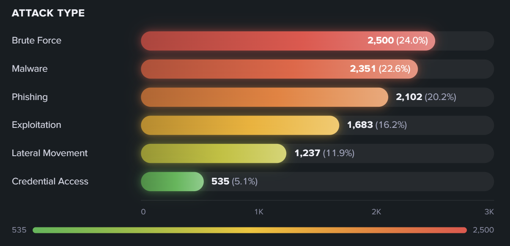

# custom-viz-gradient-bar



Splunk Dashboard Studio 向けのカスタムビジュアライゼーション（グラデーション横棒バーチャート）。

サーチ結果を、グラデーション＋グロー付きの横棒バーで表示する。各行にラベル・値・割合を並べ、
値の大小がひと目で分かるモダンなバーチャート。編集画面（右パネル）から色・並び順・表示要素を
細かく設定できる。

## 特徴

- データドリブン描画（既定は第1列＝ラベル、第2列＝数値としてバー生成）
- **ラベル/値のフィールド選択**（標準 viz と同じ「データ設定」UI。列名を選んで割り当て。
  未指定なら第1列/第2列に自動フォールバック）
- **2 種類の塗り方式**
  - 単色グラデーション（基準色を1色指定）
  - **値ベースのカラースケール**（低値＝緑／高値＝赤 のように値に応じて色分け。中間色を挟んだ
    3色スケール、上限/下限の指定、反転にも対応。値ベース時は連続グラデーションの凡例を表示）
- **並べ替え・件数制御**（値で降順/昇順、上位N件のみ表示）
- **表示要素のトグル**（タイトル・目盛り軸・数値・割合・下地トラック・発光・アニメーション）
- **高さオートフィット**（パネルを大きくしても余白を残さず行を広げる。バーの太さは固定も可）
- ライト / ダークテーマ対応（`useTheme` によるガード付き）
- 空データ・型不一致・カンマ付き数値に対するガード処理
- 設定はすべて `useOptions` 経由。編集画面のラベルは日本語

## データ仕様

| 列 | 説明 |
| --- | --- |
| ラベル列 | カテゴリ名。既定は第1列（編集画面「データ > ラベルのフィールド」で変更可） |
| 値列 | 数値。既定は第2列（編集画面「データ > 値のフィールド」で変更可）。カンマ付き文字列も可。負値・非数値・空ラベルの行は除外 |

## 編集画面のオプション

| セクション | オプション | 内容 |
| --- | --- | --- |
| データ | ラベルのフィールド / 値のフィールド | バーのラベル列・値列を選択（空欄で第1列/第2列） |
| バーの色 | 値で色分けする | ON で値ベースのカラースケール、OFF で単色グラデーション |
| バーの色 | 単色グラデーションの基準色 | OFF 時の1色 |
| 値ベースのカラースケール | 低値/高値/中間色 | スケールの色 |
| 値ベースのカラースケール | 中間色を使う | 3色スケールにする |
| 値ベースのカラースケール | 反転 | 高い値を低値側の色にする |
| 値ベースのカラースケール | スケール下限/上限 | 空欄でデータの min/max を自動採用 |
| 並べ替え・件数 | 値で並べ替える / 昇順 | OFF で検索結果順を維持 |
| 並べ替え・件数 | 上位N件のみ表示 | 0 で全件 |
| 表示 | タイトル/軸/数値/割合/トラック/発光/アニメーション | 各要素の表示切替 |
| レイアウト | 高さいっぱいに広げる | OFF で固定行高 |
| レイアウト | バーの太さ | 0 で自動 |
| 診断 | オプションのデバッグ表示 | options の生値をオーバーレイ表示 |

## 開発

```bash
yarn install
yarn build          # dist/custom_viz_gradient_bar/visualization.js を生成
yarn package        # dist/*.spl（Splunk アプリパッケージ）を生成
node test/verify.mjs # happy-dom によるローカル検証（実機なし。25 チェック）
```

本番向け（minify・ソースマップ無し）は `yarn build:prod` の後に `yarn package` を実行する。
アプリのメタデータは `package/app/app.conf` に格納されている（`package.json` は Node/npm 用）。

> `test/verify.mjs` は happy-dom を `custom-viz-sankey-flow/node_modules` から借用するため、
> gradient-bar 側に happy-dom を追加インストールする必要はない。

## デプロイ（再インストール・再起動なし）

1. `npm version patch --no-git-tag-version && yarn build && yarn package` でバージョンを上げて `.spl` を生成
2. Splunk Web「Install app from file」で **"Upgrade app"（上書き）にチェック**して `.spl` をアップロード
3. ブラウザで `https://<host>:8000/en-US/_bump` を開き **Bump version**（Splunk 再起動の代替）
4. ブラウザをハードリロード（Ctrl+Shift+R）

## サンプル SPL

Splunk 9.0+（最も確実・読みやすい）:

```spl
| makeresults format=csv data="category,count
Authentication,1240
Network,980
Malware,760
Policy,540
Web,410
Email,230"
| eval count=tonumber(count)
```

旧環境（`makeresults format=csv` が使えない場合）:

```spl
| makeresults
| eval raw=split("Authentication,1240|Network,980|Malware,760|Policy,540|Web,410|Email,230","|")
| mvexpand raw
| eval category=mvindex(split(raw,","),0), count=tonumber(mvindex(split(raw,","),1))
| table category count
```

「値で色分けする」を ON にすると、count の大小に応じて 緑（低）→黄→赤（高）で塗り分けられる。
セキュリティ深刻度など「高い値ほど危険」を直感的に見せたいときに有効。

### フィールド選択の例（3列以上）

3列以上あるときは「データ > ラベルのフィールド／値のフィールド」で使う列を選べる。

```spl
| makeresults format=csv data="host,region,bytes,errors
web-01,us,5200,12
web-02,eu,1400,3
db-01,us,3600,8
db-02,eu,1500,21"
| eval bytes=tonumber(bytes), errors=tonumber(errors)
```

- ラベル＝`host`・値＝`bytes` を選べば通信量のバー、値＝`errors` に切り替えればエラー数のバーになる。
- ラベル＝`region` を選ぶと地域名がラベルになる（同名の集約はしないため、集計は SPL 側で `stats` 等で行う）。

> **実装メモ**: フィールド選択 UI は `editor.columnSelector`。カスタム viz には選択結果が
> DOS 文字列（`> primary | seriesByName('bytes')`）のまま届くため、viz 側の `resolveFieldIndex`
> が `seriesByName(...)` / `seriesByIndex(...)` / 生フィールド名 / ホスト解決済み配列 を自前で
> パースして列を解決する。解釈できない・存在しないフィールドは第1列/第2列へ安全にフォールバックする。

---

## リリースノート

このセクションは本ビジュアライゼーションのバージョン履歴を記録します。
新しいバージョンをパッケージ化するたびに、履歴の先頭（下の区切り線の直下）に新しいエントリを追記してください。

書式は [Keep a Changelog](https://keepachangelog.com/ja/1.0.0/) に準拠し、バージョンは [セマンティックバージョニング](https://semver.org/lang/ja/) に従います。
変更種別: `追加` / `変更` / `修正` / `削除` / `非推奨` / `セキュリティ`。

---

### [1.0.1] - 2026-07-21

#### 修正

- **まれにパネルが描画されない事象への対策（マウントゲート導入）**。ホスト初期化完了
  （`DashboardExtensionAPI` 注入＋テーマ／データの初期 state 受信）を待ってから React を
  マウントするよう変更。公式フックは購読登録時に現在値を再送しないため、初期 state が
  マウント後に届くと取り逃して `useTheme` 等が undefined のまま永久に非表示となる
  競合があった。
- **テーマ未取得時のフォールバックを追加**。最大5秒待っても初期 state が揃わない場合は
  light テーマで必ず描画を開始する（永久に真っ白のままになる経路を排除）。

#### パッケージ
- `dist/custom_viz_gradient_bar-1.0.1-d824e00.spl`

### [1.0.0] - 2026-07-20

値に応じたグラデーション配色の横棒バーチャート。

#### 追加
- 新規作成（初回リリース）。
- パッケージ: `dist/custom_viz_gradient_bar-1.0.0-beb3d05.spl`
