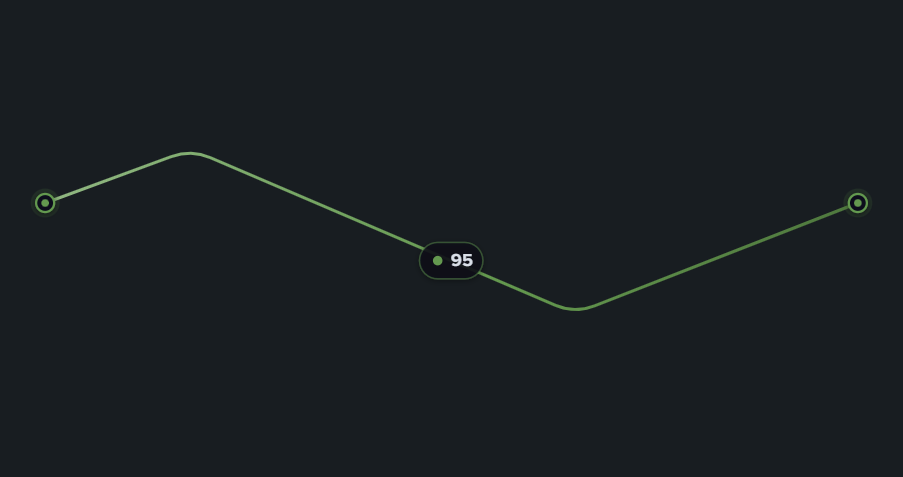

# Custom Viz Link Line（サーバ間コネクタ線）



Splunk Dashboard Studio 用のカスタムビジュアライゼーション。
SOC ダッシュボードなどで「サーバ（パネル）同士を線で繋ぎ、接続の状態に応じて線の色を変える」ためのコネクタ線。

## 特徴

- **キャンバス上で線を直接編集**（表示画面の「✎ 線を編集」トグル）
  - 点（○）をドラッグ＝移動
  - セグメント中央の「＋」をドラッグ＝折れ点を追加
  - 中間の点をダブルクリック＝削除
  - 「線をリセット」ボタン＝既定の水平線に戻す
  - 点列は正規化座標(0..1)の JSON としてオプションに保存されるため、編集後に**ダッシュボードの「編集」→「保存」で線の形が確定**する。パネルをリサイズすると線も相対的に追従する
  - ⚠️ Studio の**編集モード中はドラッグ編集できない**（ホストがカスタム viz への入力をパネル選択に使うため）。編集モードでは案内のみ表示し、線の形は表示画面で調整する設計。「表示画面での線編集を許可」オプションでトグルを非表示にもできる
- **シングルバリュー×動的色設定**（標準 Single Value の「動的色設定」UI を再現）
  - サーチ結果の値フィールド（既定は「数値を含む最後の列」）の**最終行**を採用
  - 表示画面の「🎨 色を設定」パネルで設定。方式は「**範囲**」（しきい値バンド）と「**一致**」（値の完全一致。`OK`/`NG` など文字列にも対応）
  - 範囲: プリセットパレット（ダーク/ライト・7段ランプ・▾で赤→緑/緑→赤/青を選択）、⇄色反転、＋範囲の追加、「80 以上」「60 〜 80」「より小さい 20」の標準準拠表記
  - 変更は即時反映され、ダッシュボードの「編集」→「保存」で確定
  - ※標準の「動的色設定」パネル（editor.dynamicColor）はカスタム viz に編集内容が渡らない Splunk の制約があるため、同じ操作感を viz 内で再現している
  - 簡易しきい値（緑→黄→橙→赤）は動的設定が無いときの既定フォールバックとして機能
- **質感を選べる**（どんなダッシュボードにも馴染むよう背景は透明）
  - 1=フラット / 2=ソフトシャドウ / 3=ネオン発光 / 4=立体パイプ
  - 線幅・破線・**流れアニメーション**（実線では明るい粒が流れ、破線では破線自体が流れる）・不透明度
  - 両端のコネクタ（丸端子）・終点の矢印・線の中央の値ラベル（小数桁指定可）
- データが無い/数値が無い場合も線は消さず、ニュートラル色（グレー）＋「N/A」で描画（コネクタとしての表示を維持）

## データ仕様

- シングルバリュー。値フィールド（編集パネルで選択。未指定なら「数値を含む最後の列」）の**最終行の値**を使用
- `timechart` の結果を渡した場合は最新値が使われる
- rows / columns 両形式、マルチバリューセルにも対応

## 使い方（Dashboard Studio）

1. `packages/custom_viz_link_line-<ver>-<hash>.spl` を「Install app from file」でインストール（更新時は Upgrade にチェック）
2. ダッシュボードのソース JSON で viz の `type` に `custom_viz_link_line.custom_viz_link_line` を指定（またはビジュアライゼーション一覧の Custom から選択）
3. 編集モードでパネルを繋ぎたい位置・サイズに配置し、質感などを右パネルで設定 → 保存
4. **表示画面**に戻り、パネル右上の「✎ 線を編集」で点をドラッグ（＋で折れ点追加／ダブルクリックで削除）、「🎨 色を設定」で値の範囲→色を設定
5. もう一度ダッシュボードの「編集」に入る（この瞬間に変更が定義へ書き込まれ「保存」が有効になる）→「保存」で確定

### サンプル SPL（動作確認用）

```spl
| makeresults format=csv data="_time,latency_ms
2026-07-22 10:00:00,35
2026-07-22 10:01:00,52
2026-07-22 10:02:00,95"
```

最終行の `95` が採用され、既定しきい値（40/70/90）では線が赤になる。

ランダムに状態が変わるデモ:

```spl
| makeresults | eval latency_ms=random()%120
```

## 開発

```bash
yarn install
yarn build     # dist/custom_viz_link_line/visualization.js
yarn verify    # happy-dom でのローカル検証（Splunk 実機なし）
yarn package   # dist/custom_viz_link_line-<ver>-<hash>.spl
```

## デプロイ（再起動不要）

1. `package.json` と `package/app/app.conf` のバージョンを上げて `yarn build && yarn package`
2. Splunk Web「Install app from file」で **Upgrade にチェック**してアップロード
3. `https://<host>:8000/en-US/_bump` で Bump version → ブラウザをハードリロード（Ctrl+Shift+R）

---

## リリースノート

本ファイルは [Keep a Changelog](https://keepachangelog.com/ja/1.0.0/) に準拠し、バージョニングは [Semantic Versioning](https://semver.org/lang/ja/) に従う。

---

### [1.7.0] - 2026-07-22

#### 修正

- **光の帯が始点/終点で段階的にカクついて消える問題（デュデュデュ）を修正**
  - 原因: パス範囲外に出た帯のサンプル点を単純に捨てていたため、境界を跨ぐ瞬間にポリゴンの端がサンプル間隔ぶん飛んでいた
  - 対策: 端点近傍（帯長の 1/2）に smoothstep のフェード窓を掛け、境界に近いサンプルの幅を 0 へ滑らかに窄める。サンプルが消える瞬間には幅がほぼ 0 のため、出入りが連続的に見える

#### 変更

- **複数の link-line パネルで光の帯が同期するように**（同時に出発・同時に終点へ到着）
  - 位相を rAF のローカル経過時間でなく壁時計（`Date.now`）から算出（別 iframe のパネル同士でも共通の時計で自動同期）
  - 帯の長さをパス長の固定比率（24%）に変更（world-map と同方式）。これで線の長さが違っても出発・到着が周期内の同じ位相で起きる
  - `flowSpeed` の意味を「px/秒ベース」から「周期ベース」に変更: 周期 = 8秒 ÷ 速度（速度1=8秒、速度2=4秒、…）。**同期させたいパネルは同じ速度に設定する**
  - 端点パルスも壁時計位相に変更（パネル間で同期して明滅）

#### 成果物

- `dist/custom_viz_link_line-1.7.0-89dd49d.spl`

---

### [1.6.0] - 2026-07-22

#### 変更

- **流れアニメーションを world-map と同方式の「光の帯」（Canvas）に刷新**
  - 従来の SVG `stroke-dashoffset` で細かい明るい粒の破線を流す方式は、粒の繰り返しがストロボ的に見えて目がチカチカするため廃止
  - 新方式は「両端が sin エンベロープで滑らかに窄まるテーパー形状の光の帯」を Canvas にポリゴン 1 回塗りで描画（world-map v1.1.1 と同じ手法）。下に太く淡い同色グローを敷き、柔らかい輪郭に。加算合成は不使用（白飛びしない）
  - 帯は角丸を含む線の形状（折れ点・角丸ベジェ）に正確に追従。速度の体感は従来と同じ（速度1 ≒ 60px/秒）
  - 破線（`dashLength` > 0）は静的な線種となり、流れアニメーションは破線/実線どちらでも光の帯が担う
  - 端点パルスも同じ Canvas の rAF ループに統合し、SVG の毎フレーム属性書き換えを全廃。アニメーション停止時（速度0・パルスなし）は Canvas 自体をマウントせず rAF ゼロ（CPU 0）で軽量
  - 編集パネルのラベルを「光の帯の速度（0で停止）」に変更
- 値ラベルのチップを SVG から HTML に移動（光の帯がラベルの上を通って重ならないように Canvas より上のレイヤーへ）

#### 成果物

- `dist/custom_viz_link_line-1.6.0-89dd49d.spl`

---

### [1.5.0] - 2026-07-22

#### 変更

- **「🎨 色を設定」パネルを標準の動的色設定 UI に忠実に再現**
  - 方式タブ「**範囲**」/「**一致**」（標準と同じ2方式。※標準の editor.dynamicColor 自体は編集内容がカスタム viz に渡らない Splunk の制約により流用不可のため、UI を再現）
  - **範囲**: プリセットパレット（ダークカラー/ライトカラー タブ＋7段ランプバー。バーをクリックで各範囲に適用、▾で他パレット選択=赤→緑/緑→赤/青）、⇄ 色反転、＋範囲の追加、行表記は標準準拠（「80 以上」「60 〜 80」「より小さい 20」）
  - **一致**: 値の完全一致 → 色（カラーピッカー＋値入力＋×削除、＋一致の追加）。数値以外の文字列値（例: `OK`/`NG`）にも対応し、値ラベルにも生の文字列を表示。どれにも一致しない場合はグレー
  - 方式・範囲・一致はすべて保存対象（pending flush 経由で「編集」→「保存」で確定）

#### 追加

- オプション `colorMethod`（range/match）・`colorMatches`（一致定義 JSON）
- 成果物: `dist/custom_viz_link_line-1.5.0-4cffa87.spl`

### [1.4.0] - 2026-07-22

#### 変更

- **ビジュアル全面刷新**（モダンなダッシュボードに馴染む質感へ）
  - 線に始点→終点の淡い**グラデーション**（既定オン、`lineGradient` でオフ可）
  - ネオン発光をガウスぼかしの二層ハローに変更（レイヤー重ねの硬い光→柔らかい発光）
  - 立体パイプに上側スペキュラハイライト（進行方向に応じてオフセット）
  - ソフトシャドウを浅く上品に調整
  - 端点コネクタを「ポート風」に刷新（淡いハロー＋面フィルのリング＋色のコアドット）
  - 値ラベルを再設計: インク色テキスト＋色ドットのチップ（テキストに系列色を使わない）、細いボーダー、微シャドウ
  - 矢印をシェブロン（凧型）形状に
  - 流れる粒を「ぼかした下層＋シャープな粒」の二層に
  - 画面上のボタン（✎/🎨）の様式を調整（角丸8px・シャドウ・タイポ調整）

#### 追加

- オプション「線にグラデーション（立体感）」（`lineGradient`、既定オン）
- オプション「端点をパルス発光させる（アニメーション）」（`pulseCaps`、既定オフ）
- 成果物: `dist/custom_viz_link_line-1.4.0-4cffa87.spl`

#### 削除

- 編集パネル（右側）の「色（簡易しきい値）」セクションを削除。色は表示画面の「🎨 色を設定」に一本化（簡易しきい値オプション自体は既定値・後方互換のため内部に残り、動的設定が無いときのフォールバックとして機能）

### [1.3.0] - 2026-07-22

#### 修正

- **表示画面で編集した線の形・色が「編集」モードに入るとリセットされる問題を修正**。ホストが表示モード中の `setOptions` をダッシュボード定義に取り込まないことが実機で判明したため、表示画面での変更（線の形 `linePoints`・色の範囲 `colorBands`）を viz 内に保持し、**編集モードに入った瞬間に `setOptions` を再送（flush）**するようにした。編集モードでは定義が更新されて「保存」ボタンが有効になるので、そのまま保存すれば永続化される。再送は未反映分のみ・一度反映されたら再送しない
- 色設定パネルの編集中はホストの反映を待たずに線の色が変わるライブプレビューを追加（表示モードの setOptions が無視される環境でも見た目が追従）

#### 追加

- 成果物: `dist/custom_viz_link_line-1.3.0-4cffa87.spl`

### [1.2.0] - 2026-07-22

#### 修正

- 「アップグレードしても旧バンドルが配信され続ける」事象の原因は **Cloudflare トンネル経由アクセスのキャッシュ**と判明（直接 IP でのアクセスでは v1.1.0 以降が反映されていた）。調査過程で build 番号のエポック秒化を試したが原因ではなかったため取り消し（本バージョンの `.spl` のみエポック秒 build で生成されているが動作への影響はない）。トンネル経由で反映されない場合は直 IP で確認するか、Cloudflare 側のキャッシュをパージする

#### 追加

- **動的色設定パネル**（表示画面の「🎨 色を設定」）: 標準 Single Value の「動的色設定：範囲」相当の UI を viz 内に実装。範囲の＋追加/×削除・カラーピッカー・プリセット2種（低=赤→高=緑／低=緑→高=赤）・⇅色反転・「簡易しきい値に戻す」。設定は `colorBands`（JSON）として保存され、簡易しきい値より優先される。※標準の editor.dynamicColor はカスタム viz に編集内容が渡らないため使用不可（Splunk の制約）
- バージョン表記（編集モードの案内・色設定パネル・デバッグ表示に `v1.2.0`）— デプロイ反映の確認が一目でできるように
- 成果物: `dist/custom_viz_link_line-1.2.0-4cffa87.spl`

### [1.1.0] - 2026-07-22

#### 変更

- 線のドラッグ編集を「編集モード中」から「**表示画面の『✎ 線を編集』トグル**」方式に変更。Studio の編集モードではホストがカスタム viz（iframe）への入力をパネル選択に使うため、viz 内のドラッグ UI が動かないことが実機で判明（原因調査の詳細はスキルナレッジに記録）。編集後はダッシュボードの「編集」→「保存」で確定する
- 編集モード中はハンドルの代わりに案内（「線の形は表示画面の『✎ 線を編集』で調整します」）を表示

#### 追加

- オプション「表示画面での線編集を許可（✎ボタンを表示）」（`allowViewEdit`、既定オン）。レイアウト確定後にトグルを非表示にできる
- 成果物: `dist/custom_viz_link_line-1.1.0-4cffa87.spl`

### [1.0.0] - 2026-07-22

#### 追加

- 新規作成（初回リリース）
- キャンバス上での線編集（点のドラッグ移動・「＋」での折れ点追加・ダブルクリック削除・リセット）。点列は `setOptions` で保存され、ダッシュボード保存で永続化
- シングルバリュー×しきい値色分け（基本色＋しきい値×3、カラーピッカー、しきい値オフで固定色）
- 質感 4 種（フラット/ソフトシャドウ/ネオン発光/立体パイプ）、線幅・破線・流れアニメーション・不透明度
- 端点コネクタ・終点矢印・値ラベル（小数桁指定）
- 値フィールド選択（editor.columnSelector、DOS 文字列の自前パース）
- データ欠損時はニュートラル色＋N/A で線を維持
- happy-dom によるローカル検証（63 pass）
- 成果物: `dist/custom_viz_link_line-1.0.0-4cffa87.spl`
