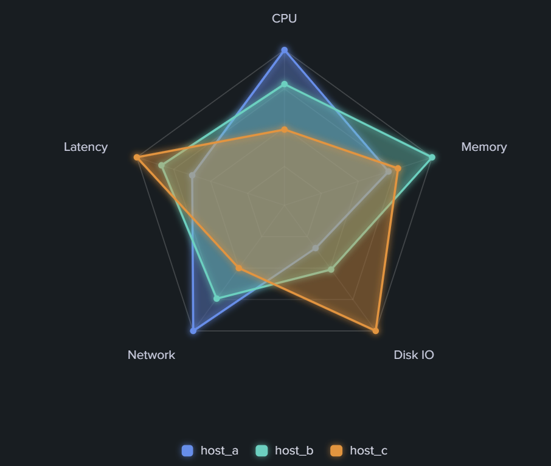

# custom-viz-radar-chart



Splunk Dashboard Studio 向けのカスタムビジュアライゼーション（レーダー / スパイダーチャート）。

複数のメトリック（軸）にまたがる複数の系列（エンティティ）を、重なり合うポリゴンとして
一目で比較できる。既定では各行が 1 つの軸、各数値列が 1 つの系列（最大 6 系列）になり、
編集画面の「データ設定」で軸・系列に使う列を任意に選べる。

## データモデル

| 列                | 役割                                              |
| ----------------- | ------------------------------------------------- |
| 軸フィールド      | 軸（メトリック）名。レーダーの各頂点になる（既定=第1列）。 |
| 系列フィールド    | 系列（エンティティ）。1 列 = 1 ポリゴン（既定=第2列以降）。 |

- 軸は 3 つ以上（3 行以上）必要。それ未満の場合はガイドメッセージを表示する。
- 既定では **軸ごとに個別スケール**（各軸をその軸の最大値で正規化）。単位の異なる
  メトリックを 1 枚のレーダーで比較できる。編集画面で「共通スケール」に切り替え可能。
- 編集画面の **「データ設定」で軸・各系列のフィールドを選択**できる。未選択なら
  「第1列=軸、それ以外=系列」の従来動作にフォールバックする。
- マルチバリューセル（`mvexpand` し忘れ・`values()` など）が 1 行に配列で届いても、
  全列のトークン数が揃っていれば自動で行へ平行展開して救済する。

## 特徴

- データドリブン描画（SPL の結果に応じて軸・系列を自動生成）
- **フィールド選択 UI**：軸・系列の列を編集画面から個別に指定（`editor.columnSelector`）
- **マルチバリューセルの自動救済**（配列/改行区切りセルを行へ展開）
- 軸ごと個別スケール ⇔ 全軸共通スケールを切り替え可能
- ポリゴン塗り不透明度・輪郭線太さ・グリッドリング本数・開始角度を編集画面から設定（useOptions）
- 頂点ドット / 軸ラベル / ホバー時の値ラベル / 凡例の表示切替
- 軸ラベルの見切れ防止（CJK 幅を考慮して余白を動的計算）
- 系列 6 色をカラーピッカーで設定
- ネオン風グロー、凡例 ⇔ ポリゴンのホバー連動ハイライト
- ライト / ダークテーマ対応（useTheme によるガード付き）
- **デバッグダンプ**（options / データ形状を画面下部に表示。オプション反映の切り分け用）

## 編集画面のオプション（日本語）

- **データ設定**：軸（メトリック名）のフィールド、系列 1〜6 の値フィールド
- **レーダー**：塗りの不透明度、輪郭線の太さ、リング本数、開始角度、共通スケール、頂点ドット、発光
- **ラベル**：軸ラベル、ホバー時の値、凡例の表示切替
- **系列の色**：系列 1〜6 のカラーピッカー
- **デバッグ**：options / データ形状のダンプ表示

## 開発

```bash
yarn install
yarn build          # dist/*/visualization.js を生成
yarn verify         # happy-dom で描画・オプション反映・ガードを検証（Splunk 実機不要）
yarn package        # dist/*.spl（Splunk アプリパッケージ）を生成
```

## デプロイ（再インストール・再起動なし）

1. `npm version patch --no-git-tag-version` でバージョンを上げ、`package/app/app.conf` の
   `version` も同期。`yarn build && yarn package` で新 `.spl` を生成
2. Splunk Web「Install app from file」で **"Upgrade app"（上書き）にチェック**して `.spl` をアップロード
3. ブラウザで `https://<host>:8000/en-US/_bump` を開き **Bump version**（Splunk 再起動の代替）
4. ブラウザをハードリロード（Ctrl+Shift+R）

## サンプル SPL

3 系列（host_a / host_b / host_c）× 5 メトリックのデモデータ。
`makeresults format=csv`（Splunk 9.0+）を使うと `mvexpand`/`rex` チェーンの取りこぼしがなく確実。

```spl
| makeresults format=csv data="metric,host_a,host_b,host_c
CPU,82,64,40
Memory,55,78,60
Disk IO,30,45,88
Network,70,52,35
Latency,45,60,72"
| table metric host_a host_b host_c
```

旧環境（`format=csv` が使えない場合）:

```spl
| makeresults
| eval raw=split("CPU,82,64,40|Memory,55,78,60|Disk IO,30,45,88|Network,70,52,35|Latency,45,60,72","|")
| mvexpand raw
| eval metric=mvindex(split(raw,","),0),
       host_a=tonumber(mvindex(split(raw,","),1)),
       host_b=tonumber(mvindex(split(raw,","),2)),
       host_c=tonumber(mvindex(split(raw,","),3))
| table metric host_a host_b host_c
```

---

## リリースノート

このセクションは本ビジュアライゼーションのバージョン履歴を記録します。
新しいバージョンをパッケージ化するたびに、履歴の先頭（下の区切り線の直下）に新しいエントリを追記してください。

書式は [Keep a Changelog](https://keepachangelog.com/ja/1.0.0/) に準拠し、バージョンは [セマンティックバージョニング](https://semver.org/lang/ja/) に従います。
変更種別: `追加` / `変更` / `修正` / `削除` / `非推奨` / `セキュリティ`。

---

### [1.0.1] - 2026-07-21

#### 修正

- **まれにパネルが描画されない事象への対策（マウントゲート導入）**。ホスト初期化完了
  （`DashboardExtensionAPI` 注入＋テーマ／データの初期 state 受信）を待ってから React を
  マウントするよう変更。公式フックは購読登録時に現在値を再送しないため、初期 state が
  マウント後に届くと取り逃して `useTheme` 等が undefined のまま永久に非表示となる
  競合があった。
- **テーマ未取得時のフォールバックを追加**。最大5秒待っても初期 state が揃わない場合は
  light テーマで必ず描画を開始する（永久に真っ白のままになる経路を排除）。

#### パッケージ
- `dist/custom_viz_radar_chart-1.0.1-d824e00.spl`

### [1.0.0] - 2026-07-20

複数指標を多角形で比較するレーダー／スパイダーチャート。

#### 追加
- 新規作成（初回リリース）。
- パッケージ: `dist/custom_viz_radar_chart-1.0.0-beb3d05.spl`
