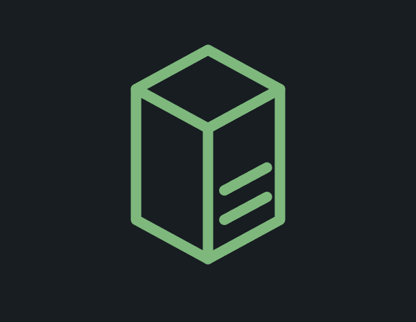
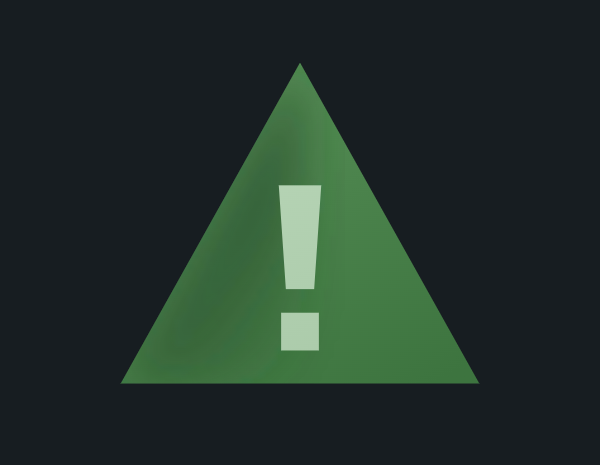
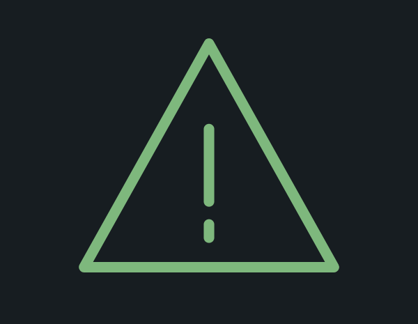
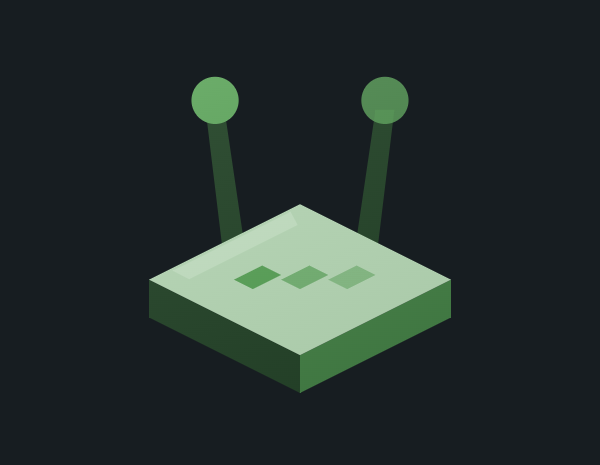
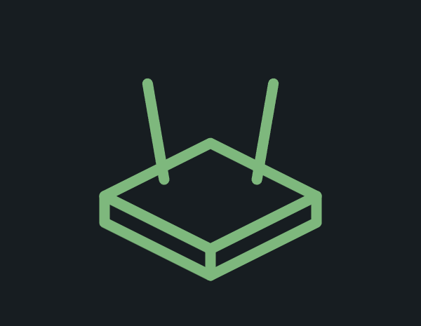
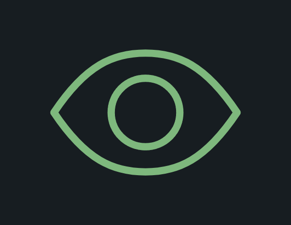
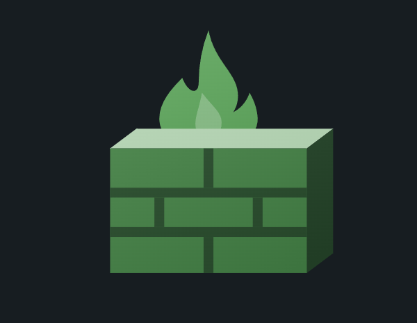
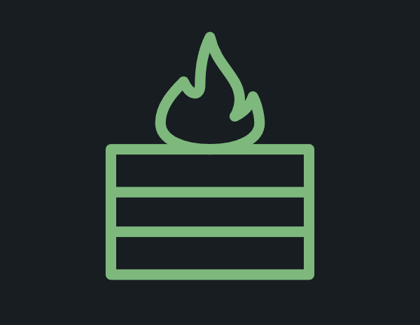
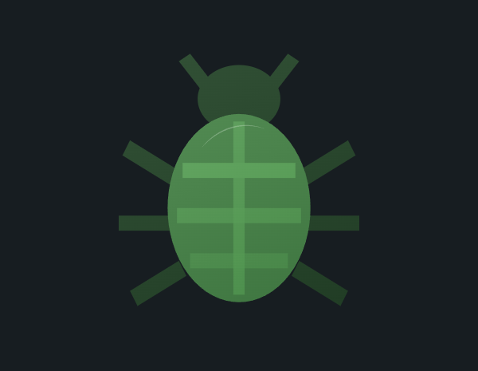
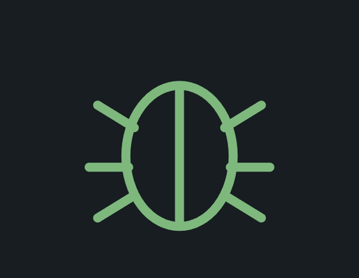

# Custom Viz Icon Status

Splunk Dashboard Studio 用のカスタムビジュアライゼーション。
**単一の数値を、SOC でよく使うアイコンで表現し、値に応じて色を変える**タイルです。

アイコンは平坦な線画ではなく **多層 SVG による立体表現**（アイソメトリック／面の陰影・
発光・接地シャドウ）で、モダンなダッシュボードの中でも見劣りしない仕上がりにしています。


## アイコン一覧

編集画面の「アイコン」で選べる 12 種です。**質感**は `立体`／`線画` を切り替えられ、
どのアイコンも**値に応じて色が変わります**（下の画像は既定の赤系バンドでの表示例）。

| | アイコン | 設定値 | 立体 | 線画 | 主な用途 |
| --- | --- | --- | --- | --- | --- |
| 1 | サーバー | `server` |  |  | ホスト数、稼働台数、CPU/メモリ使用率 |
| 2 | データベース | `database` |  |  | インデックス容量、レコード件数、DB 接続数 |
| 3 | シールド（防御） | `shield` |  |  | ブロック成功数、防御率、対策済み件数 |
| 4 | 警告 | `alert` |  |  | 未対応アラート数、重大インシデント件数 |
| 5 | 錠前 | `lock` |  |  | 暗号化率、ロックアウト数、認証失敗数 |
| 6 | ネットワーク機器 | `router` |  |  | 通信量、セッション数、機器の死活 |
| 7 | ユーザー | `user` |  |  | ログインユーザー数、特権アカウント数 |
| 8 | 監視（目） | `eye` |  |  | 監視対象数、検知ルール数、観測イベント数 |
| 9 | クラウド | `cloud` |  |  | クラウド資産数、API 呼び出し数、転送量 |
| 10 | ファイアウォール | `firewall` |  |  | 拒否パケット数、ポリシー違反数 |
| 11 | エンドポイントPC | `endpoint` |  |  | 端末数、EDR 未導入台数、パッチ未適用数 |
| 12 | バグ（マルウェア） | `bug` |  |  | マルウェア検出数、脆弱性件数 |

> **画像の置き場所**：`examples/icons/<設定値>-solid.png` と `examples/icons/<設定値>-outline.png`。
> 上の表はこのパスを参照しているので、同じ名前で画像を置けばそのまま表示されます。
> 全体の表示例は `examples/example.png` です。

## 特徴

- **12 種の SOC 向けアイコンを切り替え**
  サーバー / データベース / シールド / 警告 / 錠前 / ネットワーク機器 /
  ユーザー / 監視（目）/ クラウド / ファイアウォール / エンドポイントPC / バグ
- **値に応じた色分け**（`editor.threshold`）
  「+ 閾値の追加」で範囲を動的に増減でき、上限・下限なしの範囲も指定可能。
  色が変わると**アイコン全体（面の陰影・差し色・グロー）が一斉に連動**します。
- **2つの質感**：`立体`（多層 SVG）と `線画`。
  小さいパネルでは立体が潰れるため、**自動で線画にフォールバック**します。
- **演出**：発光（グロー）／接地シャドウ／アニメーション（パルスリング）。
  すべて個別に ON/OFF でき、既定はアニメーションなしです。
- **6 種の集計方法**：最終行 / 合計 / 平均 / 最大 / 最小 / 件数
- ライト・ダークの両テーマに対応。パネル実寸に自動フィット。

## アイコンの作り（多層 SVG）

1つのアイコンを「べた塗りシェイプの重ね合わせ」として定義し、各レイヤーには色そのもの
ではなく **色ロール** を持たせています。描画時に「基準色1色」からロールごとの実際の色を
導出するため、しきい値で基準色が変われば立体の陰影まで追従します。

| ロール | 役割 | 色の導出 |
|---|---|---|
| `glow` | 背後の発光 | 基準色の彩度を上げる |
| `faceTop` | 上面（最も明るい） | 基準色 + 白 |
| `faceFront` | 前面（中間） | 基準色 |
| `faceSide` | 側面（最も暗い） | 基準色 + 黒 |
| `accent` | 差し色（スリット・鍵穴・チェック等） | 基準色そのまま（＝光って見える） |
| `shade` | 曲面の陰（丸い形） | 基準色 + 黒。左→右へ透明に抜ける |
| `highlight` | エッジ光 | 基準色寄りの白（純白だと面から浮く） |
| `gleam` | 鏡面反射の光点（瞳など） | 純白 |
| `line` | 輪郭線（線画モード） | 基準色 ± 明度 |

アイコンのパスはすべて本リポジトリ向けに手で書き起こしたもので、外部のアイコンセットは
使用していません（ライセンス上の制約はありません）。

## パフォーマンス

- 描画されるアイコンは**常に1個**（未選択のアイコンは配列データのままで DOM に出ません）
- 1アイコンあたり **6〜20 要素**。形状は不変で色だけが変わるため **reflow が発生しません**
- グロー（`feGaussianBlur`）を使う層は**静的に保ち**、アニメーション（パルスリング）は
  フィルタの外側にある要素の `r` / `opacity` のみを `requestAnimationFrame` で
  直接書き換えます（ぼかしの毎フレーム再計算を避けるため）
- 多数のパネルを並べて重い場合は、グローとアニメーションを個別に OFF にできます

## データ仕様

| 項目 | 内容 |
|---|---|
| ラベルフィールド | 表示ラベルに使用（未指定なら値フィールド名） |
| 値フィールド | 数値。未指定なら**最終列** |
| 集計方法 | 最終行 / 合計 / 平均 / 最大 / 最小 / 件数（既定は最終行） |

- `rows` 形式・`columns` 形式のどちらでも動作します。
- カンマ入りの数値（`1,234`）も解釈します。
- 数値が1件も無い場合は「データがありません。」を表示します（`件数` 集計を除く）。

## サンプル SPL

### 1. 最小構成（単一値）

```spl
| makeresults
| eval CPU使用率 = 88
| table CPU使用率
```

### 2. しきい値の色分けを確認する（値を変えて試す）

```spl
| makeresults format=csv data="host,CPU使用率
web-01,32
web-02,64
web-03,91"
| tail 1
```

`tail 1` の値を変える（`head 1` にするなど）と、既定バンド
（〜50 緑 / 50〜80 黄 / 80〜 赤）で色が切り替わるのを確認できます。

### 3. 集計方法を使う（未対応アラートの件数）

```spl
| makeresults format=csv data="_time,severity,count
2026-07-26 09:00,critical,4
2026-07-26 10:00,high,7
2026-07-26 11:00,critical,3
2026-07-26 12:00,medium,9"
```

「集計方法 = 合計」にすると 23 が表示されます。

### 4. 実データ寄りの例（ファイアウォール拒否数）

```spl
index=firewall action=blocked
| stats count AS 拒否数
```

「アイコン = ファイアウォール」「集計方法 = 最終行」で使います。

## 設定項目（編集画面）

| セクション | 項目 |
|---|---|
| データフィールド | ラベルフィールド、値フィールド、集計方法 |
| アイコン | アイコン（12種）、質感（立体/線画）、大きさ（0.3〜1.0） |
| 色 | 色の決め方（しきい値/単色）、基準色、しきい値の色 |
| 表示 | カード背景、発光（グロー）、接地シャドウ、アニメーション |
| 数値とラベル | 数値を表示、ラベルを表示、ラベル文字列、単位、小数点以下の桁数、省略表記 |

## 開発

```bash
yarn install
yarn build      # dist/custom_viz_icon_status/visualization.js を生成
yarn verify     # happy-dom によるローカル検証（実機不要、77項目）
yarn package    # dist/custom_viz_icon_status-<ver>-<hash>.spl を生成
```

## デプロイ

アンインストール・Splunk 再起動は不要です。

1. `package.json` と `package/app/app.conf` の `version` を上げる
2. `yarn build && yarn package` で `.spl` を生成
3. Splunk Web「Install app from file」で **"Upgrade app"（上書き）にチェック**してアップロード
4. `https://<host>:8000/en-US/_bump` を開いて **Bump version**
5. ブラウザをハードリロード（Ctrl+Shift+R）

---

## リリースノート

本セクションは [Keep a Changelog](https://keepachangelog.com/ja/1.0.0/) に準拠し、
バージョニングは [SemVer](https://semver.org/lang/ja/) に従います。

---

### [1.1.2] - 2026-07-26

#### 修正

- **画像エクスポート時に背景がくり抜かれない問題を修正（1.1.1 では直りきっていなかった）。**
  1.1.1 ではカード（内側の div）だけを透過にしたが、**ルートの `.viz-container` に
  背景を指定していなかった**ため、iframe／ホスト側の既定背景が残っていた。
  - ルートに **`background: 'transparent'` を明示**した。ローディング表示・
    「データがありません」表示のコンテナにも同様に指定している。
  - 透過エクスポートできている radial-bar と DOM を並べて比較したところ、
    **radial-bar だけがルートに `background` を明示していた**ことが分かった
    （`style={{ padding, overflow, background: palette.bg }}`）。
    このリポジトリの他の viz（kpi-tile / gauge-arc / donut-graph 等）も
    ルートに背景を指定していないため、**同じ症状が出る可能性がある**。

#### 追加

- **ルートの透過を検査する回帰テストを追加**（`[9c]` に2項目）。
  (1) `.viz-container` が `background: transparent` を明示していること、
  (2) ガード表示（データなし）でも透過であること。
  指定を外して**テストが実際に落ちること**を確認済み。
  検証項目は 75 → **77 項目**。

#### 生成物

- `dist/custom_viz_icon_status-1.1.2-<hash>.spl`

---

### [1.1.1] - 2026-07-26

#### 修正

- **画像エクスポート時に背景がくり抜かれない問題を修正。**
  カード背景のベース色に**不透明色**（ダーク `#0d1020` / ライト `#ffffff`）を使っていたため、
  ダッシュボードのパネル背景を塗り潰してしまい、透過 PNG として書き出しても
  viz の地色が写り込んでいた。
  - ベース色を廃止し、**背景は常に `transparent`** にした。カード表示時の「面」は
    アクセント色の**半透明グラデーションだけ**で表現する（見た目はほぼ変わらない）。
  - 同リポジトリの radial-bar は `bg: 'transparent'` で透過エクスポートできており、
    こちらが本来あるべき実装。icon-status だけが不透明色を敷いていた。
- **`background`（一括指定）と `backgroundImage`（個別指定）の混在を解消。**
  `カード背景を表示` をトグルすると React が
  "Removing a style property during rerender" を警告し、
  片方のプロパティが消えない／消えすぎる可能性があった。
  常に同じキー集合（`backgroundColor` / `backgroundImage` / `border` /
  `borderRadius` / `boxShadow`）を渡す形に統一した。

#### 追加

- **背景の透過を検査する回帰テストを追加**（`[9c]`、6項目）。
  (1) ライト×ダーク × カード ON/OFF の全4組み合わせで不透明な背景を持たないこと、
  (2) カード配下の HTML 要素が不透明な塗りを持たないこと、
  (3) カードの面がベタ塗りではなくグラデーションであること、
  (4) カードを OFF にしたときグラデーションと枠線が残らないこと、を検査する。
  不透明色（`#0d1020`）を意図的に戻して**3項目が実際に落ちること**を確認済み。
  検証項目は 69 → **75 項目**。

#### 生成物

- `dist/custom_viz_icon_status-1.1.1-<hash>.spl`

---

### [1.1.0] - 2026-07-26

#### 変更

- **余白を最小限にした。** 「はみ出さない範囲でできるだけ小さく」する方針に変更。
  - カードの内側余白を `min(幅,高さ)×8%`（最大 20px）から **`×3.5%`（最大 10px）** に縮小。
    カード枠を出さない（`カード背景を表示`=OFF）ときは **最大 4px** までさらに詰める。
  - **アイコンの固定上限（260px）を撤廃**。大きいパネルで下に余白が残っていたのを解消し、
    テキストを引いた残りの領域いっぱいまで広げる。
  - 実測（300×260 のパネル）：余白 20px→9px、アイコン 136px→**153px**。
    480×400 では 260px→**282px**、600×500 では **382px** まで拡大する。
  - 縦方向の使用率は主要なパネルサイズで**ちょうど 100%**（余りゼロ）になる。
- **アイコンの大きさ（倍率）の範囲を 0.4〜1.6 から 0.3〜1.0 に変更。**
  固定上限の撤廃にともない、1.0 で「領域いっぱい」を意味するようにした
  （1.0 超はパネルからはみ出すため、内部でも領域サイズで頭打ちにしている）。
- **面をベタ塗りからグラデーションへ変更。** ロールごとに線形グラデーション
  （`faceTop` / `faceFront` / `faceSide` / `accent`）を生成し、光源を左上と想定して
  上→下で暗くする。ベタ塗りは「色を塗り分けただけの平面」に見えていた。
  `gradientUnits="userSpaceOnUse"` で viewBox 全体を基準にし、
  隣り合う面で明るさが噛み合うようにしている（既定の `objectBoundingBox` だと
  レイヤーごとに基準が変わり、パッチワークに見える）。

#### 削除

- **アニメーションの「LED 明滅」を廃止。** オプションは `なし` / `パルスリング` の2択になり、
  `editor.select` から `editor.radioBar` に変更した。
  旧設定に `led` が残っていても既定（なし）に倒れる。
  明滅用の `blink` フラグ・rAF ループ・`data-base-opacity` 属性もすべて削除した。

#### 修正

- **丸い形のアイコンに出ていた「中央の硬い縦線（seam）」を解消。**
  人・盾・警告・雲・目・虫・錠前は「左半分をベタ塗り」して陰にしていたため、
  中心 x=48 に切れ目が出てクリップアート然として見えていた。
  陰専用の色ロール **`shade`** を新設し、(1) 左→右へ透明に抜けるグラデーション、
  (2) 陰の層だけを `feGaussianBlur` で軽くぼかす、(3) 本体の外形（`clipShape`）で
  切り抜いてはみ出しを防ぐ、の3点で境界を溶かした。
  ※ グラデーションの終点を調整するだけでは消えず、ぼかしとクリップの併用が必要だった
  （複数回にわたり描画して確認）。
- **ネットワーク機器のアンテナ**を太くし、先端の玉も大きくした（棒＋点で玩具っぽく見えていた）。
- **錠前の本体の陰**を左端のみの帯からグラデーションに変更。

#### 追加

- **余白に関する回帰テストを追加**（`[9b]`、5項目）。
  (1) 内側余白が 10px 以下、(2) 主要な4サイズで中身がパネルからはみ出さない、
  (3) 大きいパネルでアイコンが固定上限で頭打ちにならない、
  (4) `iconScale=1` で領域を超えない、を検査する。
  余白を旧実装（20px）に戻して**テストが実際に落ちること**を確認済み。
- 既存テストをグラデーション対応に更新（面の色は `linearGradient` の stop を見て判定する）。
  LED 廃止の回帰テスト（旧値 `led` が残っていてもアニメーションしないこと）も追加。
  検証項目は 64 → **69 項目**。

#### 生成物

- `dist/custom_viz_icon_status-1.1.0-<hash>.spl`

---

### [1.0.1] - 2026-07-26

#### 修正

- **立体アイコンの要素のズレ・はみ出しを全12種で修正。** 96×96 のグリッドを重ねて
  拡大描画し、各レイヤーが親形状の内側に収まっているかを1つずつ確認して座標を引き直した。
  - **錠前**：シャックル（弦）が左にズレていた（本体は x=24〜72＝中心 52 なのに、
    シャックルは中心 48 で描かれていた）。本体・シャックル・鍵穴をすべて中心 x=48 で
    対称に描き直した。本体の陰も「左半分ベタ塗り」をやめ、左端のみに変更（半分塗ると
    立体ではなく平面2枚に見えるため）。
  - **盾**：チェックマークが盾の右縁からはみ出していた。盾は y=48 付近から内側へ曲がるため、
    チェックの右上端を x=62 までに制限。
  - **ネットワーク機器**：アンテナの長さ・角度が左右非対称、LED が不揃い、
    上面のエッジ光が面の外へ溢れていた。すべて中心 x=48 で対称化し、
    LED は菱形の稜線と平行な対角線上に等間隔で配置。
  - **ユーザー**：頭部（下端 y=44）と肩（上端 y=50）の間に隙間があった。肩を y=42 から
    立ち上げて頭部に食い込ませた。
  - **監視（目）**：瞳のハイライトが瞳の外に出ていた。中心間距離を計算して内側に収めた。
  - **バグ**：甲羅の縞が胴の楕円からはみ出していた。各段の y における楕円の半幅
    （`19*√(1-((y-54)/25)²)`）から余裕を引いた幅に調整。
  - **警告 / クラウド / エンドポイントPC / サーバー / データベース / ファイアウォール**：
    安全域（6〜90）からの溢れ、中心線からの偏り、サブ要素の親形状外への突き出しを是正。
- **ハイライトが「白い棒」に見える問題を修正。** `highlight` ロールを純白から
  基準色寄りの白（ダーク 0.75 / ライト 0.85 で混色）に変更。エッジの照り返しとして面に馴染む。
  面に沿う帯は、頂点を辺の端に重ねると角で溢れるため、4頂点とも面の内側に取る方式へ変更。
- **鏡面反射用の色ロール `gleam` を追加。** 瞳の光点のように純白のまま強く出したい箇所に使う
  （`highlight` を弱めた分、こちらで補う）。
- **ファイアウォールの炎の芯が「水滴」に見える問題を修正。** 左右対称のなめらかな雫形を
  やめ、先端を左へ倒した非対称の炎形にし、色も純白から明るい面色へ変更。

#### 追加

- **立体アイコンの幾何を検査する回帰テストを追加**（`[11b]`、4項目）。
  全12アイコンについて (1) viewBox 96×96 からの座標のはみ出し、(2) 中心 x=48 からの
  左右の偏り、(3) 錠前シャックルの対称性 を検査する。
  パス文字列は SVG のコマンド別引数数を解釈して**実際の端点だけ**を取り出す
  （`A` は 7 引数で末尾2つのみが座標。全数値を座標として読むと半径やフラグを
  x 座標と誤読し、偽の「はみ出し」を報告する）。
  シャックルの座標を意図的にズラして**テストが実際に落ちること**を確認済み。

#### 生成物

- `dist/custom_viz_icon_status-1.0.1-<hash>.spl`

---

### [1.0.0] - 2026-07-26

#### 追加

- 新規作成（初回リリース）。単一値をアイコンで表現する Dashboard Studio 拡張 viz。
- **多層 SVG による立体アイコン** 12 種（サーバー / データベース / シールド / 警告 /
  錠前 / ネットワーク機器 / ユーザー / 監視 / クラウド / ファイアウォール /
  エンドポイントPC / バグ）。色ロール方式により、基準色1色から面の陰影・LED・
  グローまでを導出する。
- **`editor.threshold` による値→色マッピング**。範囲を動的に増減でき、
  `openRanges: true` で上限・下限なしの範囲にも対応（`from`/`to` が `null` になるため
  `optionsSchema` は null 許容で定義）。
- 質感の切り替え（立体 / 線画）。パネルが小さいときは自動で線画にフォールバック。
- 演出：発光（グロー）、接地シャドウ、アニメーション（LED 明滅 / パルスリング）。
  グローを使う層は静的に保ち、アニメーションはフィルタ外のレイヤー属性のみを
  `requestAnimationFrame` で更新する構成とした。
- 集計方法 6 種（最終行 / 合計 / 平均 / 最大 / 最小 / 件数）。
- 表示オプション：カード背景、数値、ラベル、ラベル文字列、単位、小数点以下の桁数、
  省略表記、アイコンの大きさ（倍率）。
- ローカル検証 `yarn verify`（happy-dom、60 項目）。しきい値の色追従、開いた範囲、
  全 12 アイコンの描画、集計、テーマ切替、オートフィット、データ欠損・型不一致の
  ガード、`columnSelector` の DOS 文字列解決、複数インスタンスの filter id 衝突回避を検証。

#### 生成物

- `dist/custom_viz_icon_status-1.0.0-<hash>.spl`
