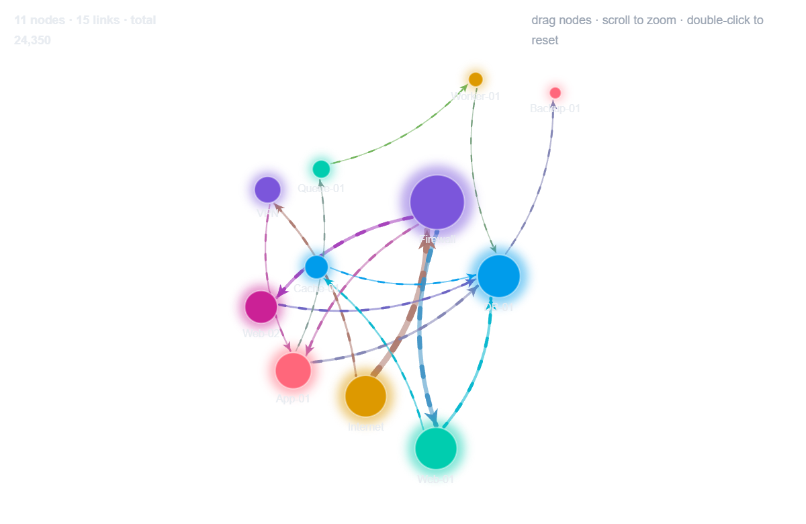

# Network Graph


Splunk Dashboard Studio 向けのカスタムビジュアライゼーション
（**物理シミュレーション付きフォースダイレクテッド・ネットワークグラフ**）。

`src → dest` の通信・依存・遷移関係をノードとエッジで描く。Splunk のデフォルト
ビジュアライゼーションには存在しないカテゴリで、以下はカスタム viz でしか実現できない:

- **リアルタイム物理シミュレーション** … 反発・スプリング・中心重力・衝突回避を
  requestAnimationFrame ループで自前実装。ノードが力学的に配置され、動きが落ち着くまで
  アニメーションする（React の再レンダリングを介さず SVG 属性を直接更新）
- **流れる破線（フロー）** … エッジ線そのものが破線として ソース→ターゲット方向へ
  流れ続ける（`stroke-dashoffset` を進めるだけの軽量アニメーション。点は動かさない）。
  破片の長さは流量に、速度は速度%に連動。通信の向きと勢いが一目で分かる（OFF 可）
- **線幅連動の矢印** … 向きの矢印はエッジ太さに比例する実三角で、頂点がノードの縁に
  ぴったり刺さる（曲線エッジでも終端の接線に沿って正しく整列）
- **インタラクション** … ノードをドラッグして再配置（他ノードが力学的に追従）、
  ホイールでカーソル中心ズーム、背景ドラッグでパン、ダブルクリックでリセット
- **オートフィットカメラ** … グラフ全体のバウンディングボックスへカメラが easing で
  自動追従し、パネルいっぱいに表示。手動ズーム/パンで解除、ダブルクリックで復帰（OFF 可）
- **ホバーハイライト** … 隣接ノード・接続エッジ・その上のフローだけを残して
  他を減光。ツールチップに in/out 流量と隣接ノード数
- **ダークテーマ時のグロー** … ノードに同色のハロー（OFF 可）

## 特徴（実装面）

- **値ベースの着色** … 低値色→(中間色)→高値色の自前カラースケール。編集画面の色設定が
  確実に反映される（`editor.dynamicColor` はカスタム viz では使えないため不採用）。
  OFF 時はノードを流量ランク順に色パレットで着色し（色数は編集画面で増減可・循環）、エッジは両端ノード色の中間色
- **決定的レイアウト** … 初期配置はノード名のハッシュをシードにした乱数。
  同じデータなら同じ形に収束する
- **重なり回避** … 反発と衝突を強め、衝突判定はラベルの実幅（推定）・高さを含む矩形近似で
  縦横それぞれに間隔を確保（2 回反復）。ノード・ラベルの団子を防ぐ。「ノード間隔（%）」で
  一括調整可能（既定 95%）。双方向エッジ（A→B と B→A）は左右反対に膨らませて線の重なりを解消
- **面積スケールの物理定数** … 反発力とリンク距離をパネル面積とノード数から自動算出
  （`√(面積/ノード数)` ベース）。広いパネルではノードが広がり、エッジの混雑を防ぐ
- **オートフィット** … ResizeObserver でコンテナ実寸に追従（リサイズ時は再加熱して馴染ませる）
- **silent cap にしない** … ノード上限（既定 60、流量上位を残す）・自己ループ・不正行・
  除外リンクの件数をヘッダーに表示
- **堅牢性** … rows/columns 両形式、カンマ付き数値、空名・非数値・0以下・自己ループ、
  空データ、テーマ未取得をすべてガード。同一 (source, target) ペアは合算。エッジ上限 800

## データ仕様

**列は編集画面で選べる**（v1.2.0〜）。指定しない場合は下記のルールで自動判定する。

| 役割 | 指定しないときの既定 |
|---|---|
| 接続元ノード名 | **名前らしい列（数値でない列）の1つ目**（空欄の行は無視） |
| 接続先ノード名 | 名前らしい列の2つ目（接続元と同じ = 自己ループの行は無視） |
| 数値（流量） | **残りのうち最も数値らしい列**。無ければ 1（= 行数カウント）。カンマ付き文字列も可 |

> 単純な `src, dst, bytes` の並びなら従来どおり 1/2/3 列目になる。
> `bytes, src, dst` のように**数値列が先頭にある並びでも正しく描ける**（v1.2.0 で対応）。
> 意図と違う列が選ばれるときは、編集画面の「データ」で明示的に指定する。

## オプション（ダッシュボード編集画面）

| セクション | 項目 |
|---|---|
| データ | 送信元の列 / 宛先の列 / 値の列（いずれも未指定なら自動判定） |
| レイアウトと物理 | ノード数上限 / ノードサイズ% / ノード間隔%（既定95） / リンク距離 / 反発強度%（既定45） / 自動フィット |
| エッジ | 曲線 / 向き矢印 / 不透明度% / 太さ% |
| フロー（流れる破線） | フロー ON/OFF / フロー速度% / 破線の密度% / グロー |
| ラベルとヘッダー | ラベル / 文字サイズ / **ラベルの最大文字数** / 値併記 / ヘッダー / ホバーハイライト |
| ノードのパレット | ノードの色（色パレット。流量ランク順に割当・循環） |
| 値による色分け | 値ベース着色 ON/OFF / 低・中・高色 / 中間色使用 / 反転 |
| クリック操作 | ノードのクリックでインタラクションを発火 |

editor は実績のある `editor.color` / `editor.checkbox` / `editor.number` /
`editor.columnSelector` / `editor.seriesColors` を使用。

### 操作

| 操作 | 動作 |
|---|---|
| ノードをドラッグ | その位置へ移動（**ドラッグ中は反発・衝突が弱まり、狙った場所に置ける**） |
| ノードをクリック | トークンを設定（編集画面の「インタラクション」で割り当て。ドラッグ後は発火しない） |
| ホイール | 拡大縮小 |
| 背景をドラッグ | 平行移動 |
| ダブルクリック | 表示位置を元に戻す（自動フィットに復帰） |

> ⚠ **パネルが狭いとヘッダーを省く**。幅が足りなければ操作ヒントを、
> 高さが 170px 未満ならヘッダーごと出さない（グラフの領域を優先するため）。

## 開発

```bash
yarn install
yarn build      # dist/custom_viz_network_graph/visualization.js
yarn verify     # happy-dom によるローカル検証（Splunk 実機なし・83 チェック）
yarn package    # dist/custom_viz_network_graph-<ver>-<hash>.spl
```

## デプロイ（アンインストール・再起動なし）

1. `npm version patch --no-git-tag-version` で `package.json` を上げ、
   `package/app/app.conf` の `version` 2 箇所も同期する
2. `yarn build:prod && yarn package`
3. Splunk Web「App をファイルからインストール」で **「App をアップグレード」にチェック**して `.spl` をアップロード
4. `https://<host>:8000/en-US/_bump` で **Bump version**
5. ブラウザをハードリロード（Ctrl+Shift+R）

## サンプル SPL

動作確認用（`makeresults` のみ・インデックス不要）:

```spl
| makeresults format=csv data="src,dest,bytes
Internet,Firewall,5200
Internet,VPN,1400
Firewall,Web-01,3600
Firewall,App-01,1500
Firewall,Web-02,2400
VPN,App-01,900
Web-01,DB-01,2100
Web-02,DB-01,1300
Web-01,Cache-01,1100
Cache-01,DB-01,700
App-01,DB-01,1700
App-01,Queue-01,600
Queue-01,Worker-01,550
Worker-01,DB-01,400
DB-01,Backup-01,900"
| table src dest bytes
```

実データの例（ファイアウォールログの通信マップ）:

```spl
index=firewall action=allowed
| stats sum(bytes) as bytes by src_ip dest_ip
| sort - bytes
| table src_ip dest_ip bytes
```

値なし 2 列でも動く（エッジ = 行数カウント）:

```spl
index=web
| table referer_domain domain
```

---

## リリースノート

このセクションは本ビジュアライゼーションのバージョン履歴を記録します。
新しいバージョンをパッケージ化するたびに、履歴の先頭（下の区切り線の直下）に新しいエントリを追記してください。

書式は [Keep a Changelog](https://keepachangelog.com/ja/1.0.0/) に準拠し、バージョンは [セマンティックバージョニング](https://semver.org/lang/ja/) に従います。
変更種別: `追加` / `変更` / `修正` / `削除` / `非推奨` / `セキュリティ`。

---

### [1.2.3] - 2026-08-09

#### 修正

- **スピナーが永遠に回り続けることがある問題への対策**（全 viz 共通の横展開）。
  公式 `useDataSources` は「render 時に現在値でシード → `useEffect` で購読」の構造で、
  その間に届いた更新を取り逃す（ホストは購読登録時に現在値を再送しない）。
  サーチ完了の最終通知をこの隙間で落とすと `loading` のまま固まる。対策として、
  loading 中は `getDataSources()` を 500ms 間隔で読み直し、ホスト側が完了済みなら
  その値を採用する（`useDataSourcesWithRescue`）。完了後はポーリングしない。
  不定期・初回表示時に発生しやすく、リロードで直る症状はこれが原因とみられる。
  描画・オプションの挙動に変更はない。

`.spl`: `dist/custom_viz_network_graph-1.2.3-2bb5ec3.spl`

### [1.2.2] - 2026-08-08

#### 変更

- **反発をさらに弱めた**（v1.2.1 でもまだ強かったため）。
  - **既定値**: `反発強度` 70% → **45%**、`ノード間隔` 110% → **95%**。
  - **ドラッグ中**: 力の倍率 0.15 → **0.07**、衝突の押し戻し 0.07 → **0.03**。
  - ノード同士が重ならないことは**衝突判定**が担保しているため、反発を下げても
    団子にはならない（実機・ローカル検証の両方で確認）。
  - ⚠ v1.2.1 と同様、**編集画面で値を明示している場合はそちらが優先**される。

#### 補足

- optionsSchema の項目は増減していないため **splunkd の再起動は不要**（`_bump` のみ）。
- 生成した `.spl`: `dist/custom_viz_network_graph-1.2.2-63b6b9f.spl`

### [1.2.1] - 2026-08-08

#### 変更

- **反発を弱めた**（ノードが散らばりすぎる／ドラッグ時に周囲が動きすぎるため）。
  - **既定値**: `反発強度` 100% → **70%**、`ノード間隔` 130% → **110%**。
    グラフがより寄り集まった見た目になる（実機で確認）。
  - **ドラッグ中**: 力の倍率 0.35 → **0.15**、衝突の押し戻し 0.18 → **0.07**。
    掴んだノードがほぼ押し返されず、周囲もほとんど動かない。
  - ⚠ **既定値の変更なので、編集画面で反発強度・ノード間隔を明示的に設定している
    ダッシュボードは従来どおりの見た目のまま**（設定値が優先される）。
    以前の広がりに戻したい場合は 100% / 130% を明示的に指定する。

#### 補足

- optionsSchema の**項目は増減していない**（既定値のみ変更）ため、
  **splunkd の再起動は不要**（`_bump` のみで反映）。
- 生成した `.spl`: `dist/custom_viz_network_graph-1.2.1-63b6b9f.spl`

### [1.2.0] - 2026-08-08

実機（Splunk 10.4.2）で確認しながら、実用性・操作性・物理演算をまとめて見直した。

#### 追加

- **送信元・宛先・値の列を選べるようにした**（`editor.columnSelector`）。
  従来は 1/2/3 列目に固定で、SPL の列順が違うと黙って別のグラフになっていた。
- **列を指定しない場合の自動判定を賢くした**。「名前らしい列（数値でない列）を2つ」を
  送信元・宛先に、「残りで最も数値らしい列」を値に選ぶ。
  そのため `bytes, src, dst` のような並びでも正しく描ける（実機で確認）。
- **ノードのクリックでトークンを設定できるようにした**（編集画面の「インタラクション」）。
  渡すキーは `row.node.value`（ノード名）／`row.value.value`（合計流量）／
  `row.in.value`・`row.out.value`（入/出）／`name`・`value`。
  **ドラッグして動かしただけのときは発火しない**（位置を変えるつもりの操作でトークンが
  変わると予測できないため）。「クリック操作」で OFF にもできる。
- **ラベルの最大文字数**（`labelMaxChars`、既定 14）。超える分は `…` で省略する。

#### 変更

- **反発力の計算を Barnes-Hut 近似にした**（O(n²) → O(n log n)）。
  実測で **300 ノードのとき約 21 倍高速**（力の向きの差は中央値 1.6°＝見た目は同等）。
  24 ノード以下は木を作るコストの方が高いので従来どおり総当たり。
- **衝突判定を空間ハッシュ格子にした**（総当たり2パス → 自セル＋隣接8セル）。
- これらの高速化に伴い **ノード数の上限を 300 → 400** に引き上げた。
- **ヘッダー・注記を日本語にした**（`nodes/links/total` → `ノード/エッジ/合計` など）。
  編集画面に出る説明文も日本語にした。
- エッジの色計算で `nodes.find()` をループ内で呼んでいたのを Map 参照にした
  （60ノード×800エッジで約4.8万回の走査が消える）。

#### 修正

- **ノードのドラッグが「逃げる・暴れる」問題を修正**した。原因は3つ:
  - mousemove のたびにグラフ全体を再加熱（alpha=0.35）していた → 控えめ（0.12）にし、
    **ドラッグ中は反発・衝突を弱める**（掴んだノードが押し返されない）
  - 掴んだノードが1フレーム遅れて追従していた → 座標を即時反映
  - 離した瞬間に速度が残って弾かれていた → 速度を消してから解放
- **狭いパネルでヘッダーがグラフを潰す問題を修正**した。240×170 のパネルで
  ヘッダーが2行に折り返し、グラフがほぼ見えなくなっていた（実機で確認）。
  幅が足りなければ操作ヒントを省き、高さが足りなければヘッダーごと出さない。

#### 補足

- ⚠ **この版は `config.json` を変更している**ため、編集パネルに新オプションを出すには
  **splunkd の再起動が必要**（描画だけなら `_bump` で反映される）。
- 生成した `.spl`: `dist/custom_viz_network_graph-1.2.0-63b6b9f.spl`

### [1.1.2] - 2026-08-06

#### 変更

- **表示名から `Custom Viz ` プレフィックスを削除**（`Custom Viz Network Graph` → `Network Graph`）。
  Studio の viz 切替 UI に出る名前・管理画面の App 一覧・README タイトルの3か所が対象。
  **アプリ ID（`custom_viz_*`）は変更していない**ため、配置済みダッシュボードには影響しない。
---

### [1.1.1] - 2026-07-30

#### 追加

- **`THIRD_PARTY_NOTICES.txt` を `.spl` に同梱**するようにした。バンドルしている
  OSS のライセンス条文と同梱素材の出典を、esbuild metafile（実際にバンドルされた
  モジュールの一覧）から機械生成している。パッケージ時に内容の鮮度も検査され、
  依存が変わったまま再生成し忘れると `.spl` 生成が失敗する。

#### 修正

- **`.spl` に開発ビルド（非 minify＋ソースマップ）が混入していたのを修正**。
  本番ビルド（`yarn build:prod`）で梱包するようにした（`.spl` が大幅に小さくなる）。
  機能・描画の変更はない。

#### 成果物

- `dist/custom_viz_network_graph-1.1.1-b4e4674.spl`

---


### [1.1.0] - 2026-07-25

#### 変更

- ノードのパレット設定を `editor.color` 6個（`color1`〜`color6`）から **`editor.seriesColors` 1項目**（`seriesColors`）へ統合。編集画面が「プリセット選択＋色スウォッチ列」になり、色数もユーザーが増減できるようになった。
- パレットがノード数より少ない場合は循環して適用する（既定パレットに落ちない）。
- 「値による色分け」セクション（`useValueColors` / `lowColor` / `midColor` / `highColor` / `useMidColor` / `reverse`）は連続スケールのため従来どおり個別の `editor.color` を維持。

#### 削除

- 旧オプション `color1`〜`color6`。**既定値が options に載らないホスト挙動のため、旧キーへのフォールバックは意図的に実装していない**（実装すると「既定値を選んだときだけ直らない」不具合になる）。既存ダッシュボードでパレット色を変更していた場合は既定パレットに戻るので、編集画面で設定し直すこと。
- 開発用の `debug` オプション（「デバッグ表示」チェックボックスと診断オーバーレイ）。

#### 成果物

- `dist/custom_viz_network_graph-1.1.0-fcde869.spl`

---

### [1.0.2] - 2026-07-25

#### 変更

- **データ未取得時のメッセージを全 viz 共通の文言に統一**した。
  「データがありません。サーチ結果を確認してください。」（従来は英語表記や viz ごとに異なる文言だった）。
  ダッシュボードに複数の viz を並べたときに、サーチ未設定の空パネルが揃った見た目になる。

- ソース中に3箇所だけ残っていた生の NUL 文字（リンクキーの区切り）を `\u0000` エスケープに統一した。
  同ファイル内の他の箇所は既にエスケープ形式で、表記が混在していた。
  生の制御文字が入っていると grep がファイルをバイナリ扱いし、検索・レビューができなくなる。

#### 生成物

- `dist/custom_viz_network_graph-1.0.2-2dc2dde.spl`

---

### [1.0.1] - 2026-07-21

#### 修正

- **まれにパネルが描画されない事象への対策（マウントゲート導入）**。ホスト初期化完了
  （`DashboardExtensionAPI` 注入＋テーマ／データの初期 state 受信）を待ってから React を
  マウントするよう変更。公式フックは購読登録時に現在値を再送しないため、初期 state が
  マウント後に届くと取り逃して `useTheme` 等が undefined のまま永久に非表示となる
  競合があった。
- **テーマ未取得時のフォールバックを追加**。最大5秒待っても初期 state が揃わない場合は
  light テーマで必ず描画を開始する（永久に真っ白のままになる経路を排除）。

#### パッケージ
- `dist/custom_viz_network_graph-1.0.1-d824e00.spl`

### [1.0.0] - 2026-07-20

物理シミュレーション付きフォースダイレクテッド・ネットワークグラフ。

#### 追加
- 新規作成（初回リリース）。
- パッケージ: `dist/custom_viz_network_graph-1.0.0-beb3d05.spl`
