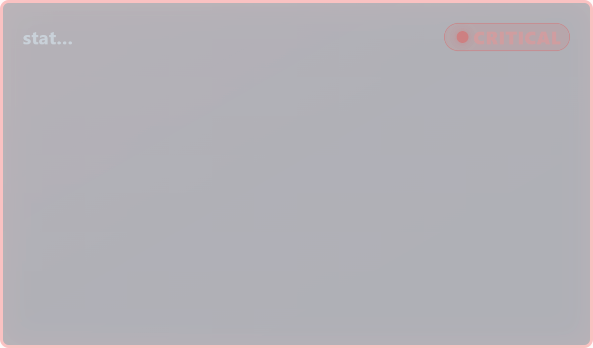

# Custom Viz Spotlight Frame



Splunk Dashboard Studio 向けのカスタムビジュアライゼーション。
パネルの外周を **色付きの枠＋発光＋状態バッジ** で縁取り、サーチ結果の状態値（severity / status / 件数）に応じて色・点滅・バッジが変わる「データ駆動のステータス枠」。

単体では中身をほとんど持たない **脇役** だが、ダッシュボード上で他パネルに重ねる／隣に置くことで「今どこが危険か」を視線を上げた瞬間に伝える。`link-line` と同じく、それ自体が主役ではなくダッシュボード全体の意味づけを強化する部品として使う。

## 特徴

- **状態で枠色が変わる**: サーチ結果を「段（tier）」に分類し、枠線・発光・バッジの色を切り替え
- **段数はユーザー定義**: 数値なら **「値の範囲と色」（`editor.threshold`）で帯を何段でも追加**でき、各帯が自分の色を持つ。上限/下限なしの開いた範囲も可
- **最悪ケースに丸める**: 複数行のデータは「一番深刻な段」で枠色を決める。各段の件数を集計してバッジ下に内訳表示（`Crit 3 / Warn 12 / OK 40`、数値なら `90 + 3` のような帯ラベル）。最上段に該当する行のラベル（対象名）も併記
- **3 つの判定モード**（`editor.select`）:
  - `自動`: 値が数値なら「値の範囲と色」の帯、文字列なら既知キーワード（critical/error/warn/ok…）で判定
  - `数値`: 「値の範囲と色」の帯で判定（帯の色を降順に並べれば可用性% など小さいほど悪い指標にも対応）
  - `文字列一致`: severity 文字列で判定。色は `statusColors` パレット（正常→警告→危険の順）
- **点滅（パルス）**: 危険時のみ／警告以上／常時／なし を選択、周期も指定（0 で停止）。段数可変に対応し、`危険のみ`＝最上段のとき / `警告以上`＝上位 2 段のとき、と相対的に解釈する
- **枠だけ表示（frameOnly）**: 中央を透明化して他パネルへ重ね置きできる
- 枠の太さ・角丸・発光の強さ・背景の塗り不透明度を編集パネルで調整。ライト/ダークテーマ両対応
- コンテナ実寸へ自動フィット。小さいパネルではタイトル → 件数内訳を段階退避

## データ仕様

1 行 = 1 つの判定対象。

| 列 | 意味 | 既定 |
|---|---|---|
| 状態値列 | severity 文字列（critical/warn/ok…）または数値 | 最終列 |
| ラベル列 | 対象名（任意。Critical の内訳表示に使用） | 第1列 |

- フィールドは編集パネルの「データフィールド」（columnSelector）で選択可
- タイトルは状態値フィールド名を表示（SPL の `rename` で日本語化するのが手軽）。`titleText` オプション（ソース JSON 編集）でも上書き可
- 文字列一致パスのバッジ文言は `okLabel` / `warnLabel` / `critLabel` オプション（ソース JSON 編集）で変更可。数値パスのバッジは帯のラベル（`10 +` など）を表示する
- 1 列だけの結果は「状態値のみの系列」として扱う

### 状態判定に使うキーワード（文字列モード / 自動モード）

- **CRITICAL**: `crit` `critical` `fatal` `error` `down` `fail` `alert` `high` `severe` `sev1` `p1` `緊急` `重大` `危険` `異常` `停止` など
- **WARNING**: `warn` `warning` `medium` `minor` `degrad` `sev2` `sev3` `p2` `p3` `警告` `注意` など
- **OK**: `ok` `up` `healthy` `normal` `good` `pass` `low` `info` `success` `正常` `成功` など

## サンプル SPL

### 文字列 severity（自動判定）

```spl
| makeresults format=csv data="host,severity
web-01,ok
web-02,warning
api-01,critical
api-02,warning
db-01,ok"
| table host, severity
```

→ 1 件 critical があるので枠は **赤（CRITICAL）**、バッジに `Crit 1 / Warn 2 / OK 2` と `api-01` を表示。

### 数値（エラー件数）

```spl
| makeresults format=csv data="host,errors
web-01,0
web-02,3
api-01,12"
| table host, errors
```

編集パネルで **判定モード=数値** にし、「値の範囲と色」を `< 3`＝緑 / `3–10`＝橙 / `10 +`＝赤 の 3 段に設定すると、12 件のホストが最上段（赤）になる。`＋` で段を増やせば 4 段以上も可。

### 可用性%（小さいほど悪い）

```spl
| makeresults format=csv data="svc,uptime
auth,99.9
cart,95
search,80"
| table svc, uptime
```

判定モード=**数値** にし、「値の範囲と色」を **降順の色** で `< 90`＝赤 / `90–98`＝橙 / `98 +`＝緑 と設定すると、80% のサービスが赤くなる（`higherIsWorse` は不要になった）。

### 単一の状態値

```spl
| makeresults
| eval status = "CRITICAL"
| table status
```

## 使い方のヒント

- **重ね置き**: `frameOnly=ON` にして枠だけにし、既存の表やグラフのパネルと同じ位置・サイズで重ねると、そのパネルの外周が状態色で縁取られる
- **セクションの見張り番**: 関連パネル群の背後に大きめに置き、配下の集計 SPL（`stats count by severity` など）を食わせると、そのセクション全体の状態が一目で分かる
- **編集モード**: このビジュアライゼーションは表示専用（クリック操作 UI を持たない）ため、編集モードの iframe 入力遮断の影響を受けない。色・値の範囲などはすべて右パネルで設定する

## 開発

```bash
yarn install
yarn build      # dist/custom_viz_spotlight_frame/visualization.js を生成
yarn verify     # happy-dom でローカル検証（実機不要）
yarn package    # dist/custom_viz_spotlight_frame-<ver>-<hash>.spl を生成
```

## デプロイ

1. `yarn build:prod && yarn package` で `.spl` を生成
2. Splunk Web「Install app from file」で **"Upgrade app"（上書き）にチェック**してアップロード
3. `https://<host>:8000/en-US/_bump` で **Bump version**
4. ブラウザをハードリロード（Ctrl+Shift+R）

---

## リリースノート

[Keep a Changelog](https://keepachangelog.com/ja/1.0.0/) 準拠 / [SemVer](https://semver.org/lang/ja/)。

---

### [1.2.0] - 2026-07-25

#### 変更

- **数値パスの状態判定を `editor.threshold`（「値の範囲と色」）1項目に統合した**（`colorBands`）。
  従来の `warnThreshold` / `critThreshold` / `higherIsWorse` の3オプションは、
  「OK / WARNING / CRITICAL の3段固定」という前提が組み込まれており、段数を増やせなかった。
  新方式では **帯を何段でも `＋` で追加でき、各帯が自分の色を持つ**。
  上限なし（`90 +`）・下限なし（`< 10`）の開いた範囲も作れる。
- 「小さいほど悪い」（可用性 % など）は `higherIsWorse` の代わりに、**帯の色を降順に並べる**ことで表現する
  （例: `< 90` を赤 / `90–98` を橙 / `98 +` を緑）。従来より直感的で、段数の制約も無い。
- **文字列一致パスの色は `editor.seriesColors` の順序付きパレット**（`statusColors`）に変更した。
  正常 → 警告 → 危険 の深刻度順に上から1色ずつ適用する。
  文字列カテゴリは数値レンジで表せないため、こちらには `editor.threshold` ではなくパレットを使っている。
  辞書に無い独自のステータス文字列が混ざっても、既知の語だけで判定して落ちない。
- **`pulseMode`（点滅モード）を段数可変に対応させた**。`危険のみ` / `警告以上` を絶対的な
  CRITICAL / WARNING ではなく **最上段からの相対位置**として解釈する:
  `危険のみ` = 最上段のときだけ点滅 / `警告以上` = 最上段の1つ下以上（上位2段）のとき点滅。
  段が3段（文字列パスの既定）なら v1.1.0 と完全に同じ挙動になり、5段でも意味が保たれる。
  枠の `data-status` 属性も同じ相対規則で `crit` / `warn` / `ok` を出す。
- 件数の内訳は各段の色と名前で表示する（数値パスは `90 + 3` のような帯ラベル、
  文字列パスは従来どおり `Crit 3 / Warn 12 / OK 40`）。
- 既定の帯（`< 1` 緑 / `1–10` 橙 / `10 +` 赤）と既定パレット（緑 / 橙 / 赤）は、
  一般的な使い方で **v1.1.0 とほぼ同じ見た目**になるよう選んである。
- 不正な入力（配列でない・空・色が壊れている・`from > to` の逆転・未ソート・範囲の重複・
  どの帯にも入らない値）はすべて安全側に倒し、既定の帯へフォールバックするか近い端の帯へ丸める。

#### 削除

- 旧オプション `warnThreshold` / `critThreshold` / `higherIsWorse`（→ `colorBands` へ統合）。
- 旧オプション `okColor` / `warnColor` / `critColor`（→ 数値パスは `colorBands` の各帯の色、
  文字列パスは `statusColors` パレットへ統合）。
- **既定値が options に載らないホスト挙動のため、これら旧キーへのフォールバックは意図的に実装していない**
  （実装すると「既定値を選んだときだけ直らない」不具合になる）。
  **既存ダッシュボードで色やしきい値を変更していた場合は既定値に戻るので、編集画面で設定し直すこと。**

#### 成果物

- `dist/custom_viz_spotlight_frame-1.2.0-fcde869.spl`

---

### [1.1.0] - 2026-07-25

#### 変更

- **「判定モード」「点滅モード」を数値入力からドロップダウン（`editor.select`）に変更**。数字の意味を覚える必要がなくなり、範囲外の値も入力できなくなった。
  - 判定モード: `自動` / `数値しきい値` / `文字列一致`（内部値 `auto` / `numeric` / `string`、既定 `auto`）
  - 点滅モード: `点滅しない` / `警告以上` / `危険のみ` / `常時`（内部値 `none` / `warn` / `crit` / `always`、既定 `crit`）
  - ラベルから数値コードの凡例（`（0=自動 / 1=…）`）を削除。
- **⚠ この 2 つの設定は既定値に戻ります。編集画面で選び直してください。**
  旧バージョンの数値（`0` / `1` / `2` / `3`）からの読み替え（後方互換マッピング）は**意図的に実装していません**。
  ホストは optionsSchema の既定値と同じ値を options に載せないため、読み替えを実装すると
  「ドロップダウンで既定値を選び直したときだけ旧設定のままになる」という分かりにくい不具合になります。
  未知の値はすべて既定値（判定モード=`自動`、点滅モード=`危険のみ`）へ丸めます。
- 判定不能時のガイドメッセージから数値コードの表記を削除（「自動 / 数値しきい値 / 文字列一致」へ）。

#### 削除

- **`debug`（オプションのデバッグ表示）オプションを廃止**。編集パネルの「デバッグ」セクション、
  オーバーレイ描画、およびそれだけのために保持していたパレット色（`panelBg` / `panelBorder`）と
  `useMode` 購読を削除。ダッシュボードに `debug: true` が残っていても無視されます。

#### 成果物

- `dist/custom_viz_spotlight_frame-1.1.0-fcde869.spl`

---

### [1.0.0] - 2026-07-24

#### 追加

- 新規作成（初回リリース）。データ駆動のステータス枠ビジュアライゼーション。
  - サーチ結果を OK / WARNING / CRITICAL の 3 段階に分類し、枠線・発光・状態バッジの色を切り替え
  - 複数行は「最悪の状態」に丸めて枠色を決定。各状態の件数と Critical の対象名をバッジ／内訳に表示
  - 3 つの判定モード（0=自動 / 1=数値しきい値 / 2=文字列一致）、しきい値・「大きいほど悪い」反転に対応
  - 点滅（なし／警告以上／危険のみ／常時、周期指定）、枠だけ表示（frameOnly）、枠の太さ・角丸・発光の強さ・背景の塗り不透明度を編集パネルで調整
  - ライト/ダークテーマ両対応、コンテナ実寸への自動フィット、マウントゲートによる安定描画
  - 生成物: `dist/custom_viz_spotlight_frame-1.0.0-e95b0ae.spl`
